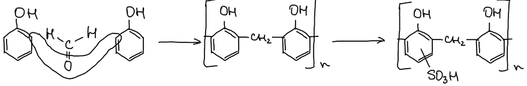
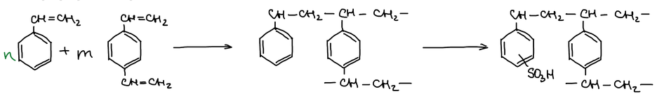
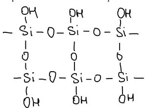
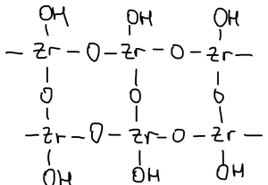
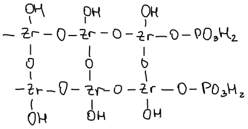
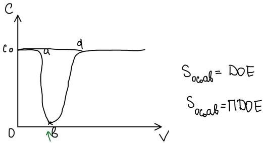
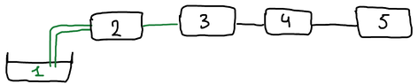

**Ионообменная хроматография** основана на обратимом стехиометрическом обмене ионов раствора на ионы твёрдого вещества — **ионита** (ионообменника). По знаку обменивающихся ионов иониты делят на **катиониты** и **аниониты**.

## Из истории

**1850 г.** — Томпсон проводил опыты на почве: промывал почву раствором сульфата аммония и наблюдал обмен ионов:

$$
\mathrm{RCa} + (\mathrm{NH_4})_2\mathrm{SO_4} \longrightarrow \mathrm{R(NH_4)_2} + \mathrm{CaSO_4}
$$

То же происходит на глинах, алюмосиликатных породах, цеолитах — они способны к ионному обмену.

В конце XIX — начале XX века явление начали использовать на практике, например для «умягчения» воды. С помощью природных ионообменных материалов была решена проблема получения чистого сахара из сахара-сырца.

**1935 г.** — Адамс и Холмс синтезировали первые ионообменные материалы — синтетические ионообменные органические смолы.

Природные неорганические материалы получали в порошкообразном виде. В больших колоннах для умягчения воды под действием большого гидродинамического давления слой уплотнялся, и скорость пропускания уменьшалась. Синтетические смолы можно получать в гранулированной форме — шариками, и пропускная способность шариков выше, чем порошков.

Органические иониты неустойчивы к радиоактивному излучению и высокой температуре. В 50-е годы XX века стали получать синтетические **неорганические** иониты, устойчивые к излучению и температуре.

## Органические ионообменные материалы

Органические иониты — смолы, которые получают поликонденсацией и полимеризацией.

**Поликонденсационные смолы.** Фенол конденсируется с формальдегидом в фенолформальдегидную смолу. Её собственные ионогенные группы — фенольные гидроксилы — очень слабокислотные, и работать с ней можно только в сильнощелочных средах. Удобнее сульфированная смола:

Сульфогруппы обменивают протон на катионы — получается **катионит**:

$$
\mathrm{R{-}SO_3^-H^+} + \mathrm{Na^+} \rightleftarrows \mathrm{R{-}SO_3^-Na^+} + \mathrm{H^+}
$$

**Полимеризационные смолы.** Очень распространённая матрица — сополимер стирола с дивинилбензолом, который затем сульфируют:

Дивинилбензол сшивает цепи; его доля $m$ — не более 15 % (обычно около 8 %). В настоящее время используются и сверхсшитые материалы.

Чтобы сделать **анионит**, в матрицу вводят азот — четвертичные аммониевые группы:

$$
\mathrm{RN(CH_3)_3^+OH^-} + \mathrm{Cl^-} \longrightarrow \mathrm{RN(CH_3)_3^+Cl^-} + \mathrm{OH^-}
$$

| Ионит | Тип | Ионогенные группы |
|---|---|---|
| Катионит | сильнокислотный | $\mathrm{-SO_3H}$ |
| | среднекислотный | $\mathrm{-PO_3H_2}$ |
| | слабокислотный | $\mathrm{-COOH}$ |
| Анионит | сильноосновный | $\mathrm{-N^+(CH_3)_3\,OH^-}$ |
| | среднеосновный | $\mathrm{-N^+(CH_3)_2C_2H_5\,OH^-}$ |
| | слабоосновный | $\mathrm{-NH_3^+\,OH^-}$ |

🙏 Если вам нравится сайт, подпишитесь на наш <a href="https://t.me/+JfpTv9CJlwQ0MThi">🔗 Телеграм-канал</a>.

## Неорганические ионообменные материалы

**Силикагель** — неудобный ионит:

**Гидратированный диоксид циркония:**

Такие иониты применяют, в частности, для извлечения радионуклидов: $^{137}\mathrm{Cs}$ и $^{90}\mathrm{Sr}$ — самые долгоживущие из опасных продуктов деления.

**Фосфат циркония** устойчив почти до 400 °C и может использоваться для очистки воды в первом контуре ядерного реактора:

## Равновесие ионного обмена

Обмен катиона $\mathrm{A^+}$, находящегося в ионите, на катион $\mathrm{B^+}$ из раствора (чертой отмечены концентрации в фазе ионита):

$$
\bar{\mathrm{R}}\mathrm{A^+} + \mathrm{B^+} \rightleftarrows \bar{\mathrm{R}}\mathrm{B^+} + \mathrm{A^+}, \qquad
K_{\mathrm{A/B}} = \frac{[\bar{\mathrm{B}}^+][\mathrm{A^+}]}{[\bar{\mathrm{A}}^+][\mathrm{B^+}]}
$$

**Коэффициент распределения** иона B — отношение его концентраций в ионите и в растворе:

$$
D_\mathrm{B} = \frac{[\bar{\mathrm{B}}^+]}{[\mathrm{B^+}]}, \qquad
K_{\mathrm{A/B}} = D_\mathrm{B} \frac{[\mathrm{A^+}]}{[\bar{\mathrm{A}}^+]}
\quad\Rightarrow\quad
D_\mathrm{B} = K_{\mathrm{A/B}} \frac{[\bar{\mathrm{A}}^+]}{[\mathrm{A^+}]}
$$

$$
\lg D_\mathrm{B} = \underbrace{\lg K_{\mathrm{A/B}} + \lg [\bar{\mathrm{A}}^+]}_{\text{const}} - \lg [\mathrm{A^+}] = \text{const} - \lg [\mathrm{A^+}]
$$

Если ион B присутствует в микроколичествах, ионит почти целиком находится в A-форме и $[\bar{\mathrm{A}}^+]$ постоянна. Тогда зависимость $\lg D_\mathrm{B}$ от $\lg [\mathrm{A^+}]$ — прямая с наклоном $-1$: чем выше концентрация вытесняющего иона в растворе, тем слабее удерживается ион B.

![Зависимость lg D_B от lg[A⁺]: прямая с наклоном −1 (|tg α| = 1)](images/ionoobmennaya-hromatografiya/lgD-ot-lgA.png)

## Обменная ёмкость ионитов

**Обменная ёмкость** — количественная мера способности ионита поглощать противоионы; её выражают в ммоль эквивалентов на 1 г сухого ионообменного материала.

1. **Статическая обменная ёмкость (СОЕ)** определяется в статических условиях: в стаканчик помещают навеску ионита и раствор, перемешивают сутки, разделяют фазы и анализируют раствор.
2. **Динамическая обменная ёмкость** определяется методом фронтальной хроматографии: раствор пропускают через колонку с ионитом, вытекающий раствор собирают фракциями и анализируют. Строят **выходную кривую** — концентрацию иона в вытекающем растворе в зависимости от пропущенного объёма $V$:

Пока ионит поглощает ион полностью, в вытекающем растворе его нет. **Момент проскока** — появление иона в вытекающем растворе; затем концентрация растёт до исходной $C_0$ — ионит насыщен.

- **ДОЕ** (динамическая обменная ёмкость до проскока) — площадь прямоугольника с высотой $C_0$ и основанием, равным объёму, прошедшему до проскока;
- **ПДОЕ** (полная динамическая обменная ёмкость) — вся площадь над выходной кривой до полного насыщения ионита.

ДОЕ всегда меньше ПДОЕ и зависит от типа ионита, состава раствора, размера зёрен и скорости протекания раствора.

## Высокоэффективная жидкостная хроматография

Высокоэффективная жидкостная хроматография (ВЭЖХ) появилась позже газовой. Схема жидкостного хроматографа:

1. ёмкость с подвижной фазой (элюентом);
2. насос;
3. хроматографическая колонка;
4. детектор;
5. компьютер (ПК).
