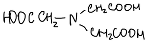
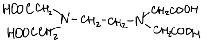
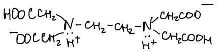
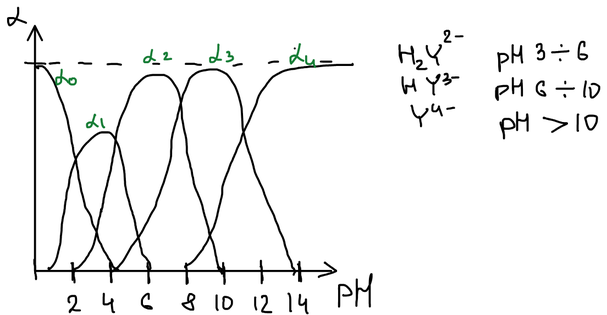
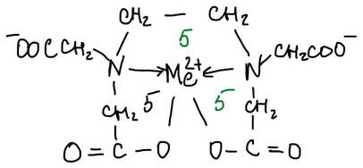

## Комплексные соединения в анализе

Многие металлы образуют комплексы с органическими лигандами, у которых есть удобные функциональные группы. Такие соединения применяют:

1. в качественном анализе (например, реакция никеля с диметилглиоксимом);
2. как гравиметрические реагенты: органические реагенты, в отличие от неорганических, почти не дают соосаждения.

У комплексов с органическими реагентами и комплексов с монодентатными лигандами общее то, что связь с металлом образуют одни и те же донорные атомы: O, N, S.

**Координационное число** (характеристика центрального атома) — число связей, которое центральный атом может образовать с лигандами.

**Дентатность лиганда** — число донорных атомов лиганда, образующих координационные связи с центральным атомом. Например, этилендиамин $\mathrm{NH_2{-}CH_2{-}CH_2{-}NH_2}$ — бидентатный лиганд.

**Правило циклов Чугаева**: наиболее устойчивые хелатные циклы образуются в том случае, когда в состав цикла входят пять или шесть атомов.

Пример — 1-нитрозо-2-нафтол: с кобальтом (при окислении до кобальта(III)) он образует красно-бурый осадок хелата; металл связан с атомом кислорода и атомом азота нитрозогруппы, при этом выделяются ионы $\mathrm{H^+}$:

![1-нитрозо-2-нафтол + Co²⁺ (окисление [O]) → красно-бурый осадок хелата кобальта: металл связан с кислородом и азотом нитрозогруппы](images/kompleksony/nitrozonaftol-kobalt.png)

**Функционально-аналитические группы** — определённое сочетание функциональных групп, обеспечивающее необходимый аналитический эффект.

**Теория подобия В. И. Кузнецова**: реакции ионов металлов с органическими реагентами подобны реакциям образования простых неорганических соединений — гидроксидов, аммиакатов и сульфидов:

$$
\left.\begin{matrix} -\mathrm{OH} \\ -\mathrm{COOH} \\ -\mathrm{NO} \end{matrix}\right\} \sim \mathrm{Me(OH)}_n, \qquad
\left.\begin{matrix} {>}\mathrm{NH} \\ -\mathrm{NH_2} \end{matrix}\right\} \sim \mathrm{Me(NH_3)}_n, \qquad
\left.\begin{matrix} -\mathrm{SH} \\ =\mathrm{S} \end{matrix}\right\} \sim \mathrm{Me}_2\mathrm{S}_n
$$

**Области применения комплексных соединений:**

1. оптические методы анализа;
2. **комплексонометрия** — титриметрический метод анализа, основанный на применении комплексных соединений. Достаточно молодой метод.

Долго комплексные соединения в титриметрии не использовались: когда комплекс образуется ступенчато, точку эквивалентности определить сложно. **1834 г.** — для определения ртути была использована реакция с иодидом:

$$
\mathrm{Hg^{2+}} + 4\mathrm{I^-} \rightleftarrows \mathrm{HgI_4^{2-}}
$$

— но широкого применения метод не нашёл.

**1945 г.** — швейцарский химик Г. Шварценбах ввёл в практику **комплексоны** — аминополикарбоновые кислоты, которые нашли широкое применение в аналитической химии.

## Комплексоны

1\. **Нитрилотриуксусная кислота** (НТА, комплексон I, хелатон I, трилон А):

2\. **Этилендиаминтетрауксусная кислота** (ЭДТУК, комплексон II, хелатон II), $\mathrm{H_4Y}$. Очень плохо растворима в воде:

3\. **Динатриевая соль этилендиаминтетрауксусной кислоты** $\mathrm{Na_2H_2Y}$ (комплексон III, хелатон III, трилон Б) — хорошо растворима, поэтому в практике анализа используют именно её; её и называют ЭДТА.

В молекуле $\mathrm{H_4Y}$ два протона переходят от карбоксильных групп к атомам азота — кислота существует в форме биполярного иона:

Поэтому первые два протона отщепляются от групп –COOH, а последние — от атомов азота. $\mathrm{H_4Y}$ диссоциирует ступенчато:

$$
\mathrm{H_4Y} \xrightarrow{-\mathrm{H^+}} \mathrm{H_3Y^-} \xrightarrow{-\mathrm{H^+}} \mathrm{H_2Y^{2-}} \xrightarrow{-\mathrm{H^+}} \mathrm{HY^{3-}} \xrightarrow{-\mathrm{H^+}} \mathrm{Y^{4-}}
$$

$$
K_1 = 1{,}0 \cdot 10^{-2}, \quad K_2 = 2{,}18 \cdot 10^{-3}, \quad K_3 = 6{,}92 \cdot 10^{-7}, \quad K_4 = 5{,}50 \cdot 10^{-11}
$$

Мольные доли форм зависят только от кислотности раствора:

$$
\alpha_{\mathrm{Y^{4-}}} = \frac{[\mathrm{Y^{4-}}]}{C_\text{ЭДТА}} = \frac{K_1 K_2 K_3 K_4}{[\mathrm{H^+}]^4 + K_1 [\mathrm{H^+}]^3 + K_1 K_2 [\mathrm{H^+}]^2 + K_1 K_2 K_3 [\mathrm{H^+}] + K_1 K_2 K_3 K_4}
$$

$$
\alpha_{\mathrm{H_4Y}} = \frac{[\mathrm{H_4Y}]}{C_\text{ЭДТА}} = \frac{[\mathrm{H^+}]^4}{[\mathrm{H^+}]^4 + K_1 [\mathrm{H^+}]^3 + K_1 K_2 [\mathrm{H^+}]^2 + K_1 K_2 K_3 [\mathrm{H^+}] + K_1 K_2 K_3 K_4}
$$

Таблицы мольных долей есть во всех учебниках по аналитической химии, ими можно пользоваться на экзаменах.

Преобладающие формы: $\mathrm{H_2Y^{2-}}$ — при pH 3–6, $\mathrm{HY^{3-}}$ — при pH 6–10, $\mathrm{Y^{4-}}$ — при pH > 10.

🙏 Если вам нравится сайт, подпишитесь на наш <a href="https://t.me/+JfpTv9CJlwQ0MThi">🔗 Телеграм-канал</a>.

## Особенности комплексообразования ионов металлов с ЭДТА

### 1. Стехиометрия комплекса

В условиях обычного определения ЭДТА образует с ионами металлов комплексы состава **1 : 1** независимо от заряда иона:

$$
\begin{aligned}
\mathrm{Me^{2+}} + \mathrm{H_2Y^{2-}} &\longrightarrow \mathrm{MeY^{2-}} + 2\mathrm{H^+} \\
\mathrm{Me^{3+}} + \mathrm{H_2Y^{2-}} &\longrightarrow \mathrm{MeY^-} + 2\mathrm{H^+} \\
\mathrm{Me^{4+}} + \mathrm{H_2Y^{2-}} &\longrightarrow \mathrm{MeY} + 2\mathrm{H^+}
\end{aligned}
$$

Первый фактор, оказывающий существенное влияние, — **никакого ступенчатого комплексообразования**: $\mathrm{Me} + \mathrm{R} \longrightarrow \mathrm{MeR}$, и по количеству израсходованного реагента $\mathrm{R}$ сразу находят количество металла.

После открытия комплексонов Шварценбахом титриметрический анализ получил новый толчок: стали развиваться методы определения ионов металлов, которые раньше титровать не умели.

### 2. Устойчивость комплексов

Второй фактор — высокая **устойчивость** образующихся комплексов.

ЭДТА — гексадентатный лиганд: два атома азота и четыре карбоксильные группы могут удовлетворить координационные возможности металлов с КЧ 6. Даже при КЧ 4 образуются три пятичленных цикла — это упрочняет соединение:

| Комплекс | $\mathrm{CaY^{2-}}$ | $\mathrm{CoY^{2-}}$ | $\mathrm{CuY^{2-}}$ |
|---|:-:|:-:|:-:|
| $K_\text{уст}$ | $5 \cdot 10^{10}$ | $2 \cdot 10^{16}$ | $6{,}3 \cdot 10^{18}$ |

Такие комплексные соединения чрезвычайно устойчивы за счёт образования нескольких циклов.

**1952 г.** — проведя теоретическое осмысление этих процессов, Шварценбах ввёл понятие **хелатного эффекта** — резкого упрочнения комплексов, которые образуют полидентатные лиганды, по сравнению с соответствующими комплексами монодентатных лигандов:

$$
\text{ХЭ} = \lg \beta_{\mathrm{MZ}} - \lg \beta_{\mathrm{MA}_n}
$$

где $\mathrm{Z}$ — $n$-дентатный лиганд, $\mathrm{A}$ — монодентатный, ХЭ — выигрыш в устойчивости.

Причина хелатного эффекта — энтропийная. Сравним число частиц до и после реакции:

$$
\begin{aligned}
\underset{1}{\mathrm{M(H_2O)_6^{2+}}} + \underset{6}{6\mathrm{NH_3}} &\longrightarrow \underset{1}{\mathrm{M(NH_3)_6^{2+}}} + \underset{6}{6\mathrm{H_2O}} && \text{— энтропия системы не меняется} \\
\underset{1}{\mathrm{M(H_2O)_6^{2+}}} + \underset{1}{\mathrm{Y^{4-}}} &\longrightarrow \underset{1}{\mathrm{MY^{2-}}} + \underset{6}{6\mathrm{H_2O}} && \text{— энтропия возрастает}
\end{aligned}
$$

$$
\Delta G^\circ = \Delta H^\circ - T\Delta S^\circ, \qquad \Delta G^\circ = -2{,}3\,RT \lg K_p
$$

Чем больше $\Delta S^\circ$, тем меньше $\Delta G^\circ$ и тем больше константа устойчивости.

### 3. Универсальность реагентов

Оборотная сторона — ЭДТА реагирует почти со всеми металлами, и приходится учитывать взаимное мешающее влияние близких по свойствам элементов. Способы повысить селективность:

1. **Регулирование кислотности раствора** — один из наиболее распространённых способов. Например, из смеси Cu, Co, Ca в кислой среде титруется медь (её комплекс устойчив настолько, что образуется и при малой доле $\mathrm{Y^{4-}}$), а кальций — только в щелочной.
2. **Маскирование** — ион металла как бы делают невидимым: он остаётся в растворе, но не участвует в реакции. Поиск маскирующих агентов — непростая задача.
3. **Отделение** мешающих ионов — перевод их в другую фазу: в виде малорастворимых соединений, хроматографически и т. д.

## Требования к реакциям

1. реакция взаимодействия должна идти до конца;
2. стехиометричность;
3. достаточная скорость: комплексообразование идёт не мгновенно (лиганду нужно время, чтобы «обернуться» вокруг иона металла), поэтому из бюретки нельзя быстро приливать раствор — надо малыми порциями.

**Как определить точку эквивалентности?** Сам комплексон в твёрдом состоянии — белое кристаллическое вещество, его раствор бесцветен. Комплексонаты некоторых металлов имеют слабую окраску за счёт хромофорных свойств самих ионов металлов, но для фиксирования точки эквивалентности этого обычно недостаточно — нужны индикаторы или инструментальные методы.
