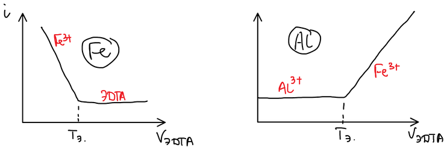
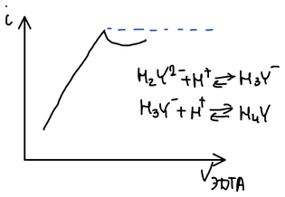

Комплексон и большинство комплексонатов бесцветны (см. [комплексоны и ЭДТА](../kompleksony/#требования-к-реакциям)), поэтому конечную точку титрования фиксируют либо металлохромными индикаторами, либо инструментально.

## Металлохромные индикаторы

Наиболее распространёнными всегда были визуальные методы. **Металлохромные индикаторы** — органические красители, которые сами являются полидентатными лигандами и образуют с ионами металлов окрашенные хелаты (обычно состава 1 : 1), причём окраска комплекса отличается от окраски свободного индикатора.

Индикатор вводят в раствор определяемого иона — образуется комплекс $\mathrm{MInd}$, и раствор приобретает его окраску. При титровании ЭДТА связывает металл в более устойчивый комплексонат, а в точке эквивалентности отнимает металл и у индикатора:

$$
\mathrm{MInd} + \mathrm{Y^{4-}} \longrightarrow \mathrm{MY} + \mathrm{Ind}
$$

— раствор приобретает окраску свободного индикатора. Интервал перехода окраски на шкале pM определяется условной константой устойчивости комплекса $\mathrm{MInd}$ и потому зависит от pH. Индикатор выбирают так, чтобы интервал перехода лежал в пределах скачка титрования, — иначе погрешность будет большой.

- **Эриохромовый чёрный Т** — при pH 7–11 окраска переходит из красной (комплекс с металлом) в синюю (свободный индикатор).
- **Мурексид** (аммониевая соль пурпуровой кислоты) — в сильнощелочной среде ($\mathrm{pH} \ge 12$) окраска меняется с красной на сине-фиолетовую.

## Инструментальные методы

### 1. Потенциометрия с ионоселективным электродом

Лучший вариант потенциометрического фиксирования точки эквивалентности в комплексонометрии — с **ионоселективным электродом** (ИСЭ) на определяемый металл. Ячейка:

$$
\text{ИСЭ (индикаторный электрод)} \mid \text{исследуемый раствор} \mid \text{электрод сравнения}
$$

Снимают кривую титрования и дифференциальным методом находят точку эквивалентности.

### 2. Потенциометрия с парой $\mathrm{Fe^{3+}/Fe^{2+}}$

Платиновый электрод способен принимать потенциал той окислительно-восстановительной системы, в раствор которой он опущен. Если в растворе есть пара $\mathrm{Fe^{3+}/Fe^{2+}}$:

$$
E = E^\circ_{\mathrm{Fe^{3+}/Fe^{2+}}} - 0{,}059 \lg \frac{[\mathrm{Fe^{2+}}]}{[\mathrm{Fe^{3+}}]}
$$

Оба иона железа образуют комплексонаты, железо(III) — намного более устойчивый:

$$
K_1 = \frac{[\mathrm{FeY^-}]}{[\mathrm{Fe^{3+}}][\mathrm{Y^{4-}}]}, \qquad
K_2 = \frac{[\mathrm{FeY^{2-}}]}{[\mathrm{Fe^{2+}}][\mathrm{Y^{4-}}]}
$$

$$
[\mathrm{Fe^{3+}}] = \frac{[\mathrm{FeY^-}]}{K_1 [\mathrm{Y^{4-}}]}, \qquad
[\mathrm{Fe^{2+}}] = \frac{[\mathrm{FeY^{2-}}]}{K_2 [\mathrm{Y^{4-}}]}
$$

Пока в растворе есть избыток ЭДТА, оба иона связаны в комплексы, и

$$
\begin{aligned}
E &= E^\circ_{\mathrm{Fe^{3+}/Fe^{2+}}} - 0{,}059 \lg \frac{[\mathrm{FeY^{2-}}]\, K_1 [\mathrm{Y^{4-}}]}{K_2 [\mathrm{Y^{4-}}]\, [\mathrm{FeY^-}]} \\
&= E^\circ_{\mathrm{Fe^{3+}/Fe^{2+}}} - 0{,}059 \lg \frac{K_1}{K_2} - 0{,}059 \lg \frac{[\mathrm{FeY^{2-}}]}{[\mathrm{FeY^-}]}
\end{aligned}
$$

— потенциал на $0{,}059 \lg (K_1/K_2)$ ниже, чем у пары свободных ионов. Когда ЭДТА израсходована, в растворе появляются свободные ионы железа, и потенциал поднимается до уровня пары $\mathrm{Fe^{3+}/Fe^{2+}}$. Скачок потенциала в конечной точке

$$
\Delta E \approx 0{,}059 \lg \frac{K_1}{K_2} \approx 0{,}6\text{–}0{,}7\ \text{В}
$$

(для $\lg K_1 \approx 25{,}1$ и $\lg K_2 \approx 14{,}3$ отношение $K_1/K_2 \approx 10^{11}$ и $\Delta E \approx 0{,}64$ В; на лекции называлось 660 мВ).

**Пример — алюминий.** $\mathrm{Al^{3+}}$ не определяют прямым титрованием: в растворе он находится в виде прочных аквакомплексов, и реакция с ЭДТА идёт медленно. Добавляют избыток ЭДТА, получается комплекс, а избыток ЭДТА титруют солью железа(III) с платиновым электродом:

$$
\begin{aligned}
\mathrm{Al^{3+}} + \mathrm{Y^{4-}}_\text{изб} &\longrightarrow \mathrm{AlY^-} \\
\mathrm{Y^{4-}}_\text{изб} + \mathrm{Fe^{3+}} &\longrightarrow \mathrm{FeY^-}
\end{aligned}
$$

🙏 Если вам нравится сайт, подпишитесь на наш <a href="https://t.me/+JfpTv9CJlwQ0MThi">🔗 Телеграм-канал</a>.

### 3. Амперометрическое титрование

Амперометрически можно титровать очень малые количества вещества ($10^{-5}$–$10^{-6}$ моль/л). Ток в ячейке создаёт электроактивное вещество, например:

$$
\underset{\text{электроактивен}}{\mathrm{Fe^{III}}} + \mathrm{Y^{4-}} \longrightarrow \underset{\text{неэлектроактивен}}{\mathrm{FeY^-}}
$$

При прямом титровании железа ток падает, пока в растворе остаются ионы $\mathrm{Fe^{3+}}$, и после точки эквивалентности не меняется. При обратном титровании избытка ЭДТА солью железа(III) (определение алюминия) ток сначала постоянен — $\mathrm{Al^{3+}}$ и его комплексонат неэлектроактивны, — а после точки эквивалентности растёт за счёт избыточных ионов $\mathrm{Fe^{3+}}$:

### 4. Кондуктометрическое титрование

При титровании выделяются ионы водорода:

$$
\mathrm{Fe^{3+}} + \mathrm{H_2Y^{2-}} \rightleftarrows \mathrm{FeY^-} + 2\mathrm{H^+}
$$

За счёт высокой подвижности протонов электропроводность раствора растёт. После точки эквивалентности избыток $\mathrm{H_2Y^{2-}}$ связывает активные протоны, и электропроводность немного падает:

$$
\begin{aligned}
\mathrm{H_2Y^{2-}} + \mathrm{H^+} &\rightleftarrows \mathrm{H_3Y^-} \\
\mathrm{H_3Y^-} + \mathrm{H^+} &\rightleftarrows \mathrm{H_4Y}
\end{aligned}
$$

## Способы комплексонометрического титрования

### I. Прямое титрование

$$
\mathrm{Me^{2+}} + \mathrm{H_2Y^{2-}} \longrightarrow \mathrm{MeY^{2-}} + 2\mathrm{H^+}
$$

Выделяющиеся ионы $\mathrm{H^+}$ связывает буферный раствор. Массовая доля определяемого металла:

$$
\omega_x\,(\%) = \frac{M_\text{КIII}\, V_\text{КIII}\, M_x}{10\, g}
$$

где $M_\text{КIII}$ — молярная концентрация комплексона III, моль/л; $V_\text{КIII}$ — его объём, мл; $M_x$ — молярная масса металла, г/моль; $g$ — масса навески, г. Так как реакция идёт 1 : 1, можно брать молярную концентрацию.

### II. Обратное титрование

Используют для определения металлов, медленно взаимодействующих с ЭДТА. К раствору добавляют известный избыток ЭДТА, а непрореагировавшую ЭДТА оттитровывают солью магния (или цинка):

$$
\begin{aligned}
\mathrm{Me^{2+}} + \mathrm{H_2Y^{2-}}_\text{изб} &\longrightarrow \mathrm{MeY^{2-}} + 2\mathrm{H^+} \\
\mathrm{H_2Y^{2-}}_\text{изб} + \mathrm{Mg^{2+}}\ (\mathrm{Zn^{2+}}) &\longrightarrow \mathrm{MgY^{2-}}\ (\mathrm{ZnY^{2-}}) + 2\mathrm{H^+}
\end{aligned}
$$

$$
\omega_x\,(\%) = \frac{\left(M_\text{КIII} V_\text{КIII} - M_{\mathrm{Mg^{2+}}} V_{\mathrm{Mg^{2+}}}\right) M_x}{10\, g} \cdot \frac{V_\text{об}}{V_\text{ал.ч.}}
$$

где $V_\text{об}/V_\text{ал.ч.}$ — отношение общего объёма раствора пробы к объёму аликвотной части.

### III. Метод замещения (вытеснительное титрование)

Применяют, когда металл образует комплекс с ЭДТА, но точку эквивалентности при прямом титровании определить нельзя. Для этого готовят раствор комплексоната магния (магний образует наименее прочный комплексонат), из которого определяемый металл вытесняет магний; выделившийся магний титруют ЭДТА с индикатором эриохромовым чёрным:

$$
\begin{aligned}
\mathrm{Me^{2+}} + \mathrm{MgY^{2-}} &\rightleftarrows \mathrm{Mg^{2+}} + \mathrm{MeY^{2-}} \\
\mathrm{Mg^{2+}} + \mathrm{H_2Y^{2-}} &\rightleftarrows \mathrm{MgY^{2-}} + 2\mathrm{H^+}
\end{aligned}
$$

## Стандартизация раствора ЭДТА

Точную концентрацию раствора ЭДТА устанавливают по первичному стандарту — раствору хлорида цинка, приготовленному растворением навески металлического цинка марки «хч» в соляной кислоте (для 100 мл 0,025 М раствора — 0,163 г Zn). Аликвоту нейтрализуют аммиаком до растворения осадка гидроксида цинка, добавляют аммиачный буфер (pH 10) и эриохромовый чёрный Т и титруют ЭДТА до перехода окраски от красно-фиолетовой к чистой синей:

$$
\mathrm{Zn^{2+}} + \mathrm{H_2Y^{2-}} \longrightarrow \mathrm{ZnY^{2-}} + 2\mathrm{H^+}
$$

## Жёсткость воды

Комплексонометрия позволяет определить **общую жёсткость воды** — суммарное содержание солей кальция и магния. Жёсткость показывает, можно ли эту воду кипятить в технических установках: из жёсткой воды образуется накипь. Накипь плохо проводит тепло, поэтому стенки установки (например, парового котла) перегреваются, и её может разрушить или даже взорвать.
