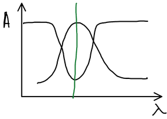
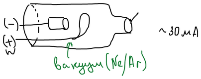
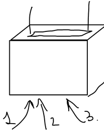

**Атомно-абсорбционная спектроскопия** (ААС) — высокочувствительный метод, основанный на поглощении излучения свободными атомами в основном состоянии. Поглощение зависит от концентрации атомов. Используются **резонансные линии** — переходы между основным состоянием и первым возбуждённым.

Мерой концентрации служит оптическая плотность слоя атомного пара; как и в молекулярной спектрофотометрии, она подчиняется закону Бугера — Ламберта — Бера:

$$
A = \lg \frac{I_0}{I} = K L C
$$

где $L$ — толщина поглощающего слоя атомного пара, $C$ — концентрация определяемого элемента, $K$ — коэффициент пропорциональности (связан с вероятностью электронного перехода).

## Ширина линии и источник излучения

Естественная ширина линии поглощения — порядка $10^{-5}$ нм. За счёт доплеровского и столкновительного (лоренцевского) уширения реальная ширина линии в атомизаторе составляет

$$
0{,}002\text{–}0{,}005\ \text{нм}
$$

Монохроматор выделяет из сплошного спектра полосу, которая намного шире такой линии, поэтому доля поглощённого излучения ничтожна — **поглощение мы не увидим**:

Поэтому нужен источник, испускающий узкую линию того же элемента. Он должен удовлетворять **условиям Уолша**:

1. длина волны максимума линии испускания совпадает с максимумом линии поглощения:

$$
\lambda_\text{max, исп} = \lambda_\text{max, погл}
$$

2. полуширина линии поглощения должна быть больше полуширины линии испускания:

$$
\alpha = \frac{\Delta\lambda_{1/2,\ \text{исп}}}{\Delta\lambda_{1/2,\ \text{погл}}} \le 1
$$

Если условие не выполняется, резко падает чувствительность. На практике линия поглощения должна быть в 2–3 раза шире линии испускания.

## Лампа с полым катодом

**Лампа с полым катодом** (ЛПК) — источник узкополосного излучения. Катод в форме полого цилиндра сделан из определяемого элемента (или покрыт им); лампа заполнена инертным газом (Ne или Ar) при низком давлении, выходное окно — из кварца; рабочий ток — порядка 30 мА:

Инертный газ ионизируется, ионы газа летят на катод и выбивают из него атомы определяемого элемента; атомы возбуждаются и испускают характеристическое излучение:

$$
\mathrm{Ne^0} \to \mathrm{Ne^*},\ \mathrm{Ne^+}; \qquad
\mathrm{Ne^+} \to \mathrm{Me^0}; \qquad
\mathrm{Me^0} \to \mathrm{Me^*}; \qquad
\mathrm{Me^*} \to \mathrm{Me^0} + h\nu
$$

Излучает и сам газ ($\mathrm{Ne^*} \to \mathrm{Ne^0} + h\nu$), но его линии отделяет монохроматор. Для каждого элемента нужна своя лампа (есть и многоэлементные лампы).

## Атомизация

Пробу нужно перевести в атомный пар. Используют два вида атомизации — **электротермическую** (ЭТА, графитовая печь) и **пламенную**.

**Пламенная атомизация.** Раствор пробы распыляют в пламя щелевой горелки; длинная узкая щель даёт вытянутое пламя и большую толщину поглощающего слоя $L$:

## Схема атомно-абсорбционного спектрометра

Излучение лампы с полым катодом проходит через пламя (или печь) с атомным паром пробы, затем через монохроматор, который выделяет резонансную линию, и попадает на детектор; сигнал усиливается и регистрируется. Горючая смесь для пламени — обычно ацетилен с воздухом.
