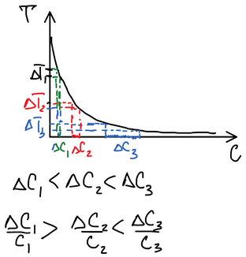
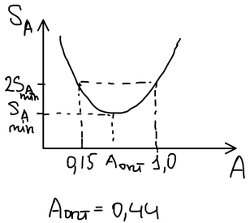
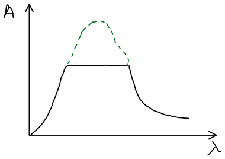

## Оптическая компенсация

Оптическая компенсация основана на применении **лепестковых диафрагм**: раскрывая и сужая диафрагму, можно регулировать её площадь, а световой поток пропорционален площади раскрытия. Поэтому отношение потоков можно измерить как отношение площадей раскрытия диафрагмы $S_1$ и $S_2$:

$$
A = \lg \frac{I_0}{I} = \lg \frac{S_0}{S}
$$

## Двухлучевая схема

1. источник света;
2. поворотные зеркала;
3. конденсорные линзы;
4. светофильтры (для монохроматизации);
5. кюветы: I — с раствором сравнения, II — с исследуемым раствором;
6. фотоэлементы;
7. нуль-гальванометр;
8. диафрагмы.

Порядок измерения:

1. В оба пучка ставят раствор сравнения. Световые потоки не будут равны (линзы, фильтры, фотоэлементы не идентичны). Чтобы уравнять их, уменьшают раскрытие первой диафрагмы, пока стрелка нуль-гальванометра не встанет на ноль, — после уравнивания на фотоэлементы падают одинаковые световые потоки.
2. Во второй пучок ставят исследуемый раствор. Поток через него уменьшается; вторую диафрагму тоже уменьшают до равновесия и снимают показания по шкале правой диафрагмы — оптическую плотность $A$.

**Преимущества:**

- световые потоки сравниваются в один и тот же момент времени, поэтому требования к стабилизации источника излучения (напряжения, подаваемого на источник) менее жёсткие, и прибор дешевле за счёт отсутствия стабилизатора;
- гальванометр простой — прибор дешевле; такие приборы производились массово. Большинство современных приборов тоже работают по двухлучевой схеме.

**Недостатки:** схема сложнее — всё нужно иметь в двойном комплекте, и приходится решать технические задачи: одинаковые линзы, оптика и т. д.

Монохроматизацию излучения обеспечивают светофильтрами (в фотоколориметрах) или монохроматорами — призменными и на основе дифракционной решётки (в спектрофотометрах). Монохроматическое излучение дают также лазеры и газоразрядные лампы с одной преобладающей линией (натриевая, ртутная).

🙏 Если вам нравится сайт, подпишитесь на наш <a href="https://t.me/+JfpTv9CJlwQ0MThi">🔗 Телеграм-канал</a>.

## Погрешность измерения оптической плотности

Приборы позволяют измерять $A$ от 0 до 2–3, но воспроизводимый результат получается в ещё более узком интервале.

Светопропускание падает с концентрацией по экспоненте. Одна и та же погрешность отсчёта $\Delta T$ в разных частях шкалы даёт разную погрешность концентрации: $\Delta C_1 < \Delta C_2 < \Delta C_3$. Относительная же погрешность $\Delta C / C$ велика и при малых концентрациях (мало $C$), и при больших (велико $\Delta C$), а минимальна посередине:

Относительная погрешность $S_A$ минимальна при

$$
A_\text{опт} = 0{,}44
$$

(теоретически $A_\text{опт} = 1/\ln 10 \approx 0{,}434$), а в интервале $A \approx 0{,}15\text{–}1{,}0$ она не больше удвоенной минимальной. Поэтому концентрацию раствора и толщину кюветы подбирают так, чтобы оптическая плотность попадала в этот интервал. Прибор может определять оптическую плотность до 3 единиц.

**Обзорные спектры.** Если оптическая плотность в максимуме полосы выше предела прибора, вершина спектра «срезается»:

Такой спектр годится как обзорный: положение максимума по нему не определить, но общее представление о спектре он даёт.

## Сложение погрешностей

Относительная погрешность результата фотометрического определения складывается из погрешностей всех измеряемых величин — массы навески $g$, объёма $V$, величины $\varphi$ и оптической плотности $A$:

$$
\frac{S_c}{c} = \sqrt{\left(\frac{S_g}{g}\right)^2 + \left(\frac{S_V}{V}\right)^2 + \left(\frac{S_\varphi}{\varphi}\right)^2 + \left(\frac{S_A}{A}\right)^2}
$$

Наибольший вклад обычно вносит погрешность измерения оптической плотности $S_A/A$.
