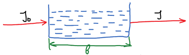
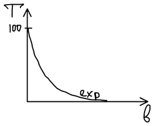
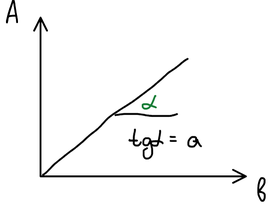
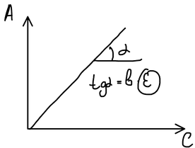

**Спектрофотометрия**, или молекулярно-абсорбционная спектроскопия, изучает светопоглощение растворов, помещённых в кюветы.

## Светопропускание и оптическая плотность

Световой поток $I_0$ проходит через кювету толщиной $b$ с раствором; на выходе поток $I < I_0$:

Кюветы из кварцевого стекла позволяют работать и в УФ-, и в ближней ИК-области.

Падающий поток делится на части:

$$
I_0 = I_a + I_\text{отр} + I_p + I
$$

- $I_a$ — **поглощённая** часть (абсорбция);
- $I_\text{отр}$ — **отражённая**: стенки кюветы делают перпендикулярными лучу, и отражённый поток минимален;
- $I_p$ — **рассеянная**: в истинных растворах размер частиц — это размер атомов и молекул, рассеяние начинается, если есть коллоидные частицы.

Пренебрегая отражением и рассеянием, получаем $I_0 = I_a + I$. Вводят величины:

$$
T = \frac{I}{I_0} \cdot 100\ \% \quad \text{— светопропускание}, \qquad
A = \lg \frac{I_0}{I} \quad \text{— оптическая плотность}
$$

Отношение $I_0/I$ характеризует светопоглощение; термин «оптическая плотность» рекомендован ИЮПАК в 1973 г. Связь между величинами (при $T$ в долях единицы):

$$
A = -\lg T
$$

Возможные пределы светопропускания:

1. раствор не поглощает: $I_0 = I$, $T = 100\ \%$, $A = 0$;
2. раствор полностью поглощает световую энергию: $T = 0\ \%$, $A \to \infty$.

На практике измеряют $A$ примерно от 0 до 3.

## Основные законы светопоглощения

**1729 г. — Бугер, 1760 г. — Ламберт.** Интенсивность света убывает с толщиной поглощающего слоя экспоненциально:

$$
I = I_0\, e^{-kb} = I_0 \cdot 10^{-\frac{k}{2{,}303} b} = I_0 \cdot 10^{-ab}
$$

Светопропускание падает с толщиной слоя по экспоненте, а оптическая плотность растёт линейно, с наклоном $\operatorname{tg}\alpha = a$:

**1852 г. — Бер** установил зависимость от концентрации: при $b = \text{const}$

$$
I = I_0 \exp(-k' c), \qquad I = I_0 \exp(-k'' c b)
$$

Объединённый **закон Бугера — Ламберта — Бера**:

$$
\boxed{\ A = \varepsilon b c\ }
$$

При прочих равных условиях оптическая плотность растворов пропорциональна концентрации поглощающего вещества.

Эта зависимость легко определяется практически — строят градуировочный график; его наклон $\operatorname{tg}\alpha = b\varepsilon$:

$\varepsilon$ — **молярный коэффициент поглощения**; он определяет наклон этой зависимости. Это оптическая плотность раствора с концентрацией 1 М, помещённого в кювету с толщиной поглощающего слоя 1 см.

Закон выполняется для разбавленных растворов и монохроматического света: при высоких концентрациях и немонохроматическом излучении график отклоняется от прямой.

🙏 Если вам нравится сайт, подпишитесь на наш <a href="https://t.me/+JfpTv9CJlwQ0MThi">🔗 Телеграм-канал</a>.

## Молярный коэффициент поглощения и чувствительность

| Раствор | $\varepsilon$ |
|---|:-:|
| РЗЭ + HCl | 1–10 |
| РЗЭ + арсеназо III | $(3\text{–}9) \cdot 10^4$ |
| Титан(IV) + $\mathrm{H_2O_2}$ | 720 |
| Титан(IV) + хромотроповая кислота | $1{,}7 \cdot 10^5$ |

Чем больше $\varepsilon$, тем больше чувствительность определения: один и тот же элемент в виде разных соединений можно определять с чувствительностью, различающейся на несколько порядков. Поэтому определяемый ион переводят в интенсивно окрашенное соединение с органическим реагентом.

## Избирательность светопоглощения

В молекулах много электронов, которые могут переходить в возбуждённое состояние, поэтому вещества поглощают свет избирательно. Цвет раствора — дополнительный к цвету поглощённого излучения:

| Спектральная область поглощённой части, нм | Цвет поглощённой части | Наблюдаемый цвет раствора |
|---|---|---|
| 380–450 | фиолетовый | жёлто-зелёный |
| 450–480 | синий | жёлтый |
| 480–560 | зелёный | оранжевый — красно-фиолетовый |
| 560–590 | жёлтый | синий |
| 590–625 | оранжевый | зелёно-синий |
| 625–750 | красный | сине-зелёный |

Спектры поглощения молекул в УФ- и видимой области широкополосные. Для количественного анализа не нужно снимать весь спектр — достаточно измерять оптическую плотность на одной, заранее выбранной длине волны. Её выбирают по спектру поглощения определяемого вещества: обычно в **максимуме полосы поглощения**, где чувствительность наибольшая. Сопоставляя спектры компонентов пробы, проверяют, можно ли определять одно вещество в присутствии других: если полосы накладываются, результаты будут завышены.
