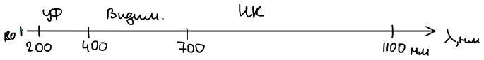
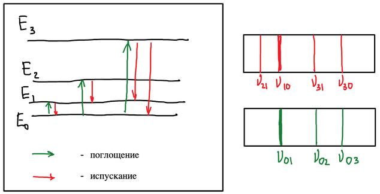

## Оптические методы анализа

В анализе можно использовать все виды излучения, но в этом разделе мы ограничимся оптическим диапазоном — ультрафиолетовой, видимой и ближней инфракрасной областями спектра:

Излучение может поглощаться веществом — обычно не поверхностью, а всем объёмом. По тому, что происходит с энергией излучения, оптические методы делят на две группы:

- **абсорбционные** — поглощённая энергия переходит во внутреннюю энергию вещества:
  - атомная абсорбция — **атомно-абсорбционная спектроскопия** (ААС);
  - молекулярная абсорбция — **молекулярно-абсорбционная спектроскопия** (спектрофотометрия);
- **эмиссионные** — поглощённая энергия затем излучается в том или ином виде:
  - **атомно-эмиссионная спектроскопия**;
  - **люминесцентный метод анализа**.

## Классификация спектроскопических методов

Спектроскопические методы анализа основаны на способности атомов и молекул вещества испускать, поглощать или рассеивать электромагнитное излучение.

**По типу оптических явлений:**

- спектроскопия испускания — эмиссионная и люминесцентная;
- спектроскопия поглощения;
- спектроскопия рассеяния.

**По диапазону энергии излучения:**

- γ-спектроскопия;
- рентгеновская спектроскопия;
- оптическая спектроскопия — в УФ-области, в видимой области, ИК-спектроскопия;
- радиоспектроскопия — микроволновая и радиочастотная.

**По изучаемым объектам:**

- ядерная — аналитическая мёссбауэровская спектроскопия;
- атомная — атомно-эмиссионная, атомно-флуоресцентная, атомно-абсорбционная, рентгенофлуоресцентная, ЭПР- и ЯМР-спектроскопия;
- молекулярная — электронная абсорбционная, ИК-спектроскопия, спектроскопия комбинационного рассеяния (КР), микроволновая, люминесцентная.

## Спектры испускания и поглощения

Современная спектроскопия базируется на квантовой теории, согласно которой частица может находиться только в определённых состояниях, которым соответствует некоторая дискретная последовательность уровней энергии. Если данному значению $E$ соответствует одно стационарное состояние, такой энергетический уровень называют **невырожденным**, если несколько — **вырожденным**.

Состояние с минимальной энергией — **основное**, все остальные — **возбуждённые**.

Переходы частицы из одних стационарных состояний в другие сопровождаются отдачей или получением энергии:

- **излучательные переходы** — частица испускает или поглощает квант электромагнитного излучения — фотон;
- **безызлучательные переходы** — частица непосредственно обменивается энергией с другими частицами за счёт столкновений, химических реакций и т. д.

Здесь $E_0$ — основное состояние, $E_1$, $E_2$, $E_3$ — уровни возбуждённых состояний. Энергия перехода и частота (длина волны) линии связаны соотношением

$$
\Delta E_{ij} = h\nu_{ij} = \frac{hc}{\lambda_{ij}}
$$

где $\Delta E$ — энергия перехода, $h$ — постоянная Планка, $\nu$ — частота, $\lambda$ — длина волны, $c$ — скорость света.

Если спектр обусловлен переходами с нижних уровней на верхние, его называют **спектром поглощения** (абсорбционным), если с верхних на нижние — **спектром испускания**.

Спектры, испускаемые термически возбуждёнными частицами, называют **эмиссионными**. Спектры нетермически возбуждённых частиц (например, квантами электромагнитного излучения, потоком электронов и т. д.) принято называть спектрами **люминесценции** (нетепловое свечение вещества). Их разделяют на спектры:

- **флуоресценции** — быстрое самопроизвольное испускание фотонов возбуждённой частицей; характерна и для молекул, и для атомов;
- **фосфоресценции** — замедленное испускание; характерна лишь для молекул.
