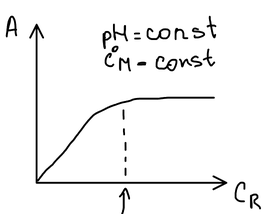
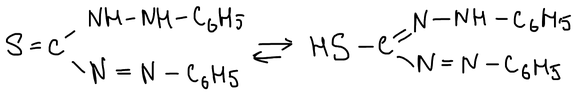
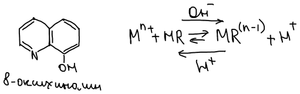
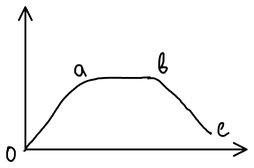
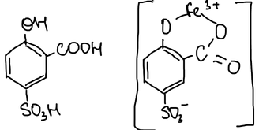
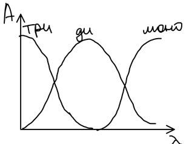

Большинство ионов сами поглощают свет слабо, поэтому в фотометрии определяемое вещество $\mathrm{X}$ переводят реагентом $\mathrm{R}$ в интенсивно окрашенное соединение:

$$
\mathrm{X} + \mathrm{R} \rightleftarrows \mathrm{XR}
$$

Оптические плотности поглощающих веществ складываются (**закон аддитивности**):

$$
A = \sum_i \varepsilon_i\, b\, c_i
$$

— поэтому, если сам реагент тоже поглощает, это нужно учитывать (например, измерять относительно раствора реагента).

## Условие полного связывания металла

Для реакции образования комплекса

$$
\mathrm{M} + n\mathrm{R} \rightleftarrows \mathrm{MR}_n
$$

металл считается связанным практически полностью, если в комплекс перешло не менее 99 % его исходной концентрации $C^\circ_\mathrm{M}$. Пусть реагент взят в стехиометрическом количестве; тогда в равновесии $[\mathrm{MR}_n] = 0{,}99\, C^\circ_\mathrm{M}$, свободного металла $C_\mathrm{M} = 0{,}01\, C^\circ_\mathrm{M}$, свободного реагента $C_\mathrm{R} = n \cdot 0{,}01\, C^\circ_\mathrm{M}$. Условная константа устойчивости:

$$
\beta'_{\mathrm{MR}_n} = \frac{[\mathrm{MR}_n]}{C_\mathrm{M}\, (C_\mathrm{R})^n} = \frac{0{,}99\, C^\circ_\mathrm{M}}{0{,}01\, C^\circ_\mathrm{M}\, (n \cdot 0{,}01\, C^\circ_\mathrm{M})^n} = \frac{0{,}99\, C^\circ_\mathrm{M}}{n^n\, (0{,}01\, C^\circ_\mathrm{M})^{n+1}}
$$

$$
\beta'_{\mathrm{MR}_n} \left(C^\circ_\mathrm{M}\right)^n \approx \frac{10^{2(n+1)}}{n^n}
$$

Если $\beta'_{\mathrm{MR}_n} (C^\circ_\mathrm{M})^n$ не меньше этой величины, комплекс настолько устойчив, что металл связывается на 99 % даже без избытка реагента. Если меньше — нужен избыток реагента: из $[\mathrm{MR}_n]/C_\mathrm{M} = \beta' C_\mathrm{R}^n \ge 10^2$

$$
C_\mathrm{R} \ge \left(\frac{10^2}{\beta'_{\mathrm{MR}_n}}\right)^{1/n}
$$

На практике при постоянных pH и концентрации металла оптическая плотность растёт с концентрацией реагента и выходит на плато — это и есть полное связывание металла:

## Влияние pH раствора

**а) R — анион сильной кислоты** ($\mathrm{I^-}$, $\mathrm{SCN^-}$). Такие анионы почти не протонируются даже в кислых растворах, поэтому повышение кислотности не мешает образованию комплекса. Мешает, наоборот, повышение pH: металлы, образующие прочные гидроксокомплексы, выходят из светопоглощающего соединения. Такие реакции проводят в достаточно кислой среде.

**б) R — анион слабой кислоты.** Примеры — дитизон (существует в двух таутомерных формах — тионной и тиольной) и 8-оксихинолин:

$$
\mathrm{M^{n+}} + \mathrm{HR} \rightleftarrows \mathrm{MR^{(n-1)+}} + \mathrm{H^+}
$$

В кислой среде реагент находится в протонированной форме $\mathrm{HR}$, и концентрация аниона мала. При повышении pH ионы $\mathrm{H^+}$ связываются, равновесие смещается вправо — комплекса образуется больше. Но слишком высокий pH вреден:

- $oa$ — увеличение образования комплекса;
- $ab$ — полное связывание металла;
- $bc$ — гидролиз металла или другая побочная реакция.

Поэтому комплексы с анионами слабых кислот получают в возможно менее кислых средах, но pH повышают осторожно — в пределах плато $ab$.

**в) Реагент обладает свойствами кислотно-основного индикатора.** Пример — эриохромовый чёрный Т: при pH 6–10 сам реагент синий, а его комплексы с металлами красные. Работать можно только в той области pH, где окраски реагента и комплекса различаются.

**г) Ступенчатое комплексообразование.** Пример — сульфосалициловая кислота ($\mathrm{H_3SSal}$), которая образует с железом(III) три комплекса разного состава:

| pH | Комплекс | $\lambda_\text{max}$, нм | $\varepsilon$ | $\beta$ |
|---|---|:-:|:-:|:-:|
| 1,8–2,5 | $\mathrm{Fe(SSal)}$ | 510 | 1800 | $\beta_1 = 1{,}1 \cdot 10^{14}$ |
| 4,0–8,0 | $\mathrm{Fe(SSal)_2^{3-}}$ | — | — | — |
| 8,0–11,5 | $\mathrm{Fe(SSal)_3^{6-}}$ | 416 | 5800 | $\beta_3 = 1{,}25 \cdot 10^{3}$ |

Каждая форма преобладает в своей области pH:

Чтобы определение было воспроизводимым, pH поддерживают в середине области существования одного комплекса.
