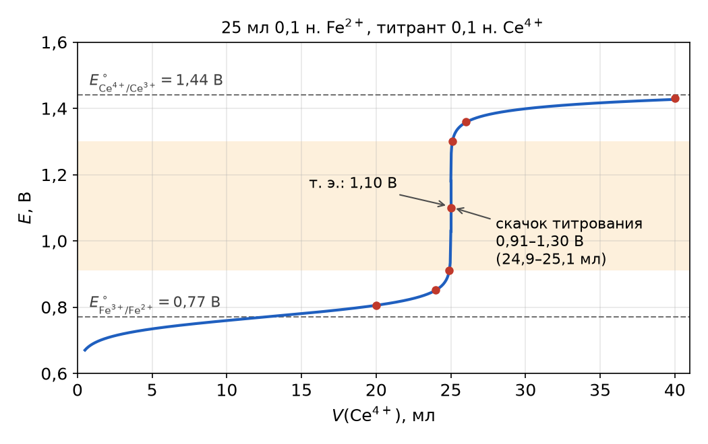

**Кривая окислительно-восстановительного титрования** — зависимость потенциала системы от количества добавленного титранта $\mathrm{R}$:

$$
E = f(c_\mathrm{R}) \qquad\text{или}\qquad E = f(V_\mathrm{R})
$$

Рассмотрим титрование железа(II) церием(IV):

$$
\mathrm{Fe^{2+}} + \mathrm{Ce^{4+}} \longrightarrow \mathrm{Fe^{3+}} + \mathrm{Ce^{3+}}
$$

После каждой порции титранта в растворе устанавливается равновесие, и потенциалы обеих пар становятся равны. Поэтому потенциал системы можно считать по любой паре — удобнее по той, концентрации обеих форм которой известны.

## Расчёт потенциала по участкам

**1. До начала титрования.** В растворе есть только $\mathrm{Fe^{2+}}$, концентрация $\mathrm{Fe^{3+}}$ неизвестна (близка к нулю) — потенциал не рассчитывается.

**2. От начала титрования до точки эквивалентности** — по паре определяемого вещества: каждая порция церия превращает эквивалентное количество $\mathrm{Fe^{2+}}$ в $\mathrm{Fe^{3+}}$, а сам церий(IV) почти весь расходуется.

$$
E_\text{сист} = E^\circ_{\mathrm{Fe^{3+}/Fe^{2+}}} - 0{,}059 \lg \frac{[\mathrm{Fe^{2+}}]}{[\mathrm{Fe^{3+}}]}
$$

**3. В точке эквивалентности** концентрации $\mathrm{Fe^{2+}}$ и $\mathrm{Ce^{4+}}$ очень малы и неизвестны, поэтому запишем потенциал через обе пары:

$$
\begin{aligned}
E_\text{т.э.} &= E^\circ_{\mathrm{Fe^{3+}/Fe^{2+}}} - 0{,}059 \lg \frac{[\mathrm{Fe^{2+}}]}{[\mathrm{Fe^{3+}}]} \\
E_\text{т.э.} &= E^\circ_{\mathrm{Ce^{4+}/Ce^{3+}}} - 0{,}059 \lg \frac{[\mathrm{Ce^{3+}}]}{[\mathrm{Ce^{4+}}]}
\end{aligned}
$$

Сложим их:

$$
2E_\text{т.э.} = E_1^\circ + E_2^\circ - 0{,}059 \lg \frac{[\mathrm{Fe^{2+}}][\mathrm{Ce^{3+}}]}{[\mathrm{Fe^{3+}}][\mathrm{Ce^{4+}}]}
$$

Так как в точке эквивалентности $[\mathrm{Fe^{2+}}] = [\mathrm{Ce^{4+}}]$ и $[\mathrm{Ce^{3+}}] = [\mathrm{Fe^{3+}}]$, дробь под логарифмом равна единице:

$$
E_\text{т.э.} = \frac{E_1^\circ + E_2^\circ}{2} = \frac{0{,}77 + 1{,}44}{2} = 1{,}10\ \text{В}
$$

Эта формула верна, когда обе полуреакции одноэлектронные; в общем случае

$$
E_\text{т.э.} = \frac{z_1 E_1^\circ + z_2 E_2^\circ}{z_1 + z_2}
$$

**4. За точкой эквивалентности** — по паре титранта: железо(II) оттитровано, а концентрации $\mathrm{Ce^{3+}}$ (образовавшегося) и $\mathrm{Ce^{4+}}$ (избыточного) известны.

$$
E_\text{сист} = E^\circ_{\mathrm{Ce^{4+}/Ce^{3+}}} - 0{,}059 \lg \frac{[\mathrm{Ce^{3+}}]}{[\mathrm{Ce^{4+}}]}
$$

## Пример: 25 мл 0,1 н. $\mathrm{Fe^{2+}}$, титрант 0,1 н. $\mathrm{Ce^{4+}}$

Например, после добавления 20,0 мл титранта (общий объём 45 мл):

$$
[\mathrm{Fe^{2+}}] = \frac{25 \cdot 0{,}1 - 20 \cdot 0{,}1}{45}, \qquad
[\mathrm{Fe^{3+}}] = \frac{20 \cdot 0{,}1}{45}
$$

$$
E = 0{,}77 - 0{,}059 \lg \frac{5}{20} = 0{,}806\ \text{В}
$$

Общий объём в отношении концентраций сокращается. Остальные точки считают так же:

| $V_\text{титранта}$, мл | Расчёт | $E$, В |
|:-:|:-:|:-:|
| 0 | — | не рассчитывается |
| 20,0 | по паре $\mathrm{Fe^{3+}/Fe^{2+}}$ | 0,806 |
| 24,0 | –//– | 0,851 |
| 24,9 | –//– | 0,911 |
| 25,0 | $(E_1^\circ + E_2^\circ)/2$ | 1,10 |
| 25,1 | по паре $\mathrm{Ce^{4+}/Ce^{3+}}$ | 1,30 |
| 26,0 | –//– | 1,36 |
| 40,0 | –//– | 1,43 |

Вблизи точки эквивалентности — от 24,9 до 25,1 мл, то есть в пределах ±0,4 % от эквивалентного объёма — потенциал меняется почти на 0,4 В. Это **скачок титрования**: по нему и фиксируют точку эквивалентности.

## От чего зависит форма кривой

До точки эквивалентности потенциал определяется только *отношением* концентраций окисленной и восстановленной форм, а не их абсолютными значениями, поэтому при разбавлении кривая почти не меняется. **Можно титровать весьма разбавленными растворами.**

На ЭДС системы и форму кривой влияют:

- **концентрация** — влияет на положение правой ветви кривой (для реакций, в которых стехиометрические коэффициенты окисленной и восстановленной форм различаются, например $\mathrm{Cr_2O_7^{2-}/2Cr^{3+}}$);
- **кислотность** — если в полуреакции участвуют ионы $\mathrm{H^+}$, потенциал пары зависит от pH;
- **комплексообразование** — связывание одной из форм в комплекс смещает потенциал пары (см. [окислительно-восстановительный потенциал](../redoks-potencial/#комплексообразование)).
