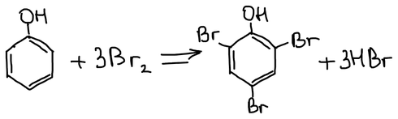
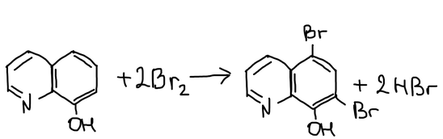
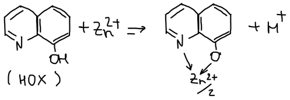

Методы окислительно-восстановительного титрования различают по названию титранта:

| Метод | Титрант |
|---|---|
| Перманганатометрия | $\mathrm{KMnO_4}$ |
| Дихроматометрия | $\mathrm{K_2Cr_2O_7}$ |
| Иодометрия | $\mathrm{I_2}$, $\mathrm{Na_2S_2O_3}$ |
| Броматометрия | $\mathrm{KBrO_3}$ |
| Цериметрия | $\mathrm{Ce^{4+}}$ |
| Ванадатометрия | $\mathrm{NH_4VO_3}$ |
| Титанометрия | $\mathrm{Ti^{3+}}$ |
| Хромометрия | $\mathrm{Cr^{2+}}$ |

В большинстве методов титрант — окислитель. Восстановительное титрование — это иодометрия (титрование иода тиосульфатом), а также титрование солями титана(III) и хрома(II).

Подробно методы описаны в учебнике В. Н. Алексеева «Количественный анализ».

## 1. Перманганатометрия

Продукт восстановления перманганата зависит от кислотности среды:

$$
\begin{aligned}
&\text{сильнокислая среда:} && \mathrm{MnO_4^-} + 8\mathrm{H^+} + 5\bar e \longrightarrow \mathrm{Mn^{2+}} + 4\mathrm{H_2O}, && E^\circ = 1{,}51\ \text{В} \\
&\text{слабокислая среда:} && \mathrm{MnO_4^-} + 4\mathrm{H^+} + 3\bar e \longrightarrow \mathrm{MnO_2} + 2\mathrm{H_2O}, && E^\circ = 1{,}69\ \text{В} \\
&\text{нейтральная среда:} && \mathrm{MnO_4^-} + 2\mathrm{H_2O} + 3\bar e \longrightarrow \mathrm{MnO_2} + 4\mathrm{OH^-}, && E^\circ = 0{,}60\ \text{В} \\
&\text{щелочная среда:} && \mathrm{MnO_4^-} + \bar e \longrightarrow \mathrm{MnO_4^{2-}}, && E^\circ = 0{,}56\ \text{В}
\end{aligned}
$$

Поэтому нужно строго контролировать кислотность раствора.

Перманганат окисляет воду:

$$
4\mathrm{MnO_4^-} + 2\mathrm{H_2O} \longrightarrow 4\mathrm{MnO_2} + 3\mathrm{O_2} + 4\mathrm{OH^-}
$$

Реакцию ускоряют свет и образующийся $\mathrm{MnO_2}$, поэтому раствор хранят в тёмной стеклянной посуде.

**Установочные вещества** для стандартизации раствора перманганата — оксалат натрия $\mathrm{Na_2C_2O_4}$ и щавелевая кислота $\mathrm{H_2C_2O_4 \cdot 2H_2O}$. Кристаллогидрат неудобен: содержание кристаллизационной воды может меняться при хранении.

**1846 г.** — Маргерит предложил перманганатометрическое определение железа.

Что определяют перманганатометрически:

| Определяемое вещество | Продукт окисления | Условия |
|---|---|---|
| $\mathrm{Fe^{2+}}$ | $\mathrm{Fe^{3+}}$ | $\mathrm{Mn^{2+}}$, $\mathrm{H_3PO_4}$, $\mathrm{H_2SO_4}$ |
| $\mathrm{Mn^{2+}}$ | $\mathrm{MnO_2 \cdot H_2O}$ | $\mathrm{ZnO} + \mathrm{ZnSO_4}$ |
| $\mathrm{I^-}$ | $\mathrm{I_2}$ | $\mathrm{H_2SO_4}$ |
| $\mathrm{C_2O_4^{2-}}$ | $\mathrm{CO_2}$ | $\mathrm{H_2SO_4}$, 70–80 °C, $\mathrm{Mn^{2+}}$ |
| $\mathrm{AsO_3^{3-}}$ | $\mathrm{AsO_4^{3-}}$ | $\mathrm{H^+}$, катализатор $\mathrm{KI}$ |
| V(III) | V(V) | $\mathrm{H_2SO_4}$, 80 °C |

В настоящее время перманганатометрия для неорганических веществ почти не используется (протекают побочные реакции), но её используют для определения **органических веществ** методом обратного титрования. В щелочной среде перманганат восстанавливается до манганата:

1\. Глицерин:

$$
\mathrm{C_3H_5(OH)_3} + 14\mathrm{MnO_4^-} + 20\mathrm{OH^-} \longrightarrow 3\mathrm{CO_3^{2-}} + 14\mathrm{MnO_4^{2-}} + 14\mathrm{H_2O}
$$

2\. Смесь муравьиной и уксусной кислот $\mathrm{HCOOH} + \mathrm{CH_3COOH}$ — окисляется только формиат-ион:

$$
\mathrm{HCOO^-} + 2\mathrm{MnO_4^-} + 3\mathrm{OH^-} \longrightarrow \mathrm{CO_3^{2-}} + 2\mathrm{MnO_4^{2-}} + 2\mathrm{H_2O}
$$

3\. Метанол — глубокое окисление, до карбоната:

$$
\mathrm{CH_3OH} + 6\mathrm{MnO_4^-} + 8\mathrm{OH^-} \longrightarrow \mathrm{CO_3^{2-}} + 6\mathrm{MnO_4^{2-}} + 6\mathrm{H_2O}
$$

## 2. Дихроматометрия и 3. иодометрия

Эти методы на лекции были оставлены для самостоятельного изучения. Основы иодометрии — определение восстановителей титрованием иодом и окислителей по выделившемуся иоду, индикатор крахмал — разобраны в статье [«Способы фиксирования точки эквивалентности»](../redoks-indikatory/#2-специфические-индикаторы).

**Прямые и косвенные определения.** Стандартный потенциал пары $\mathrm{I_2/2I^-}$ невелик ($E^\circ = 0{,}54$ В), поэтому иод окисляет лишь достаточно сильные восстановители ($E^\circ < 0{,}54$ В) — их титруют раствором иода (прямые методы). Окислители с $E^\circ > 0{,}54$ В определяют косвенно: они выделяют из избытка иодида эквивалентное количество иода, который титруют тиосульфатом натрия:

$$
2\mathrm{Na_2S_2O_3} + \mathrm{I_2} \longrightarrow \mathrm{Na_2S_4O_6} + 2\mathrm{NaI}
$$

Титруют при $\mathrm{pH} < 8$: в щелочной среде иод диспропорционирует до гипоиодита и иодата, и стехиометрия нарушается. Если кроме иода в растворе нет окрашенных веществ, конец титрования можно заметить и по собственной жёлто-оранжевой окраске иода; но обычно используют крахмал.

**Раствор тиосульфата натрия** готовят из перекристаллизованного $\mathrm{Na_2S_2O_3 \cdot 5H_2O}$ и через некоторое время устанавливают его точную концентрацию: тиосульфат медленно разлагается кислородом воздуха, растворённым $\mathrm{CO_2}$ и тиобактериями, особенно в кислой среде. Поэтому воду для раствора кипятят и добавляют немного $\mathrm{NaHCO_3}$. Первичные стандарты — окислители, выделяющие из иодида эквивалентное количество иода: дихромат калия (реакция идёт медленно, нужно выдержать смесь 3–5 мин в темноте) или иодат калия (реагирует мгновенно):

$$
\begin{aligned}
\mathrm{Cr_2O_7^{2-}} + 6\mathrm{I^-} + 14\mathrm{H^+} &\longrightarrow 2\mathrm{Cr^{3+}} + 3\mathrm{I_2} + 7\mathrm{H_2O} \\
\mathrm{IO_3^-} + 5\mathrm{I^-} + 6\mathrm{H^+} &\longrightarrow 3\mathrm{I_2} + 3\mathrm{H_2O}
\end{aligned}
$$

🙏 Если вам нравится сайт, подпишитесь на наш <a href="https://t.me/+JfpTv9CJlwQ0MThi">🔗 Телеграм-канал</a>.

## 4. Цериметрия

Потенциал пары церий(IV)/церий(III) сильно зависит от того, в какие комплексы церий связан анионами кислоты:

| Пара | $E^\circ$, В |
|---|:-:|
| $\mathrm{Ce^{4+}/Ce^{3+}}$ | +1,77 |
| $\mathrm{CeCl_6^{2-}/Ce^{3+} + 6Cl^-}$ | +1,28 |
| $\mathrm{Ce(ClO_4)_6^{2-}/Ce^{3+} + 6ClO_4^-}$ | +1,70 |
| $\mathrm{Ce(NO_3)_6^{2-}/Ce^{3+} + 6NO_3^-}$ | +1,61 |
| $\mathrm{Ce(SO_4)_3^{2-}/Ce^{3+} + 3SO_4^{2-}}$ | +1,44 |

Все вещества из таблицы перманганатометрических определений могут быть определены и цериметрически, но церий дорог.

**Определение органических веществ.**

1\. Глицерин — окисление не такое глубокое, как перманганатом, — до муравьиной кислоты:

$$
\mathrm{C_3H_5(OH)_3} + 3\mathrm{H_2O} \longrightarrow 3\mathrm{HCOOH} + 8\mathrm{H^+} + 8\bar e
$$

2\. Винная кислота $\mathrm{HOOC{-}CH(OH){-}CH(OH){-}COOH}$ (в 4 н. $\mathrm{HClO_4}$):

$$
\mathrm{C_4H_6O_6} + 2\mathrm{H_2O} \longrightarrow 2\mathrm{CO_2} + 2\mathrm{HCOOH} + 6\mathrm{H^+} + 6\bar e
$$

## 5. Броматометрия

Титрант — бромат калия $\mathrm{KBrO_3}$. Бромат-анион в кислой среде восстанавливается до бромида:

$$
\mathrm{BrO_3^-} + 6\mathrm{H^+} + 6\bar e \longrightarrow \mathrm{Br^-} + 3\mathrm{H_2O}, \qquad E^\circ = +1{,}44\ \text{В}
$$

Избыточная капля $\mathrm{KBrO_3}$ после точки эквивалентности реагирует с образовавшимся бромидом:

$$
\mathrm{BrO_3^-} + 5\mathrm{Br^-} + 6\mathrm{H^+} \longrightarrow 3\mathrm{Br_2} + 3\mathrm{H_2O}
$$

Появление $\mathrm{Br_2}$ и позволяет определить точку эквивалентности. В качестве индикатора используют метиловый оранжевый или метиловый красный. В кислой среде они красные; бром встраивается в ароматические кольца индикаторов, сопряжённая система разрушается, и индикатор обесцвечивается. Этот процесс **необратим**. Поэтому после обесцвечивания иногда добавляют ещё несколько капель индикатора: если раствор остался бесцветным — титрование закончено, если окрасился — титруют дальше.

Различают прямые и косвенные методы броматометрического определения.

### Прямые определения

Например, сурьма(III):

$$
3[\mathrm{SbCl_5}]^{2-} + \mathrm{BrO_3^-} + 6\mathrm{H^+} + 3\mathrm{Cl^-} \longrightarrow 3[\mathrm{SbCl_6}]^- + \mathrm{Br^-} + 3\mathrm{H_2O}
$$

Так как необратимость обесцвечивания индикатора не очень удобна, для повышения точности избыток брома определяют иодометрически:

$$
\begin{aligned}
\mathrm{Br_2} + 2\mathrm{I^-} &\longrightarrow \mathrm{I_2} + 2\mathrm{Br^-} \\
\mathrm{I_2} + 2\mathrm{Na_2S_2O_3} &\longrightarrow \mathrm{Na_2S_4O_6} + 2\mathrm{NaI} \quad (\text{индикатор — крахмал})
\end{aligned}
$$

Бром вступает и в реакции замещения — так определяют фенол:

$$
\mathrm{C_6H_5OH} + 3\mathrm{Br_2} \longrightarrow \mathrm{C_6H_2Br_3OH} + 3\mathrm{HBr}
$$

Для этого используют **бромид-броматную смесь** — стандартный раствор $\mathrm{KBrO_3} + \mathrm{KBr}$, который при подкислении выделяет бром:

$$
\mathrm{KBrO_3} + \mathrm{KBr} \xrightarrow{\ \mathrm{H^+}\ } \mathrm{Br_2}
$$

Смесь готовят заранее, не подкисляя: бром образуется только в анализируемом растворе, и летучий бром не теряется.

### Косвенные определения

Косвенные методы (обычно для органических веществ) основаны на бромировании **8-оксихинолина** ($\mathrm{HOx}$) до 5,7-дибром-8-оксихинолина:

$$
\mathrm{HOx} + 2\mathrm{Br_2} \longrightarrow \mathrm{HOxBr_2} + 2\mathrm{HBr}
$$

8-Оксихинолин образует малорастворимые внутрикомплексные соединения со многими ионами металлов, поэтому по нему косвенно определяют металлы.

Ион металла замещает протон гидроксильной группы и координируется ещё и атомом азота, образуя хелатный цикл (на рисунке «Zn²⁺/2» — на один ион цинка приходятся две молекулы оксихинолина):

Цинк осаждают, осадок растворяют в кислоте и бромируют выделившийся оксихинолин:

$$
\begin{aligned}
\mathrm{Zn^{2+}} + 2\mathrm{HOx} &\rightleftarrows \mathrm{Zn(Ox)_2}\!\downarrow + 2\mathrm{H^+} \\
\mathrm{Zn(Ox)_2} + 2\mathrm{H^+} &\rightleftarrows \mathrm{Zn^{2+}} + 2\mathrm{HOx} \\
\mathrm{HOx} + 2\mathrm{Br_2} &\longrightarrow \mathrm{HOxBr_2} + 2\mathrm{HBr}
\end{aligned}
$$

На один ион цинка приходятся две молекулы оксихинолина, то есть четыре молекулы брома — восемь электронов. Эквивалент цинка (и для трёхзарядного алюминия, связывающего три молекулы оксихинолина):

$$
\text{Э}_{\mathrm{Zn^{2+}}} = \frac{A_\mathrm{Zn}}{8}, \qquad \text{Э}_{\mathrm{Al^{3+}}} = \frac{A_\mathrm{Al}}{12}
$$

## 6–8. Ванадатометрия, титанометрия, хромометрия

Используются редко из-за сложностей хранения растворов титрантов.
