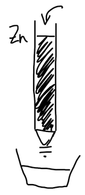

Перед титрованием определяемый элемент часто приходится перевести в одну, строго определённую степень окисления. Для этого используют вспомогательные окислители и восстановители.

**Требования к реагентам:**

1. реагент должен быть достаточно сильным, чтобы определяемое вещество прореагировало полностью;
2. избирательность — окислялось (восстанавливалось) только то, что нужно;
3. избыток вспомогательного реагента должен достаточно хорошо удаляться из раствора — иначе он прореагирует с титрантом.

## 1. Окислители

Окислители переводят элемент в высшую степень окисления.

### Висмутат натрия $\mathrm{NaBiO_3}$

$$
\mathrm{BiO_3^-} + 6\mathrm{H^+} + 2\bar e \longrightarrow \mathrm{Bi^{3+}} + 3\mathrm{H_2O}, \qquad E^\circ \approx 2{,}0\ \text{В}
$$

В кислой среде окисляет:

$$
\mathrm{Mn^{II}} \xrightarrow{\ \mathrm{H^+}\ } \mathrm{MnO_4^-}, \qquad
\mathrm{Cr^{III}} \xrightarrow{\ \mathrm{H^+}\ } \mathrm{Cr_2O_7^{2-}}, \qquad
\mathrm{Ce^{III}} \xrightarrow{\ \mathrm{H^+}\ } \mathrm{Ce^{IV}}
$$

Недостаток — нерастворим в воде; преимущество — избыток можно отделить фильтрованием.

### Пероксодисульфат аммония $\mathrm{(NH_4)_2S_2O_8}$

$$
\mathrm{S_2O_8^{2-}} + 2\bar e \longrightarrow 2\mathrm{SO_4^{2-}}, \qquad E^\circ = 2{,}0\ \text{В} \quad (\text{катализаторы } \mathrm{Ag^+},\ \mathrm{Co^{2+}},\ \mathrm{Cu^{2+}})
$$

$$
\mathrm{Mn^{II}} \xrightarrow{\ \mathrm{H^+}\ } \mathrm{MnO_4^-}, \qquad
\mathrm{Cr^{III}} \xrightarrow{\ \mathrm{H^+}\ } \mathrm{Cr_2O_7^{2-}}
$$

Избыток разлагают кипячением:

$$
2\mathrm{S_2O_8^{2-}} + 2\mathrm{H_2O} \xrightarrow{\ t^\circ\ } 4\mathrm{SO_4^{2-}} + \mathrm{O_2} + 4\mathrm{H^+}
$$

Преимущество: избыток реагента почти полностью удаляется. (Механизм катализа ионами серебра — в статье [«Требования к реакциям и скорость ОВР»](../trebovaniya-i-skorost-reakcij/#2-катализаторы).)

### Пероксид водорода, пероксид натрия

$$
\mathrm{H_2O_2} + 2\mathrm{H^+} + 2\bar e \longrightarrow 2\mathrm{H_2O}, \qquad E^\circ = +1{,}77\ \text{В}
$$

$$
\mathrm{Fe^{2+}} \to \mathrm{Fe^{3+}}, \quad
2\mathrm{I^-} \to \mathrm{I_2}, \quad
\mathrm{Cr^{III}} \xrightarrow{\ \mathrm{OH^-}\ } \mathrm{CrO_4^{2-}}, \quad
\mathrm{Mn^{II}} \to \mathrm{MnO_2}, \quad
\mathrm{As^{III}} \to \mathrm{As^{V}}
$$

Избыток удаляют кипячением:

$$
2\mathrm{H_2O_2} \xrightarrow{\ t^\circ\ } \mathrm{O_2} + 2\mathrm{H_2O}
$$

🙏 Если вам нравится сайт, подпишитесь на наш <a href="https://t.me/+JfpTv9CJlwQ0MThi">🔗 Телеграм-канал</a>.

## 2. Восстановители

### Летучие: $\mathrm{H_2S}$, $\mathrm{SO_2}$

$$
E^\circ_{\mathrm{2H^+ + S/H_2S}} = +0{,}14\ \text{В}, \qquad
E^\circ_{\mathrm{SO_4^{2-} + 4H^+/H_2SO_3 + H_2O}} = +0{,}17\ \text{В}
$$

$$
\mathrm{Fe^{III}} \to \mathrm{Fe^{II}}, \quad \mathrm{V^{V}} \to \mathrm{V^{IV}}, \quad \mathrm{MnO_4^-} \to \mathrm{Mn^{2+}}, \quad \mathrm{Ce^{IV}} \to \mathrm{Ce^{III}}
$$

Недостатки: опасность отравления; на влажных поверхностях дают кислоту (на слизистых оболочках — ожоги); скорость реакций невелика. Зато избыток удаляется легко — кипячением.

### Растворы

**Хлорид олова(II)** $\mathrm{SnCl_2}$:

$$
2\mathrm{FeCl_3} + \mathrm{SnCl_2} \longrightarrow 2\mathrm{FeCl_2} + \mathrm{SnCl_4}
$$

Избыток удаляют хлоридом ртути(II):

$$
\begin{aligned}
\mathrm{SnCl_2} + 2\mathrm{HgCl_2} &\longrightarrow \underset{\text{белый}}{\mathrm{Hg_2Cl_2}\!\downarrow} + \mathrm{SnCl_4} \\
\mathrm{SnCl_2} + \mathrm{HgCl_2} &\longrightarrow \underset{\text{чёрный}}{\mathrm{Hg}\!\downarrow} + \mathrm{SnCl_4}
\end{aligned}
$$

Если вместо белого осадка появился чёрный, проба безвозвратно испорчена: металлическая ртуть будет окисляться титрантом и мешать, а каломель — индифферентный осадок. Поэтому $\mathrm{SnCl_2}$ добавляют лишь в небольшом избытке. Ртуть токсична.

**Соли железа(II)** — сульфат железа(II) или соль Мора — восстанавливают, например, $\mathrm{V^{V}} \to \mathrm{V^{IV}}$. Удаление избытка проблематично.

### 3. Металлы

$\mathrm{Zn}$, $\mathrm{Cd}$, $\mathrm{Al}$, $\mathrm{Pb}$, $\mathrm{Cu}$, $\mathrm{Ag}$. Удаление избытка — без проблем: гранулы легко отфильтровать.

$$
\begin{aligned}
2\mathrm{Fe^{3+}} + \mathrm{Zn} &\longrightarrow 2\mathrm{Fe^{2+}} + \mathrm{Zn^{2+}} \\
\mathrm{Zn^0} + 2\mathrm{H^+} &\rightleftarrows \mathrm{Zn^{2+}} + \mathrm{H_2}\!\uparrow \quad \text{— побочная реакция}
\end{aligned}
$$

Недостатки: в растворе накапливаются ионы $\mathrm{Zn^{2+}}$, растёт ионная сила — плохо работают индикаторы; лишний расход цинка.

Преимущества: восстановительная атмосфера за счёт выделяющегося водорода. Предупредить выделение водорода можно, покрыв поверхность гранул амальгамой, но появление металлической ртути нежелательно.

## Редукторы

**Редуктор** — стеклянная трубка, заполненная гранулами металла; раствор медленно пропускают через неё. Продукты реакции уносятся с потоком раствора, поэтому равновесие смещается в сторону восстановления.

- **Цинковый редуктор Джонса**: $E^\circ_{\mathrm{Zn^{2+}/Zn}} = -0{,}76$ В — сильный восстановитель.
- **Редуктор Вальдена** (серебряный): гранулы серебра покрыты хлоридом серебра, работает в солянокислой среде, $E^\circ_{\mathrm{AgCl/Ag + Cl^-}} = +0{,}22$ В — восстановитель мягкий.

**Пример: определение смеси $\mathrm{Fe^{3+}}$ и $\mathrm{Ti^{4+}}$.**

$$
E^\circ_{\mathrm{Fe^{3+}/Fe^{2+}}} = +0{,}77\ \text{В}; \qquad E^\circ_{\mathrm{Ti^{IV}/Ti^{III}}} = +0{,}092\ \text{В}
$$

Одну аликвотную часть пропускают через редуктор Джонса, вторую — через редуктор Вальдена:

$$
\begin{aligned}
&\text{Джонс:} && \mathrm{Fe^{3+}} + \bar e \to \mathrm{Fe^{2+}}, \quad \mathrm{Ti^{IV}} + \bar e \to \mathrm{Ti^{3+}} && \Rightarrow\ \text{определяют сумму} \\
&\text{Вальден:} && \mathrm{Fe^{3+}} + \bar e \to \mathrm{Fe^{2+}}, \quad \mathrm{Ti^{IV}} \not\to && \Rightarrow\ \text{определяют железо}
\end{aligned}
$$

Потенциал цинка ниже потенциалов обеих пар, а потенциал серебряного редуктора лежит между ними. Титан находят по разности результатов.
