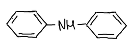
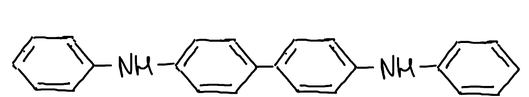
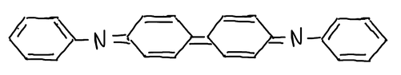
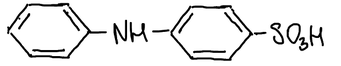
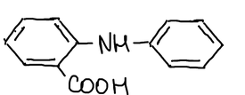
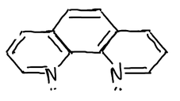

Способы фиксирования точки эквивалентности делят на **визуальные** и **инструментальные** (физико-химические). Визуальные способы в окислительно-восстановительном титровании бывают трёх типов:

1. безиндикаторное титрование;
2. титрование со специфическими индикаторами;
3. титрование с Red-Ox индикаторами.

## 1. Безиндикаторное титрование

**Безиндикаторное титрование** возможно, когда сама реакция сопровождается визуальным эффектом. Классический пример — **перманганатометрия**:

$$
5\mathrm{Fe^{2+}} + \mathrm{MnO_4^-} + 8\mathrm{H^+} \longrightarrow 5\mathrm{Fe^{3+}} + \mathrm{Mn^{2+}} + 4\mathrm{H_2O}
$$

Пока в растворе есть восстановитель, перманганат обесцвечивается; первая избыточная капля окрашивает раствор в розовый цвет. Конец титрования — **сохранение окраски в течение 30 секунд**. При титровании железа добавляют смесь Рейнгарда — Циммермана ($\mathrm{Mn^{2+}} + \mathrm{H_3PO_4} + \mathrm{H_2SO_4}$, см. [индуцированные реакции](../trebovaniya-i-skorost-reakcij/)).

С дихроматом так не получается:

$$
\mathrm{Cr_2O_7^{2-}} + 6\mathrm{Fe^{2+}} + 14\mathrm{H^+} \longrightarrow 6\mathrm{Fe^{3+}} + 2\mathrm{Cr^{3+}} + 7\mathrm{H_2O}
$$

Избыточная капля жёлтого дихромата не видна на зелёном фоне ионов $\mathrm{Cr^{3+}}$, поэтому безиндикаторный метод подходит только для перманганата.

## 2. Специфические индикаторы

**Специфические индикаторы** — индикаторы, в основе действия которых лежит специфическая реакция с одним из участников титрования. Пример — крахмал в **иодометрии**:

$$
\mathrm{I_2} + \text{крахмал} \longrightarrow \text{синее окрашивание}
$$

Синий адсорбционный комплекс образуется **только на холоду**.

**Определение восстановителей** — титрование раствором иода. Например, мышьяк(III) при $\mathrm{pH} = 8$:

$$
\mathrm{H_3AsO_3} + \mathrm{I_2} + \mathrm{H_2O} \longrightarrow \mathrm{H_3AsO_4} + 2\mathrm{I^-} + 2\mathrm{H^+}
$$

Крахмал добавляют сразу: при первой избыточной капле иода возникает резкая синяя окраска.

**Определение окислителей** — окислитель восстанавливают избытком иодида, а выделившийся иод оттитровывают тиосульфатом натрия:

$$
\mathrm{Cr_2O_7^{2-}} + 6\mathrm{I^-} + 14\mathrm{H^+} \longrightarrow 3\mathrm{I_2} + 2\mathrm{Cr^{3+}} + 7\mathrm{H_2O}
$$

$$
\mathrm{I_2} + 2\mathrm{Na_2S_2O_3} \longrightarrow \mathrm{Na_2S_4O_6} + 2\mathrm{NaI}
$$

Сначала основную массу иода оттитровывают до жёлтой окраски и только затем добавляют крахмал: при большой концентрации иода комплекс с крахмалом разрушается медленно, и конец титрования запаздывает.

🙏 Если вам нравится сайт, подпишитесь на наш <a href="https://t.me/+JfpTv9CJlwQ0MThi">🔗 Телеграм-канал</a>.

## 3. Red-Ox индикаторы

**Red-Ox индикаторы** — органические вещества, которые сами могут участвовать в окислительно-восстановительных реакциях, причём превращения, в которых они участвуют, сопровождаются изменением цвета:

$$
\underset{\text{окраска 1}}{\mathrm{Ox}} + n\bar e \rightleftarrows \underset{\text{окраска 2}}{\mathrm{Red}}, \qquad
E = E^\circ_\mathrm{Ind} - \frac{0{,}059}{n} \lg \frac{[\mathrm{Red}]}{[\mathrm{Ox}]}
$$

Глаз различает окраску одной формы, когда её концентрация примерно в 10 раз больше концентрации другой:

- $[\mathrm{Ox}]/[\mathrm{Red}] \ge 10$ — видна окраска окисленной формы;
- $\dfrac{1}{10} < [\mathrm{Ox}]/[\mathrm{Red}] < 10$ — смешанная окраска;
- $[\mathrm{Ox}]/[\mathrm{Red}] \le \dfrac{1}{10}$ — видна окраска восстановленной формы.

Подставив крайние отношения в уравнение Нернста, получаем **интервал перехода окраски**:

$$
E = E^\circ_\mathrm{Ind} \pm \frac{0{,}059}{n}
$$

Интервал узкий — всего $0{,}118/n$ В, поэтому индикатор подбирают так, чтобы $E^\circ_\mathrm{Ind}$ попадал в скачок титрования.

Требования к Red-Ox индикаторам:

- окраски окисленной и восстановленной форм должны заметно различаться;
- изменение цвета должно быть видно при малом количестве индикатора;
- индикатор должен реагировать при очень небольшом избытке окислителя или восстановителя, а его интервал перехода — быть как можно уже;
- индикатор должен быть устойчив к кислороду воздуха, $\mathrm{CO_2}$, свету.

### Дифениламин и его производные

**1838 г.** — впервые применено окислительно-восстановительное титрование, а именно перманганатометрия.

**1920 г.** — Кноп предложил первый Red-Ox индикатор, **дифениламин**. Он бесцветен, нерастворим в воде, растворяется в концентрированной серной кислоте.

При окислении две молекулы дифениламина необратимо превращаются в бесцветный **дифенилбензидин**:

$$
2\,(\mathrm{C_6H_5})_2\mathrm{NH} \longrightarrow \mathrm{C_6H_5NH{-}C_6H_4{-}C_6H_4{-}NHC_6H_5} + 2\mathrm{H^+} + 2\bar e
$$

Дифенилбензидин обратимо окисляется дальше, до **фиолетового** хиноидного соединения (дифенилбензидин фиолетовый), $E^\circ = +0{,}76$ В:

Кноп предложил при титровании железа добавлять смесь $\mathrm{H_3PO_4} + \mathrm{H_2SO_4}$. Фосфорная кислота связывает железо(III) в бесцветный комплекс, потенциал пары $\mathrm{Fe^{3+}/Fe^{2+}}$ снижается, и **нижняя ветвь кривой титрования опускается** — скачок расширяется и захватывает интервал перехода индикатора.

Недостатки дифениламина: 1) узкий интервал перехода; 2) растворитель — серная кислота. Метод совершенствовался, стали использовать производные:

- **дифениламиносульфоновая кислота** (используют натриевую соль), $E^\circ = +0{,}84$ В:

- **N-фенилантраниловая кислота**, $E^\circ = +1{,}08$ В:

**1951 г.** — в УрГУ разработан метод ванадатометрии.

### Ферроин

**1,10-фенантролин** имеет два атома азота с неподелёнными парами электронов, поэтому может образовывать комплексы:

Его комплекс с железом — **ферроин**:

$$
\underset{\text{синий}}{[\mathrm{Fe(Phen)_3}]^{3+}} + \bar e \rightleftarrows \underset{\text{красный}}{[\mathrm{Fe(Phen)_3}]^{2+}}, \qquad E^\circ = +1{,}06\ \text{В}
$$

## Индикаторная погрешность

Потенциал перехода индикатора $E_\text{Ind}$ обычно не совпадает с потенциалом точки эквивалентности, $E_\text{Ind} \ne E_\text{т.э.}$; чаще $E_\text{Ind} < E_\text{т.э.}$, и раствор оказывается недотитрованным.

Пусть в момент перехода окраски $x\,\%$ восстановителя осталось неоттитрованным, а $(100 - x)\,\%$ превратилось в окисленную форму. При концентрации $c$ моль/л

$$
\frac{[\mathrm{Red}]}{[\mathrm{Ox}]} = \frac{c\,x}{c\,(100 - x)} = \frac{x}{100 - x}
$$

$$
E_\text{Ind} = E^\circ_\text{опр} - \frac{0{,}059}{n} \lg \frac{[\mathrm{Red}]}{[\mathrm{Ox}]} = E^\circ_\text{опр} - \frac{0{,}059}{n} \lg \frac{x}{100 - x}
$$

$$
\frac{100 - x}{x} = 10^{\frac{(E_\text{Ind} - E^\circ_\text{опр})\, n}{0{,}059}}
$$

где $E^\circ_\text{опр}$ — стандартный потенциал пары определяемого вещества.

**Пример.** Титруем железо церием с индикатором $E_\text{Ind} = +0{,}84$ В; $E^\circ_{\mathrm{Fe^{3+}/Fe^{2+}}} = +0{,}77$ В:

$$
\frac{100 - x}{x} = 10^{\frac{0{,}84 - 0{,}77}{0{,}059}} \approx 15{,}4 \qquad\Rightarrow\qquad x \approx 6{,}1\ \%
$$

Погрешность $-6{,}1\ \%$: знак «−» означает, что раствор недотитрован. Добавка фосфорной кислоты, которая снижает потенциал пары железа, уменьшает эту погрешность.
