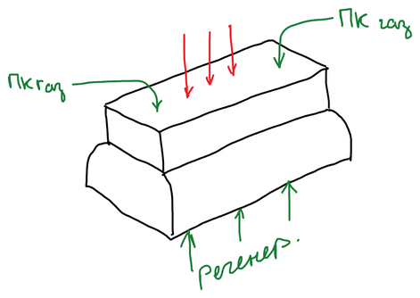

**Коксование** — переработка каменных углей нагреванием без доступа воздуха до температуры около 1000 °C. Основная задача — получение кокса для [доменного процесса](../../metallurgiya/proizvodstvo-chuguna/); попутно образуется множество ценных химических продуктов.

## Требования к коксу

| Показатель | Почему важен |
|---|---|
| Влажность | влага снижает теплотворную способность кокса |
| Зольность — не более 10 % | каждый лишний процент золы снижает выплавку чугуна примерно на 3 % |
| Содержание серы — 1–1,5 % | сера переходит в чугун как вредная примесь |

## Стадии процесса

| Температура | Что происходит |
|---|---|
| до 200 °C | уходит связанная влага, выделяются адсорбированные газы |
| около 500 °C | бурное разложение угольной массы: выделяются водород, метан и другие углеводороды, бензол и его гомологи; уголь переходит в пластическую массу, образуется полукокс |
| 700–1000 °C | кокс твердеет, а летучие углеводороды подвергаются деструкции |

## Камера коксования

Воздух в камеру попадать не должен, поэтому уголь нагревают через стенку. Коксовая печь — батарея узких камер, между которыми расположены обогревательные простенки; в них сжигают газ, а воздух для горения подогревают в регенераторах под камерами.

Размеры камеры: ширина — 40 см, длина — 10 м, высота — 5 м. Камера узкая, чтобы уголь прогревался по всей толщине.

Цикл работы: сначала через люки в своде загружают уголь; около 17 часов идёт пиролиз; затем к камере подгоняют вагон, коксовыталкиватель выталкивает в него раскалённый «коксовый пирог», и кокс тушат.

## Переработка прямого коксового газа

Из камер выходит **прямой коксовый газ** (ПКГ) — смесь водорода, углеводородов, аммиака и его солей, паров воды и смолы. Его перерабатывают по схеме:

| № | Аппарат | Что происходит |
|:-:|---|---|
| 1 | Накопительный резервуар (газосборник) | газ собирают и орошают водой |
| 2 | Холодильник | конденсируются вода и смола (в конденсат уходит практически вся смола) |
| 3 | Отстойник | смола и надсмольная вода разделяются по плотности |
| 4 | Электрофильтр | улавливаются остатки смолы и коксовая пыль |
| 5 | Насос | подаёт газ дальше по линии |
| 6 | Подогреватель | газ нагревают до 80 °C |
| 7 | Сатуратор | аммиак поглощают 20 %-й серной кислотой — получается сульфат аммония |
| 8 | Холодильник | газ охлаждают до комнатной температуры |
| 9 | Абсорбер (поглотительная башня) | минеральное масло поглощает бензол, его гомологи и сероуглерод |

После абсорбера остаётся **обратный коксовый газ** (ОКГ).

## Продукты и их использование

В линии переработки прямого коксового газа получают пять основных продуктов.

| Продукт | Аппарат | Состав и использование |
|---|:-:|---|
| Надсмольная вода | 3 | раствор солей аммония — хлорида, карбоната, цианида, сульфата, роданида. Её обрабатывают известковым молоком и выделяют аммиак — для производства соды или удобрений |
| Каменноугольная смола | 3 | вязкая, почти чёрная жидкость, содержащая около 300 веществ |
| Сульфат аммония | 7 | азотное удобрение |
| Сырой бензол | 9 | ректификацией выделяют сероуглерод, бензол, толуол и другие ароматические углеводороды |
| Обратный коксовый газ | 9 | водород, метан, оксид углерода — топливо для обогрева печей и источник водорода для [синтеза аммиака](../gazy-dlya-sinteza-ammiaka/) |

**Переработка смолы:**

1. обработка щелочами — в раствор переходят фенолы;
2. обработка кислотами — извлекаются пиридин, хинолин и другие азотистые основания;
3. ректификация под вакуумом — выделяют ароматические углеводороды (нафталин, антрацен, фенантрен);
4. остаток — **пёк**, почти чистый углерод; из него делают электроды.
