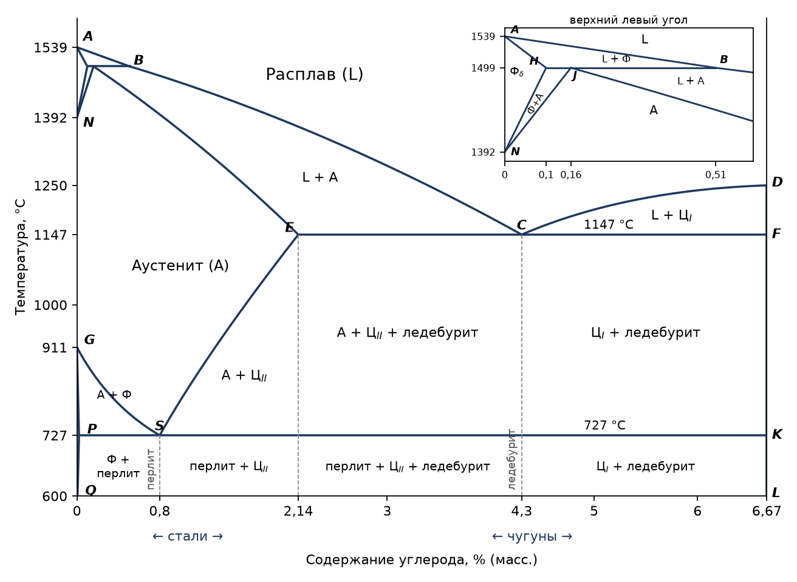

Диаграмма состояния железо — углерод — основа всей чёрной металлургии: по ней определяют, какие фазы есть в стали или чугуне данного состава при данной температуре, и выбирают режимы [термической обработки](../termicheskaya-obrabotka-stalej/). Практически важна её часть от чистого железа до цементита $\mathrm{Fe_3C}$ (6,67 % углерода).

## Компоненты

**1. Железо**, $T_\text{пл} = 1539\ ^\circ\mathrm{C}$. При нагревании железо дважды меняет кристаллическую решётку:

| Интервал температур | Модификация | Решётка |
|---|:-:|---|
| до 911 °C | $\alpha$ | объёмно-центрированная кубическая (ОЦК) |
| 911–1392 °C | $\gamma$ | гранецентрированная кубическая (ГЦК) |
| 1392–1539 °C | $\delta$ | снова ОЦК, как у $\alpha$ |

**2. Цементит** $\mathrm{Fe_3C}$ — карбид железа, $T_\text{пл} \approx 1250\ ^\circ\mathrm{C}$.

## Диаграмма

Линия $ABCD$ — **ликвидус** системы, линия $AHJECF$ — **солидус**. Узкая область вдоль оси температур левее линии $GPQ$ — феррит.

## Фазы и структурные составляющие

В системе существуют четыре фазы:

- **расплав** ($L$) — жидкий раствор углерода в железе; существует выше ликвидуса;
- **феррит** (Ф) — твёрдый раствор внедрения углерода в $\alpha$-железе с ОЦК-решёткой. В ОЦК-решётку углерод внедряется с трудом, поэтому растворимость его в феррите очень мала — не более 0,02 %. Области феррита — левее линий $AHN$ и $GPQ$;
- **аустенит** (А) — твёрдый раствор внедрения углерода в $\gamma$-железе с ГЦК-решёткой. В ГЦК-решётке растворимость углерода больше — до 2,14 %. Область существования — $NJESG$;
- **цементит** (Ц) — химическое соединение $\mathrm{Fe_3C}$; ему отвечает вертикаль $DFKL$.

Кроме фаз, на диаграмме выделяют две **структурные составляющие** — это не фазы, а смеси двух фаз:

- **ледебурит** — эвтектическая смесь аустенита и цементита;
- **перлит** — эвтектоидная смесь феррита и цементита.

## Нонвариантные превращения

Три горизонтальные линии на диаграмме — $HJB$, $ECF$ и $PSK$ — отвечают трём нонвариантным равновесиям. На каждой из них сосуществуют три фазы, и по [правилу фаз](../diagrammy-sostoyaniya-splavov/#правило-фаз) $C = 2 - 3 + 1 = 0$: превращение идёт при постоянной температуре и постоянных составах фаз. Индекс у фазы — точка диаграммы, задающая её состав.

**1499 °C, линия $HJB$** — перитектическое превращение: расплав взаимодействует с кристаллами феррита, образуя аустенит:

$$
L_B + \text{Ф}_H \longrightarrow \text{А}_J
$$

**1147 °C, линия $ECF$** — эвтектическое превращение: расплав кристаллизуется в смесь аустенита и цементита — **ледебурит**:

$$
L_C \longrightarrow \text{А}_E + \text{Ц}_F
$$

**727 °C, линия $PSK$** — эвтектоидное превращение: аустенит распадается на смесь феррита и цементита — **перлит**:

$$
\text{А}_S \longrightarrow \text{Ф}_P + \text{Ц}_K
$$

Эвтектоидное превращение похоже на эвтектическое, но исходная фаза в нём не расплав, а твёрдый раствор. Линия $ECF$ — линия эвтектики, линия $PSK$ — линия эвтектоида.

## Стали и чугуны

Граница между сталями и чугунами — точка $E$, предельная растворимость углерода в аустените:

- **стали** — сплавы, содержащие до 2,14 % углерода;
- **чугуны** — от 2,14 до 6,67 % углерода.

При нагревании любую сталь можно перевести в однофазное состояние — аустенит, а в структуре чугуна всегда есть ледебурит. Отсюда различие в свойствах: **сталь** прочная и пластичная, **чугун** твёрдый, но хрупкий.

| Свойство | Определение |
|---|---|
| Прочность | способность материала противостоять внешним нагрузкам (разрыв, кручение, сжатие) не разрушаясь; характеризуется пределом прочности |
| Пластичность | способность материала необратимо менять форму под нагрузкой (в том числе при больших сдвиговых деформациях) без разрушения |
| Твёрдость | способность материала противостоять проникновению в него другого тела; для минералов используют шкалу твёрдости Мооса |
| Хрупкость | способность материала разрушаться уже при очень малых деформациях |
