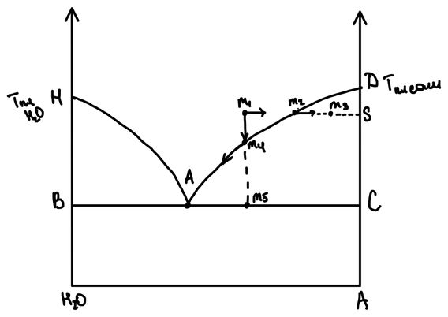

Для любой многокомпонентной системы, в состав которой входит вода, существует **диаграмма растворимости**. По ней определяют, какая соль и в каком количестве выпадет из раствора при испарении воды или охлаждении, — на этом основано производство солей: [хлорида калия](../../soli-kisloty-shchelochi/proizvodstvo-hlorida-kaliya/), нитрата калия, соды.

## Типы водно-солевых систем

| Система | Состав | Пример |
|---|---|---|
| Двухкомпонентная | вода + соль | $\mathrm{NaCl{-}H_2O}$ |
| Трёхкомпонентная | две соли с общим ионом и вода | $\mathrm{K^+,\ Na^+ \parallel Cl^-,\ H_2O}$   ($\mathrm{KCl{-}NaCl{-}H_2O}$) |
| Четырёхкомпонентная | три соли с общим ионом (обычно анионом) и вода | $\mathrm{K^+,\ Na^+,\ Mg^{2+} \parallel Cl^-,\ H_2O}$   ($\mathrm{KCl{-}NaCl{-}MgCl_2{-}H_2O}$) |
| Четырёхкомпонентная взаимная | две соли без общих ионов и вода | $\mathrm{K^+,\ Na^+ \parallel Cl^-,\ NO_3^-,\ H_2O}$   ($\mathrm{NaNO_3{-}KCl{-}H_2O}$) |

В записи ионного состава катионы отделяют от анионов двойной чертой. Систему называют **взаимной**, если соли не имеют общего иона и в растворе возможна реакция обмена: $\mathrm{NaNO_3 + KCl \rightleftarrows KNO_3 + NaCl}$.

## Двухкомпонентная система вода — соль

По горизонтали — состав: от чистой воды (слева) до чистой соли (справа); по вертикали — температура. Точка $H$ — температура плавления льда, точка $D$ — температура плавления соли.

| Элемент диаграммы | Смысл |
|---|---|
| $A$ | точка эвтектики |
| $HA$ | линия плавления льда |
| $AD$ | кривая растворимости соли |
| $HAD$ | ликвидус |
| $L$ (выше $HAD$) | область ненасыщенных растворов |
| $ADC$ | поле кристаллизации соли |
| $HAB$ | поле кристаллизации льда |
| ниже $BC$ | механическая смесь кристаллов соли и льда |

## Кристаллизация

Состояние системы в целом изображает **фигуративная точка**. Пусть исходный ненасыщенный раствор отвечает точке $m_1$. Выделить из него соль можно двумя способами.

**1. Изотермическая кристаллизация** — испарение воды при постоянной температуре. Доля соли в системе растёт, и фигуративная точка движется горизонтально вправо. В точке $m_2$ на кривой растворимости раствор стал насыщенным — появляются первые кристаллы соли. При дальнейшем испарении фигуративная точка уходит в поле кристаллизации соли, в точку $m_3$: система состоит из насыщенного раствора состава $m_2$ и твёрдой соли $S$.

**2. Политермическая кристаллизация** — охлаждение раствора. Состав системы не меняется, и фигуративная точка движется вертикально вниз. В точке $m_4$ она достигает кривой растворимости — начинает кристаллизоваться соль. При дальнейшем охлаждении соль продолжает выпадать, раствор беднеет ею, и его состав движется по линии ликвидуса от $m_4$ к точке эвтектики $A$. Когда фигуративная точка системы достигает эвтектической горизонтали (точка $m_5$), оставшийся раствор эвтектического состава замерзает целиком — в смесь кристаллов льда и соли.
