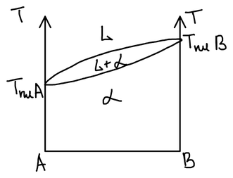
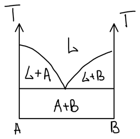
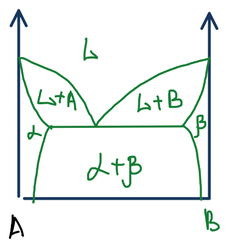
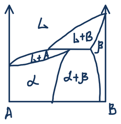
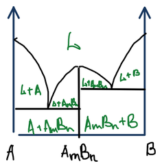
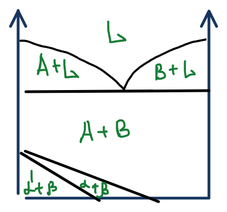

## Сплавы

**Сплав** — макроскопически однородный металлический материал, состоящий из смеси двух или большего числа химических элементов с преобладанием металлических компонентов.

Сплав может быть **твёрдым раствором**, а может быть **химическим соединением**. Твёрдые растворы бывают двух типов:

- **замещения** — атомы второго компонента занимают места в узлах решётки основного; условия образования — близость химических свойств и близость радиусов атомов;
- **внедрения** — небольшие атомы второго компонента располагаются в пустотах (междоузлиях) решётки.

От механической смеси сплав отличается тем, что механическую смесь можно разделить на исходные компоненты.

## Правило фаз

Для конденсированных систем — сплавов, где давление практически не влияет на равновесие, — **правило фаз Гиббса** записывают так:

$$
C = K - \Phi + 1
$$

где $C$ — число степеней свободы, $K$ — число компонентов, $\Phi$ — число фаз, а единица отвечает единственному внешнему параметру — температуре.

Для двухкомпонентного сплава $C = 3 - \Phi$: в однофазной области можно независимо менять и температуру, и состав ($C = 2$), в двухфазной — что-то одно ($C = 1$), а три фазы сосуществуют только при строго определённых температуре и составах ($C = 0$, нонвариантное равновесие).

При чтении диаграмм состояния пользуются двумя принципами:

- **принцип непрерывности** — при переходе через линию на диаграмме состояния количество фаз меняется на единицу;
- **принцип соответствия** — каждому полю на диаграмме состояния соответствует своя физическая модель (свой набор фаз).

🙏 Если вам нравится сайт, подпишитесь на наш <a href="https://t.me/+JfpTv9CJlwQ0MThi">🔗 Телеграм-канал</a>.

## Типы диаграмм состояния

На всех диаграммах по горизонтали отложен состав — от чистого компонента A до чистого B, по вертикали — температура; $L$ — расплав, $\alpha$ и $\beta$ — твёрдые растворы на основе A и B.

### 1. Неограниченная растворимость в жидком и твёрдом состоянии

Компоненты смешиваются в любых соотношениях и в расплаве, и в кристалле. Верхняя линия «сигары» — ликвидус, нижняя — солидус; между ними расплав сосуществует с кристаллами твёрдого раствора $\alpha$.

### 2. Неограниченная растворимость в жидкой фазе и полная нерастворимость в твёрдой

Из расплава кристаллизуются чистые компоненты. Две ветви ликвидуса сходятся в **эвтектической точке**; ниже эвтектической горизонтали сплав — механическая смесь кристаллов A и B.

### 3. Неограниченная растворимость в жидкой фазе и ограниченная — в твёрдой

Возможны два варианта — с эвтектикой и с перитектикой:

Вблизи осей появляются области твёрдых растворов: $\alpha$ — B в A и $\beta$ — A в B. Между ними лежит двухфазная область $\alpha + \beta$. С расплавом здесь сосуществуют уже не чистые компоненты, а твёрдые растворы, то есть поля под ликвидусом — это $L + \alpha$ и $L + \beta$.

### 4. С химическим соединением

Компоненты образуют соединение $\mathrm{A}_m\mathrm{B}_n$. Его вертикаль делит диаграмму на две простые эвтектические: $\mathrm{A} - \mathrm{A}_m\mathrm{B}_n$ и $\mathrm{A}_m\mathrm{B}_n - \mathrm{B}$.

### 5. С полиморфным превращением в твёрдой фазе

Один из компонентов существует в нескольких кристаллических модификациях, и ниже солидуса на диаграмме появляются дополнительные линии — границы превращения одной модификации в другую. Важнейший пример — [диаграмма железо — цементит](../diagramma-zhelezo-cementit/): железо при нагревании дважды меняет тип решётки.
