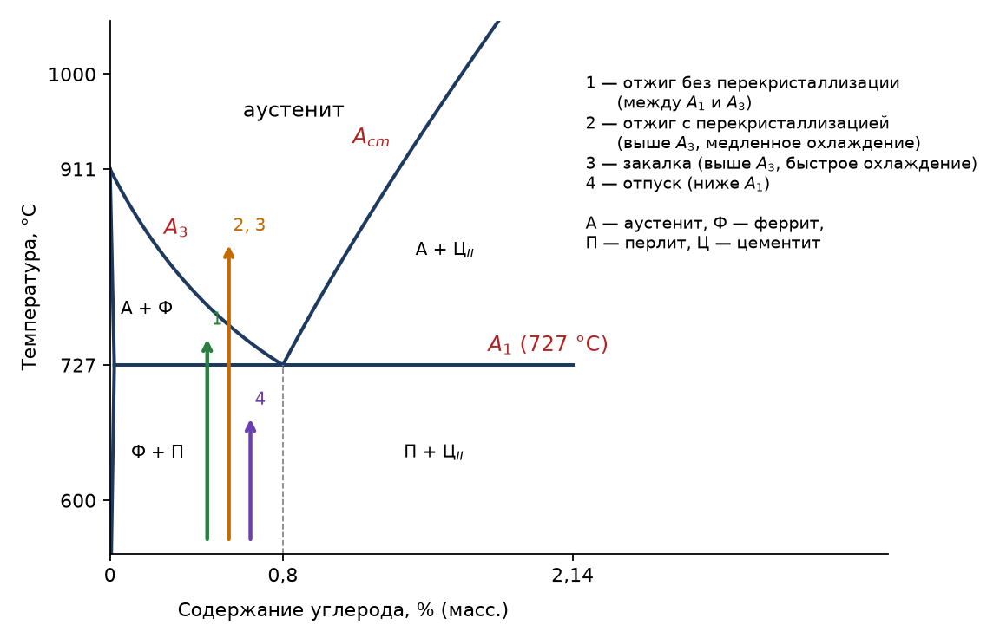

## Термическая обработка

**Термическая обработка** — нагрев стали до определённой температуры, выдержка и последующее охлаждение с той или иной скоростью.

**Цель** термической обработки — изменить структуру стали, чтобы получить и зафиксировать нужные свойства, либо снять внутренние механические напряжения.

Режимы термообработки выбирают по [диаграмме железо — цементит](../diagramma-zhelezo-cementit/). Температуры превращений в стали называют **критическими точками**:

- $A_1$ — линия $PSK$ (727 °C): ниже неё аустенита нет, при нагреве выше неё перлит превращается в аустенит;
- $A_3$ — линия $GS$: выше неё сталь, содержащая меньше 0,8 % углерода, состоит из одного аустенита.

## Четыре вида термической обработки

**1. Отжиг без перекристаллизации** — нагрев стали выше $A_1$, но ниже $A_3$ (примерно до 780 °C — розово-красное свечение) с последующим медленным охлаждением.

Что при этом происходит? Феррит и цементит частично образуют аустенит, который при охлаждении снова распадается на феррит и цементит. Так снимаются механические напряжения внутри материала.

**2. Отжиг с перекристаллизацией** — нагрев выше $A_3$ с последующим медленным охлаждением. Сталь целиком переходит в аустенит и при охлаждении кристаллизуется заново; получается равновесная мелкозернистая структура с очень хорошими механическими свойствами.

**3. Закалка** — нагрев выше $A_3$, но с быстрым охлаждением. При резком охлаждении аустенит не успевает распасться на равновесную смесь феррита и цементита: углерод остаётся в решётке железа, и образуется пересыщенный твёрдый раствор — мартенсит. Закалённая сталь обладает высокой твёрдостью, но хрупка, и в ней велики внутренние напряжения.

**4. Отпуск** — нагрев закалённой стали ниже $A_1$ с последующим медленным охлаждением; применяется в совокупности с закалкой. Цель — снять внутренние механические напряжения после закалки.

## Химико-термическая обработка

Металлы и сплавы способны растворять различные элементы, поэтому при повышенных температурах можно создавать поверхностные слои изменённого состава. **Химико-термическая обработка (ХТО)** — изменение не только структуры, но и состава поверхностного слоя материала путём внедрения различных добавок, чтобы получить определённые поверхностные (функциональные) свойства: твёрдость, износостойкость, жаростойкость, стойкость к коррозии.

По сравнению с обычной термообработкой ХТО менее производительна, но имеет преимущества:

- результат не зависит от внешней формы детали;
- свойства поверхности и сердцевины могут различаться очень сильно;
- можно устранить последствия перегрева деталей.

**Однокомпонентное насыщение:**

| Процесс | Насыщающий элемент | Что образуется в слое |
|---|---|---|
| Цементация | углерод | карбиды |
| Азотирование | азот | нитриды |
| Алитирование | алюминий | интерметаллиды |
| Хромирование | хром | интерметаллиды |
| Борирование | бор | бориды |
| Силицирование | кремний | силициды |

**Многокомпонентное насыщение:**

- нитроцементация (цианирование) — насыщение азотом и углеродом;
- боро- и хромоалитирование — насыщение бором или хромом вместе с алюминием;
- хромосилицирование — насыщение хромом и кремнием.

Важнейшие процессы:

- **Цементация** даёт твёрдый поверхностный слой при мягкой сердцевине. В твёрдом карбюризаторе (древесный уголь с добавкой карбонатов) процесс ведут при 950–1050 °C: за 4–6 часов образуется слой около 1 мм. Наиболее массовая — газовая цементация в среде $\mathrm{CO}$, $\mathrm{CH_4}$ и других углеводородов при 930–970 °C. Содержание углерода в слое доводят до 1,1–1,2 %, после чего деталь закаливают.
- **Азотирование** ведут в закрытой печи в атмосфере аммиака при 500–600 °C. Температура низкая, поэтому процесс медленный — слой 0,5 мм растёт 30–40 часов, — зато размеры детали почти не меняются, и азотировать можно готовые детали, а не заготовки.
- **Цианирование** — одновременное насыщение углеродом и азотом из сред, содержащих цианид-ионы; слой хорошо сопротивляется износу и коррозии.
- **Диффузионная металлизация** — насыщение поверхности металлами ($\mathrm{Cr}$, $\mathrm{Al}$, $\mathrm{Mo}$, $\mathrm{Ti}$, $\mathrm{V}$, $\mathrm{W}$) и неметаллами ($\mathrm{Si}$, $\mathrm{B}$) из твёрдой, жидкой или газовой фазы при 900–1100 °C. Алитирование и хромирование повышают жаростойкость стали, борирование — износостойкость.

## Способы нанесения покрытий

1. **Диффузионное насыщение** — из твёрдой, жидкой или газовой фазы.
2. **Адгезионные** — плазменное напыление, ионная имплантация, металлизация в вакууме.
3. **Электрохимические** — осаждение металлов и сплавов, анодирование.
4. **Химические** — оксидирование, хроматирование, фосфатирование, контактное вытеснение.

Пример функционального покрытия — нитрид титана $\mathrm{TiN}$: твёрдый, износостойкий и золотистого цвета. Его наносят и на инструмент, и как декоративное покрытие «под золото» — например, на купола и отделочные панели.
