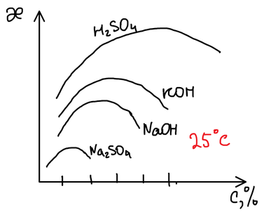
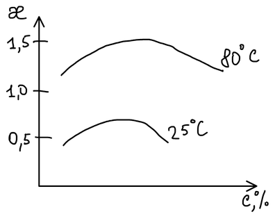
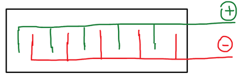
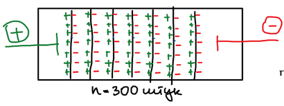

Электролиз воды известен с 1789 года. Сегодня это способ получения особо чистых водорода и кислорода, а попутно — тяжёлой воды.

## Электролит

Чистую воду для электролиза не используют: её удельная электропроводность слишком мала, $\varkappa \sim 10^{-8}\ \text{Ом}^{-1}\,\text{см}^{-1}$. В воду добавляют электролит, ионы которого сами на электродах не разряжаются:

$$
\mathrm{H_2SO_4,\quad NaOH,\quad KOH,\quad Na_2SO_4,\quad Na_2CO_3}
$$

Порядок разряда частиц определяется их потенциалами:

- на **катоде** в первую очередь восстанавливаются частицы с наиболее положительным потенциалом;
- на **аноде** в первую очередь окисляются частицы с наименьшим (наименее положительным) потенциалом.

## Электролиз в растворе серной кислоты

В растворе присутствуют ионы кислоты и вода; $[\mathrm{H^+}] \approx 2\ \text{М}$:

$$
\mathrm{H_2SO_4 \longrightarrow 2H^+ + SO_4^{2-}}, \qquad \mathrm{H_2O \rightleftarrows H^+ + OH^-}
$$

**Катод (−):**

$$
\mathrm{2H^+ + 2\bar{e} \longrightarrow H_2\!\uparrow}
$$

**Анод (+).** Возможные процессы:

| Процесс | $E^\circ$, В |
|---|:-:|
| $\mathrm{4OH^- - 4\bar{e} \longrightarrow O_2 + 2H_2O}$ | 0,40 |
| $\mathrm{2H_2O - 4\bar{e} \longrightarrow O_2 + 4H^+}$ | 1,23 |
| $\mathrm{2SO_4^{2-} - 2\bar{e} \longrightarrow S_2O_8^{2-}}$ | 2,01 |

Гидроксид-ионов в кислом растворе практически нет, а сульфат-ион окисляется труднее всего, поэтому на аноде окисляется вода. Суммарно:

$$
\mathrm{H_2O \xrightarrow{\;\text{электролиз},\ H_2SO_4\;} H_2 + \tfrac{1}{2}O_2}
$$

В растворе серной кислоты электролизу подвергается только вода.

## Электролиз в растворе щёлочи

$$
\mathrm{NaOH \longrightarrow Na^+ + OH^-}, \qquad \mathrm{H_2O \rightleftarrows H^+ + OH^-}
$$

**Анод (+):**

$$
\mathrm{2OH^- - 2\bar{e} \longrightarrow \tfrac{1}{2}O_2 + H_2O}
$$

**Катод (−).** Возможные процессы:

| Процесс | $E^\circ$, В |
|---|:-:|
| $\mathrm{Na^+ + \bar{e} \longrightarrow Na^0}$ | −2,71 |
| $\mathrm{2H_2O + 2\bar{e} \longrightarrow H_2 + 2OH^-}$ | −0,83 |

Потенциал восстановления воды намного положительнее, поэтому на катоде выделяется водород, а натрий остаётся в растворе. Суммарный процесс тот же:

$$
\mathrm{H_2O \xrightarrow{\;\text{электролиз},\ NaOH\;} H_2 + \tfrac{1}{2}O_2}
$$

🙏 Если вам нравится сайт, подпишитесь на наш <a href="https://t.me/+JfpTv9CJlwQ0MThi">🔗 Телеграм-канал</a>.

## Тяжёлая вода

Электролизу подвергается преимущественно обычная вода $\mathrm{^1H_2O}$, а тяжёлая вода $\mathrm{D_2O}$, которой в природной воде около 0,02 %, разлагается гораздо медленнее и накапливается в электролите. Её выделяют как побочный продукт и используют в ядерной и термоядерной технике. Электролизёр мощностью 1 МВт производит около 100 кг тяжёлой воды в год.

## Расход электричества и воды

На разложение одного моля воды нужно два фарадея электричества:

$$
\mathrm{H_2O} + 2F = \mathrm{H_2 + \tfrac{1}{2}O_2}
$$

$$
1F = 96\,500\ \text{Кл} = 96\,500\ \text{А}\cdot\text{с}, \qquad
2F = \frac{193\,000\ \text{А}\cdot\text{с}}{3600\ \text{с/ч}} = 53{,}6\ \text{А}\cdot\text{ч}
$$

Один моль водорода занимает 22,4 л, поэтому на 1 м³ водорода требуется

$$
Q = 53{,}6 \cdot \frac{1000}{22{,}4} \approx 2393\ \text{А}\cdot\text{ч}
$$

и расходуется воды

$$
m(\mathrm{H_2O}) = \frac{18\ \text{г} \cdot 1000\ \text{л}}{22{,}4\ \text{л}} \approx 804\ \text{г}
$$

Напряжение разложения с учётом перенапряжения на электродах — 2,13 В, а рабочее напряжение на ванне, включающее падение напряжения в растворе, — около 3 В.

## Электропроводность электролита

Чтобы потери напряжения в растворе были меньше, электропроводность электролита должна быть максимальной. У каждого электролита зависимость $\varkappa$ от концентрации проходит через максимум:

Серная кислота проводит ток лучше всех, но материалы электродов в ней неустойчивы, поэтому в промышленности работают со щелочными растворами, концентрации которых отвечают максимуму электропроводности: **17 %** $\mathrm{NaOH}$ или **29 %** $\mathrm{KOH}$.

С повышением температуры электропроводность растёт, поэтому электролиз ведут в горячем растворе:

## Типы электролизёров

**Ванны с монополярными электродами.** Все аноды присоединены к одной шине, все катоды — к другой, то есть ячейки включены параллельно (на рисунке — вид сверху):

Напряжение на ванне малое, а ток большой. Удельная производительность таких ванн невелика.

**Ванны с биполярными электродами.** Ток подводят только к двум крайним электродам, а между ними стоят проводящие перегородки. В электрическом поле перегородки поляризуются: одна сторона каждой работает как катод, другая — как анод.

Ячейки оказываются включёнными последовательно: при числе перегородок $n \approx 300$ напряжение на ванне достигает сотен вольт (≈ 300 В), зато ток небольшой. Такие электролизёры компактнее и производительнее.
