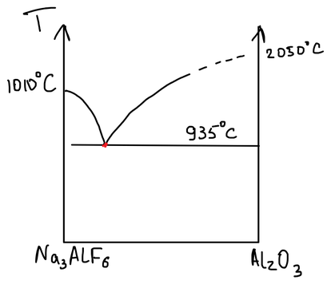
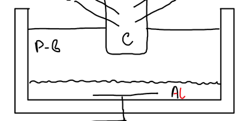

Алюминий — «крылатый металл»: сочетание лёгкости и прочности делает его основным материалом аэрокосмической промышленности; широко применяют его и в электротехнике.

## Сырьё

Алюминиевые руды:

1. **Бокситы** — руда, состоящая из гидроксидов алюминия, оксидов железа и кремния: $\mathrm{Al_2O_3}$ (≈ 60 %), $\mathrm{Fe_2O_3}$, $\mathrm{TiO_2}$, $\mathrm{SiO_2}$ (≈ 10 %).
2. **Нефелин** — алюмосиликат калия и натрия $\mathrm{(Na,K)AlSiO_4}$.
3. **Глины** — алюмосиликаты.

Металл получают электролизом, и для него нужны два исходных вещества: **глинозём** $\mathrm{Al_2O_3}$ и **криолит** $\mathrm{Na_3AlF_6}$.

## Получение глинозёма

### Метод Байера

Метод заключается в переработке бокситов растворением в гидроксиде натрия. Оксид алюминия переходит в раствор в виде алюмината:

$$
\mathrm{Al_2O_3 + 2NaOH + 3H_2O = 2Na[Al(OH)_4]}
$$

Оксиды железа и титана не растворяются и остаются в осадке. Мешает кремнезём: он тоже реагирует со щёлочью,

$$
\mathrm{SiO_2 + 2NaOH = Na_2SiO_3 + H_2O}
$$

а затем силикат и алюминат образуют нерастворимый алюмосиликат натрия $\mathrm{Na_2O \cdot Al_2O_3 \cdot 2SiO_2}$ — с ним теряются и алюминий, и щёлочь. Поэтому метод Байера годится только для бокситов с малым содержанием кремния.

Раствор алюмината разбавляют водой, и алюминат гидролизуется:

$$
\mathrm{Na[Al(OH)_4] \xrightarrow{\;+H_2O,\ t\;} Al(OH)_3\!\downarrow + NaOH}
$$

Щёлочь возвращают на растворение боксита, а гидроксид прокаливают — получается продукт, глинозём:

$$
\mathrm{2Al(OH)_3 \xrightarrow{\;t\;} Al_2O_3 + 3H_2O}
$$

### Метод спекания

Этим способом перерабатывают любое сырьё, так как лишний кремний уводят добавлением известняка. Метод заключается в спекании сырья с содой и известью.

При температуре около 700 °C оксиды алюминия и железа реагируют с содой в твёрдой фазе:

$$
\begin{aligned}
\mathrm{Al_2O_3 + Na_2CO_3} &= \mathrm{2NaAlO_2 + CO_2\!\uparrow} \\
\mathrm{Fe_2O_3 + Na_2CO_3} &= \mathrm{2NaFeO_2 + CO_2\!\uparrow}
\end{aligned}
$$

Около 900 °C феррит натрия отдаёт натрий оксиду алюминия, кремнезём связывает алюминат в алюмосиликат, а оксид кальция разрушает алюмосиликат, возвращая алюминат:

$$
\begin{aligned}
\mathrm{2NaFeO_2 + Al_2O_3} &= \mathrm{2NaAlO_2 + Fe_2O_3} \\
\mathrm{2SiO_2 + 2NaAlO_2} &= \mathrm{Na_2O \cdot Al_2O_3 \cdot 2SiO_2} \\
\mathrm{2CaO + Na_2O \cdot Al_2O_3 \cdot 2SiO_2} &= \mathrm{2NaAlO_2 + 2CaSiO_3}
\end{aligned}
$$

Получается **спек** — смесь алюмината натрия и силиката кальция. Спек измельчают и **выщелачивают** водой. Выщелачивание отличается от растворения тем, что в раствор переходят только отдельные компоненты — алюминат и примесь силиката натрия. Силикат осаждают известью в виде малорастворимого алюмосиликата кальция, а очищенный раствор алюмината подвергают **карбонизации** — продувают углекислым газом:

$$
\mathrm{Na[Al(OH)_4] + CO_2 = Al(OH)_3\!\downarrow + NaHCO_3}
$$

Гидроксид алюминия прокаливают до глинозёма, а раствор соды возвращают в процесс (раньше так попутно получали соду).

## Получение криолита

Природного криолита $\mathrm{Na_3AlF_6}$ мало, его синтезируют из плавикового шпата $\mathrm{CaF_2}$:

$$
\begin{aligned}
\mathrm{CaF_2\,(тв) + H_2SO_4\,(конц)} &= \mathrm{CaSO_4 + 2HF\!\uparrow} \\
\mathrm{6HF + Al(OH)_3} &= \mathrm{H_3[AlF_6] + 3H_2O} \\
\mathrm{2H_3[AlF_6] + 3Na_2CO_3} &= \mathrm{2Na_3[AlF_6] + 3H_2O + 3CO_2\!\uparrow}
\end{aligned}
$$

Криолит отфильтровывают и сушат. Примесь кремнезёма в плавиковом шпате вредна — на неё расходуется фтороводород:

$$
\mathrm{SiO_2 + 4HF = SiF_4 + 2H_2O}, \qquad \mathrm{SiF_4 + 2HF = H_2SiF_6}
$$

## Электролиз криолит-глинозёмного расплава

Глинозём — огнеупор, $T_\text{пл} = 2050\ ^\circ\mathrm{C}$; вести электролиз его расплава невозможно. Поэтому глинозём растворяют в расплавленном криолите: криолит плавится при 1010 °C, а эвтектика системы $\mathrm{Na_3AlF_6 - Al_2O_3}$ — при 935 °C.

Состав электролита: $\mathrm{Na_3AlF_6}$, $\mathrm{Al_2O_3}$, $\mathrm{AlF_3}$, $\mathrm{NaF}$; добавки улучшают смачивание анода расплавом. В расплаве присутствуют четыре вида ионов:

$$
\mathrm{Na^+,\quad Al^{3+},\quad F^-,\quad AlO_2^-}
$$

Катодом служит угольная подина ванны, анодом — угольный блок, погружённый в расплав сверху. Анод самообжигающийся: анодную массу из измельчённого углеродного материала прессуют, и она спекается прямо в ванне, по мере того как анод сгорает и опускается. Плотность жидкого алюминия больше плотности расплава, $d_\mathrm{Al} > d_\text{р-в}$, поэтому металл собирается на дне, под слоем электролита, который защищает его от окисления.

Режим электролиза: температура ≈ 970 °C, напряжение 4–6 В, сила тока — порядка 100 000 А.

| Электрод | Процесс |
|---|---|
| Катод (−) | $\mathrm{Al^{3+} + 3\bar{e} \longrightarrow Al^0}$ |
| Анод (+) | $\mathrm{2AlO_2^- - 2\bar{e} \longrightarrow Al_2O_3 + \tfrac{1}{2}O_2}$ |

Оксид алюминия на аноде регенерируется, но тут же снова растворяется в электролите.

**Побочные процессы:**

- выделяющийся кислород окисляет угольный анод, $\mathrm{2C + O_2 = 2CO}$, — анод расходуется;
- при недостатке глинозёма на аноде разряжаются фторид-ионы: $\mathrm{2F^- - 2\bar{e} \longrightarrow F_2\!\uparrow}$;
- металл частично растворяется в электролите с образованием ионов низшей валентности: $\mathrm{Al^{3+} + 2Al \longrightarrow 3Al^+}$ — это снижает выход по току.

## Очистка алюминия

1. **Хлорная продувка.** Через расплав алюминия барботируют сухой хлор:

   $$
   \mathrm{2Al + 3Cl_2 = 2AlCl_3}
   $$

   Хлорид алюминия летуч; его пузырьки, всплывая, уносят из металла растворённые газы и взвешенные примеси.

2. **Электролитическое рафинирование** трёхслойным методом. В ванне три жидких слоя, расположенных по плотности: внизу — очищаемый алюминий (анод), в середине — электролит ($\mathrm{BaCl_2}$, $\mathrm{AlF_3}$, $\mathrm{NaF}$), наверху — чистый алюминий (катод). Алюминий растворяется на аноде и осаждается на катоде, а примеси остаются в нижнем слое или в электролите.
