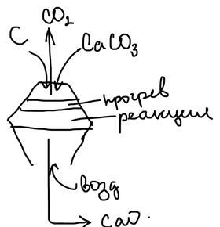

Сода — один из самых многотоннажных продуктов неорганической технологии. **Кальцинированная сода** — безводный карбонат натрия $\mathrm{Na_2CO_3}$, **кристаллическая сода** — его декагидрат $\mathrm{Na_2CO_3 \cdot 10H_2O}$.

## Теоретические основы

Соду получают через гидрокарбонат натрия, который осаждают из раствора по обменной реакции:

$$
\mathrm{NaCl + NH_4HCO_3 \rightleftarrows NaHCO_3\!\downarrow + NH_4Cl}
$$

Теоретическая основа способа — такая же четверная взаимная система, как и в производстве [нитрата калия](../poluchenie-nitrata-kaliya/): $\mathrm{Na^+,\ NH_4^+ \parallel Cl^-,\ HCO_3^-,\ H_2O}$. Из четырёх солей наименее растворим гидрокарбонат натрия — он и выпадает в осадок.

### Расчёт выхода по диаграмме растворимости

Диаграмму системы изображают квадратом: по одной стороне откладывают долю ионов $\mathrm{NH_4^+}$ в сумме катионов, по другой — долю ионов $\mathrm{HCO_3^-}$ в сумме анионов. Наибольший выход гидрокарбоната достигается, когда маточный раствор после кристаллизации отвечает точке $b$ на границе поля кристаллизации $\mathrm{NaHCO_3}$. Ионный состав раствора в этой точке (в долях):

| Ион | $\mathrm{Na^+}$ | $\mathrm{NH_4^+}$ | $\mathrm{Cl^-}$ | $\mathrm{HCO_3^-}$ |
|---|:-:|:-:|:-:|:-:|
| Доля | 0,18 | 0,82 | 0,82 | 0,18 |

Пусть из $x$ молей $\mathrm{NaCl}$ и $y$ молей $\mathrm{NH_4HCO_3}$ получается $V$ молей осадка $\mathrm{NaHCO_3}$ и 1 моль (по сумме солей) раствора состава $b$:

$$
x\,\mathrm{NaCl} + y\,\mathrm{NH_4HCO_3} + z\,\mathrm{H_2O} = V\,\mathrm{NaHCO_3} + 1\ \text{моль раствора состава } b
$$

Баланс по каждому иону даёт систему уравнений:

$$
\begin{aligned}
\mathrm{Na^+}&: & x &= V + 0{,}18 \\
\mathrm{Cl^-}&: & x &= 0{,}82 \\
\mathrm{NH_4^+}&: & y &= 0{,}82 \\
\mathrm{HCO_3^-}&: & y &= V + 0{,}18
\end{aligned}
$$

Отсюда $x = y = 0{,}82$ и

$$
V = 0{,}82 - 0{,}18 = 0{,}64
$$

Степень использования натрия (и аммиака) — доля исходной соли, перешедшая в продукт:

$$
U = \frac{V}{x} = \frac{0{,}64}{0{,}82} \approx 0{,}78
$$

то есть даже в лучшем случае около 22 % хлорида натрия остаётся в маточном растворе.

## Стадии производства

### 1. Получение углекислого газа и извести

Известняк обжигают в шахтной печи в смеси с коксом. Разложение известняка эндотермично, необходимое тепло даёт горение кокса:

$$
\begin{aligned}
\mathrm{CaCO_3} &\xrightarrow{\;t\;} \mathrm{CaO + CO_2} - Q \\
\mathrm{C + O_2} &= \mathrm{CO_2} + Q
\end{aligned}
$$

Углекислый газ идёт на карбонизацию, а известь гасят водой и получают известковое молоко — оно потребуется для регенерации аммиака:

$$
\mathrm{CaO + H_2O = Ca(OH)_2}
$$

### 2. Приготовление и очистка рассола

Из каменной соли (галита) готовят насыщенный раствор $\mathrm{NaCl}$ и отстаивают его от глины.

### 3. Аммонизация

Рассол насыщают аммиаком (и частично углекислым газом, который приходит вместе с аммиаком со стадии регенерации). Цель — получить в растворе карбонат аммония. Основная реакция стадии — растворение аммиака:

$$
\mathrm{NH_3 + H_2O \rightleftarrows NH_4OH}
$$

$$
\mathrm{2NH_3 + CO_2 + H_2O = (NH_4)_2CO_3}
$$

### 4. Карбонизация

В полученный раствор, содержащий хлорид натрия и карбонат аммония, барботируют углекислый газ; карбонат аммония переходит в гидрокарбонат, и идёт основная реакция — осаждение гидрокарбоната натрия:

$$
\begin{aligned}
\mathrm{(NH_4)_2CO_3 + CO_2 + H_2O} &= \mathrm{2NH_4HCO_3} \\
\mathrm{NaCl + NH_4HCO_3} &\rightleftarrows \mathrm{NaHCO_3\!\downarrow + NH_4Cl}
\end{aligned}
$$

Побочные реакции связаны с избытком аммиака — он переводит гидрокарбонаты обратно в карбонаты и снижает выход:

$$
\begin{aligned}
\mathrm{2NH_4OH + 2NaHCO_3} &= \mathrm{(NH_4)_2CO_3 + Na_2CO_3 + 2H_2O} \\
\mathrm{NH_4OH + NH_4HCO_3} &= \mathrm{(NH_4)_2CO_3 + H_2O}
\end{aligned}
$$

### 5. Фильтрование

Осадок гидрокарбоната натрия отделяют на фильтре и промывают.

### 6. Регенерация аммиака

Аммиак — дорогой реагент, и его возвращают в процесс. В маточном растворе он содержится в двух формах:

| Форма | Соединения | Как выделяют |
|---|---|---|
| Полусвязанный аммиак | $\mathrm{(NH_4)_2CO_3}$, $\mathrm{NH_4HCO_3}$ | нагреванием до 70 °C |
| Связанный аммиак | $\mathrm{NH_4Cl}$ | известковым молоком |

$$
\begin{aligned}
\mathrm{(NH_4)_2CO_3} &\xrightarrow{\;t\;} \mathrm{2NH_3\!\uparrow + CO_2\!\uparrow + H_2O} \\
\mathrm{NH_4HCO_3} &\xrightarrow{\;t\;} \mathrm{NH_3\!\uparrow + CO_2\!\uparrow + H_2O} \\
\mathrm{2NH_4Cl + Ca(OH)_2} &= \mathrm{2NH_3\!\uparrow + 2H_2O + CaCl_2}
\end{aligned}
$$

Аммиак и углекислый газ возвращаются на аммонизацию. Отход производства — хлорид кальция; его используют как противогололёдный реагент для зимних дорог и как осушитель.

### 7. Кальцинация

Гидрокарбонат натрия прокаливают и получают кальцинированную соду:

$$
\mathrm{2NaHCO_3 \xrightarrow{\;140\,^\circ C\;} Na_2CO_3 + CO_2\!\uparrow + H_2O}
$$

Выделяющийся углекислый газ возвращают на карбонизацию.

## Аппараты

| Стадия | Аппарат |
|---|---|
| Обжиг известняка | шахтная печь |
| Получение известкового молока | гаситель извести |
| Аммонизация | аммонизационная (абсорбционная) колонна |
| Карбонизация | карбонизационная колонна; газ подаётся компрессором через промывные колонны |
| Отделение $\mathrm{NaHCO_3}$ | вакуум-фильтр |
| Регенерация аммиака | регенерационная (дистилляционная) колонна |
| Кальцинация | печь кальцинации |
