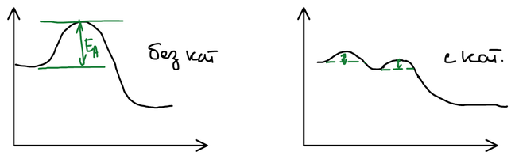

Азотную кислоту используют для получения нитрующей смеси, бездымного пороха и взрывчатых веществ, лекарственных препаратов и — в наибольших количествах — азотных удобрений.

**Принцип производства:** контактное окисление аммиака с последующей абсорбцией оксидов азота водой. Процесс включает три стадии:

$$
\mathrm{NH_3 \longrightarrow NO \longrightarrow NO_2 \longrightarrow HNO_3}
$$

## Контактное окисление аммиака

Аммиак может окисляться кислородом по трём направлениям:

$$
\begin{aligned}
\mathrm{4NH_3 + 3O_2} &= \mathrm{2N_2 + 6H_2O} + Q \\
\mathrm{4NH_3 + 4O_2} &= \mathrm{2N_2O + 6H_2O} + Q \\
\mathrm{4NH_3 + 5O_2} &= \mathrm{4NO + 6H_2O} + Q
\end{aligned}
$$

Без катализатора идёт первая реакция — до азота; вторая — промежуточная. Нужная, третья, реакция идёт только в присутствии катализатора. Катализаторами служат оксиды переходных металлов (марганца, железа, кобальта), но лучший катализатор — платина. Чистая платина мягкая, поэтому используют её сплав с родием ($\mathrm{Pt{-}Rh}$, 10 % родия). Прочность необходима, так как катализатор выполнен в виде сеток из тонкой проволоки — в реактор укладывают пакет до 20 сеток.

$$
\mathrm{4NH_3\,(г) + 5O_2\,(г) \longrightarrow 4NO\,(г) + 6H_2O\,(г)} + Q, \qquad K_p \sim 10^{60}
$$

Реакция практически необратима, поэтому смещать равновесие не нужно, а нужно увеличивать скорость — повышать концентрации реагирующих веществ за счёт увеличения давления. Реакция сильно экзотермична и протекает в автотермическом режиме: катализатор разогревается теплом самой реакции. Выход оксида азота(II) $\eta \approx 90\ \%$.

По стехиометрии на 1 моль аммиака нужно 1,25 моль кислорода, но практическая кривая выхода лежит ниже теоретической, и высокий выход достигается только при избытке кислорода.

### Механизм действия катализатора

Катализатор заменяет один высокий энергетический барьер несколькими низкими — реакция идёт через стадии:

1. на катализаторе адсорбируется кислород;
2. образуется поверхностный комплекс с аммиаком;
3. комплекс разлагается — образуются продукты.

🙏 Если вам нравится сайт, подпишитесь на наш <a href="https://t.me/+JfpTv9CJlwQ0MThi">🔗 Телеграм-канал</a>.

## Окисление оксида азота(II)

$$
\mathrm{2NO + O_2 \longrightarrow 2NO_2}
$$

Это самая медленная стадия производства. Реакция необычна: с ростом температуры её скорость падает, поэтому нитрозные газы после реактора охлаждают (примерно до 80 °C).

В газе одновременно присутствуют несколько оксидов азота — их смесь обозначают $\mathrm{NO}_x$:

$$
\mathrm{NO_2}, \qquad \mathrm{N_2O_3}\ (\mathrm{NO + NO_2}), \qquad \mathrm{N_2O_4}
$$

## Абсорбция оксидов азота водой

$$
\begin{aligned}
\mathrm{2NO_2 + H_2O} &= \mathrm{HNO_2 + HNO_3} \\
\mathrm{N_2O_3 + H_2O} &= \mathrm{2HNO_2} \\
\mathrm{N_2O_4 + H_2O} &= \mathrm{HNO_2 + HNO_3}
\end{aligned}
$$

Оксид азота(IV) диспропорционирует: азот из степени окисления +4 переходит в +3 и +5. Азотистая кислота неустойчива и разлагается:

$$
\mathrm{3HNO_2 = HNO_3 + 2NO + H_2O}
$$

Суммарно:

$$
\mathrm{3NO_2 + H_2O = 2HNO_3 + NO}
$$

За один акт в кислоту переходит только $\tfrac{2}{3}$ (66 %) оксида азота(IV), а треть возвращается в виде $\mathrm{NO}$. Его снова окисляют кислородом до $\mathrm{NO_2}$ и снова поглощают — и так много раз:

$$
\frac{2}{3} + \frac{2}{3}\cdot\frac{1}{3} + \frac{2}{3}\cdot\frac{1}{9} + \dots \longrightarrow 1
$$

Поэтому абсорбцию ведут в нескольких последовательных колоннах, в которых чередуются поглощение и доокисление.

## Технологическая схема

| № | Аппарат | Назначение |
|:-:|---|---|
| 1 | Смеситель | приготовление аммиачно-воздушной смеси |
| 2 | Реактор (контактный аппарат) | окисление аммиака на платиновых сетках |
| 3 | Котёл-утилизатор | охлаждение нитрозных газов, получение пара |
| 4 | Первичный абсорбер | получается 30 %-я кислота |
| 5 | Абсорбционные колонны (6–7 штук) | получается 45–50 %-я кислота |
| 6 | Окислительная башня | доокисление остатка оксидов до $\mathrm{NO_2}$ |
| 7 | Абсорбер нитрозных газов | щелочное поглощение раствором соды |

После абсорбционных колонн в газе остаётся около 1 % оксидов азота. Их максимально окисляют до $\mathrm{NO_2}$ в окислительной башне и поглощают раствором соды; получаются нитрит и нитрат натрия — сырьё для [производства нитрата калия](../poluchenie-nitrata-kaliya/).

При повышенном давлении степень абсорбции увеличивается, и можно получить более концентрированную кислоту.

## Концентрированная азотная кислота

Концентрированную кислоту получают прямым синтезом — из жидкого тетраоксида диазота, воды и кислорода под давлением:

$$
\mathrm{2N_2O_4 + 2H_2O + O_2 \rightleftarrows 4HNO_3} + Q
$$
