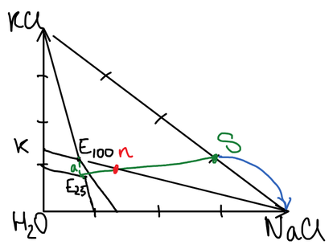
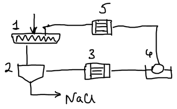

Хлорид калия — калийное удобрение и сырьё для получения других солей калия, например [нитрата калия](../poluchenie-nitrata-kaliya/).

## Сырьё

| Минерал | Состав |
|---|---|
| Сильвинит | $\mathrm{KCl \cdot NaCl}$ (смесь сильвина и галита) |
| Карналлит | $\mathrm{KCl \cdot MgCl_2 \cdot 6H_2O}$ |

Основное сырьё — сильвинит, содержащий кроме хлоридов калия и натрия примесь глины. Задача производства — разделить две очень похожие соли. Для этого есть два способа: флотация и галургия.

## Флотационный способ

Разделение основано на разной смачиваемости частиц: с помощью реагентов-собирателей частицы нужного минерала делают гидрофобными, они прилипают к пузырькам воздуха и всплывают в пену. Процесс ведут в насыщенном растворе солей, чтобы соли не растворялись.

1. **Коллективная флотация.** Измельчённую руду ($\mathrm{KCl \cdot NaCl}$ и глина) отделяют от глины. Флотореагент — ФР-2; для осаждения глинистого шлама добавляют полиакриламид. Глина уходит в хвосты.
2. **Селективная флотация.** Смесь солей разделяют с помощью собирателя — солянокислого октадециламина $\mathrm{C_{18}H_{37}NH_2 \cdot HCl}$, который закрепляется на кристаллах $\mathrm{KCl}$. Хлорид калия уходит в пену, хлорид натрия остаётся в хвостах.

| Достоинства | Недостатки |
|---|---|
| процесс идёт при низких температурах | низкая чистота продукта |
| легко поддаётся автоматизации | большое количество хвостов |

🙏 Если вам нравится сайт, подпишитесь на наш <a href="https://t.me/+JfpTv9CJlwQ0MThi">🔗 Телеграм-канал</a>.

## Галургический способ

**Галургия** — разделение солей растворением и кристаллизацией. В основе способа лежат свойства тройной системы $\mathrm{KCl - NaCl - H_2O}$: растворимость $\mathrm{KCl}$ при нагревании сильно растёт, а растворимость $\mathrm{NaCl}$ почти не меняется.

На диаграмме вершина прямого угла — вода, по осям отложено содержание $\mathrm{KCl}$ и $\mathrm{NaCl}$. Для каждой температуры изотерма растворимости состоит из двух ветвей, пересекающихся в **эвтонической точке** $E$ — это раствор, насыщенный обеими солями. Поле $K - \mathrm{KCl} - E_{100}$ двухфазное: это поле кристаллизации $\mathrm{KCl}$, в нём раствор находится в равновесии с кристаллами хлорида калия.

Цикл состоит из двух операций.

**1. Кристаллизация.** Раствор состава $E_{100}$ насыщен при 100 °C обеими солями. При охлаждении до 25 °C точка $E_{100}$ оказывается в поле кристаллизации хлорида калия, и он начинает кристаллизоваться; хлорид натрия при этом остаётся в растворе. Состав раствора смещается в точку $a$ — получается маточный раствор.

**2. Растворение.** Маточный раствор снова нагревают до 100 °C. Теперь он не насыщен по хлориду калия, и, если привести его в соприкосновение с твёрдым сильвинитом (точка $S$), из сильвинита начнёт растворяться $\mathrm{KCl}$. Хлорид натрия не растворяется — по нему раствор насыщен — и остаётся в осадке. Раствор возвращается к составу $E_{100}$, и цикл повторяется.

Соотношение между количествами сильвинита и раствора находят по правилу рычага. Смесь раствора $a$ с сильвинитом $S$ изображается точкой $n$ на отрезке $aS$:

$$
\frac{m_\text{сильвинита}}{m_\text{раствора}} = \frac{an}{nS}
$$

Выход за один цикл невелик: из 100 г раствора кристаллизуется всего около 9 г $\mathrm{KCl}$. Поэтому процесс и строят как замкнутый цикл с большим количеством циркулирующего раствора.

## Схема производства

1. **Шнековый растворитель** («мясорубка»): измельчённый сильвинит перемешивается с горячим раствором.
2. **Приёмный бункер**: от горячего раствора отделяют нерастворившийся $\mathrm{NaCl}$.
3. **Трубчатый теплообменник**: раствор охлаждается до 25 °C, кристаллизуется $\mathrm{KCl}$.
4. **Барабанный вакуум-фильтр**: отделяют выпавший хлорид калия.
5. **Нагреватель** (такой же трубчатый теплообменник): оставшийся маточный раствор нагревается до 100 °C и возвращается в растворитель.
