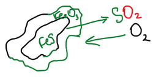
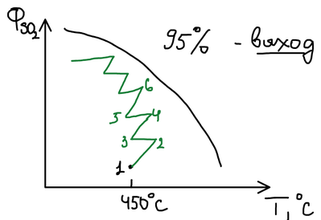
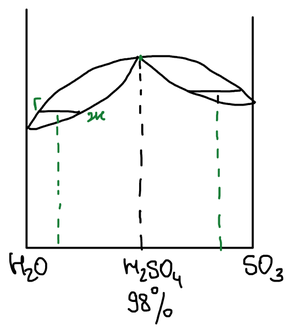

Серная кислота — самый многотоннажный продукт химической промышленности. Её применяют в производстве удобрений и слабых кислот, спиртов, для травления металлов, как электролит в свинцовых аккумуляторах и как кислую среду во множестве процессов.

**Контактный метод** включает три стадии:

$$
\mathrm{S\ (FeS_2) \xrightarrow{\;I\;} SO_2 \xrightarrow{\;II\;} SO_3 \xrightarrow{\;III\;} H_2SO_4}
$$

## I. Получение диоксида серы

**А. Сжигание серы.**

$$
\mathrm{S + O_2 \xrightarrow{\;t\;} SO_2}
$$

Твёрдая сера в печи плавится и испаряется, и горит она уже в газовой фазе, в токе воздуха. Газ получается чистым, без каталитических ядов.

**Б. Обжиг пирита.**

$$
\mathrm{4FeS_2 + 11O_2 = 2Fe_2O_3 + 8SO_2}
$$

Реакция гетерогенная: частица колчедана обгорает снаружи, покрываясь слоем оксида железа, через который кислород должен диффундировать внутрь, а диоксид серы — наружу.

Поэтому колчедан измельчают, а обжигают в печах с развитой поверхностью контакта — печах пылевидного обжига и печах кипящего слоя (частицы находятся в псевдоожиженном состоянии).

Воздух содержит 21 % кислорода, и на 11 объёмов кислорода получается 8 объёмов $\mathrm{SO_2}$, поэтому концентрация диоксида серы в обжиговом газе не может превышать

$$
\frac{8}{11} \cdot 21\ \% \approx 15\ \%
$$

**В. Отходящие газы цветной металлургии** (обжиг и конвертирование сульфидных руд, см. [производство меди](../../metallurgiya/proizvodstvo-medi/)) — перспективное сырьё: диоксид серы здесь побочный продукт. В мире в атмосферу выбрасывается вдвое больше $\mathrm{SO_2}$, чем нужно для всего мирового производства серной кислоты; но улавливать, например, сернистый газ от сжигания каменного угля экономически невыгодно.

## Очистка от каталитических ядов

Обжиговый газ содержит пыль и соединения селена, теллура, мышьяка, сурьмы — они присутствуют в сульфидной руде и отравляют катализатор. Газ очищают от пыли в циклонах и электрофильтрах и промывают серной кислотой в промывных башнях.

Очистка опирается на закономерность изменения окислительно-восстановительных свойств в ряду элементов 16-й (VIA) группы в степени окисления +4: от серы к теллуру восстановительные свойства ослабевают, а окислительные усиливаются. Поэтому диоксид серы восстанавливает диоксиды селена и теллура до простых веществ, которые выпадают в шлам:

$$
\mathrm{SeO_2 + 2SO_2 + 2H_2O = Se\!\downarrow + 2H_2SO_4}
$$

🙏 Если вам нравится сайт, подпишитесь на наш <a href="https://t.me/+JfpTv9CJlwQ0MThi">🔗 Телеграм-канал</a>.

## II. Контактное окисление диоксида серы

$$
\mathrm{2SO_2 + O_2 \rightleftarrows 2SO_3} + Q
$$

Реакция обратимая, экзотермическая, идёт с уменьшением объёма. Способы увеличения выхода:

1. **Температура.** По равновесию выгодна низкая температура, по скорости — высокая; оптимальный интервал — 450–550 °C.
2. **Давление** — повышение давления смещает равновесие вправо.
3. **Избыток воздуха** — увеличение концентрации кислорода.
4. **Катализатор** — ускоряет достижение равновесия. Платина дорога и быстро отравляется, поэтому используют соединения ванадия.

| Катализатор | Расшифровка | Состав |
|---|---|---|
| БАВ | барий-алюмо-ванадиевый | $\mathrm{K_2O \cdot SiO_2 \cdot BaO \cdot Al_2O_3 \cdot V_2O_5}$ |
| СВД | сульфованадат на диатомите | соединения ванадия и калия на диатомитовом носителе |

### Полочный контактный аппарат

Катализатор лежит слоями на нескольких полках (обычно пяти). В слое идёт реакция, и газ разогревается; между полками стоят теплообменники, в которых он охлаждается. Холодная исходная смесь (100–200 °C) проходит по трубам в межполочном пространстве: тепло передаётся через стенку, исходная смесь нагревается, а прореагировавший газ охлаждается. На первую полку газ приходит с температурой около 450 °C.

На графике равновесная степень превращения падает с ростом температуры. Процесс изображается ломаной: на каждой полке степень превращения и температура растут (отрезки 1–2, 3–4, 5–6), пока газ не приблизится к равновесию; в теплообменнике газ охлаждается без изменения состава (отрезки 2–3, 4–5). Так, шаг за шагом, достигают выхода около 95 %.

### Двойное контактирование — двойная абсорбция

Современный метод — **ДК–ДА**. После первых полок, когда превращено около 70 % диоксида серы, газ отправляют на промежуточную абсорбцию: триоксид серы поглощают, то есть отводят продукт и смещают равновесие. Оставшийся газ снова пропускают через три оставшиеся полки и снова направляют на абсорбцию. Выход достигает 99,5 %.

## III. Абсорбция триоксида серы

$$
\mathrm{SO_3 + H_2O = H_2SO_4}
$$

Чем поглощать, видно из диаграммы жидкость — пар системы $\mathrm{H_2O - SO_3}$:

- над водой и разбавленной кислотой пар состоит в основном из воды; триоксид серы реагирует с ним в газовой фазе, и получается **кислотный туман**, который почти не улавливается;
- над кислотой крепче 98 % (олеумом) в паре присутствует сам $\mathrm{SO_3}$, и поглощение будет неполным;
- азеотропная **98 %-я серная кислота** имеет наименьшее давление пара — ею и поглощают.

Кислоту в абсорбере разбавляют водой, поддерживая концентрацию 98 %.
