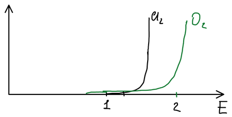
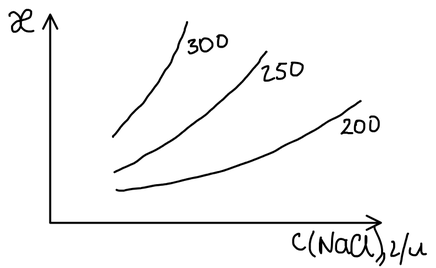
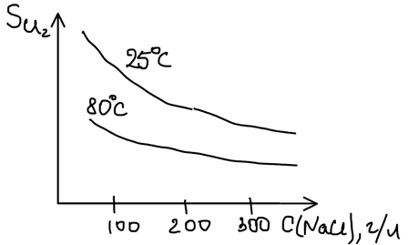
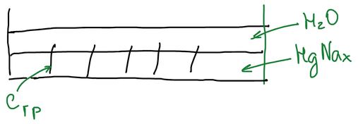

Электролизом раствора поваренной соли одновременно получают три продукта — гидроксид натрия, хлор и водород:

$$
\mathrm{2NaCl + 2H_2O \xrightarrow{\;\text{электролиз}\;} 2NaOH + Cl_2\!\uparrow + H_2\!\uparrow}
$$

| Продукт | Применение |
|---|---|
| $\mathrm{NaOH}$ | щелочной гидролиз жиров (мыловарение), производство искусственного шёлка |
| $\mathrm{Cl_2}$ | очистка воды; хлорорганические растворители (дихлорэтан); синтетический каучук; хлорирующий обжиг в производстве переходных металлов; отравляющие вещества |

Существуют два варианта электрохимического способа:

1. электролиз с **твёрдым катодом** — проще и экологичнее;
2. электролиз с **жидким (ртутным) катодом** — даёт более качественную щёлочь.

Сырьё — природная каменная соль. Из неё готовят раствор хлорида натрия и очищают его от солей жёсткости — примесей кальция и магния — содой и гашёной известью.

## Электролиз с твёрдым катодом

$$
(-)\ \mathrm{Fe \mid NaCl\ (р\text{-}р) \mid C}\ (+)
$$

В растворе присутствуют ионы соли и воды:

$$
\mathrm{NaCl \longrightarrow Na^+ + Cl^-}, \qquad \mathrm{H_2O \rightleftarrows H^+ + OH^-}
$$

**Катод (−).** Возможные процессы:

| Процесс | $E$, В |
|---|:-:|
| $\mathrm{Na^+ + \bar{e} \longrightarrow Na}$ | −2,71 |
| $\mathrm{2H^+ + 2\bar{e} \longrightarrow H_2}$ (pH 7) | −0,41 |
| $\mathrm{2H_2O + 2\bar{e} \longrightarrow H_2 + 2OH^-}$ | −0,83 |

Натрий из водного раствора на железе не выделяется. Должен разряжаться водород, но ионов $\mathrm{H^+}$ в нейтральном растворе очень мало, поэтому разряжаются молекулы воды — у катода выделяется водород и накапливается щёлочь.

**Анод (+).** Возможные процессы:

| Процесс | $E$, В | Перенапряжение $\eta$ на графите, В |
|---|:-:|:-:|
| $\mathrm{2Cl^- - 2\bar{e} \longrightarrow Cl_2}$ | 1,36 | 0,25 |
| $\mathrm{4OH^- - 4\bar{e} \longrightarrow O_2 + 2H_2O}$ | 0,40 | 1,09 |
| $\mathrm{2H_2O - 4\bar{e} \longrightarrow O_2 + 4H^+}$ (pH 7) | 0,82 | 1,09 |

По равновесным потенциалам на аноде должен был бы выделяться кислород. Но реальный потенциал разряда складывается из равновесного потенциала и перенапряжения:

$$
E_p = E + \eta
$$

Для хлора $E_p = 1{,}36 + 0{,}25 = 1{,}61\ \text{В}$, а для кислорода из воды $E_p = 0{,}82 + 1{,}09 = 1{,}91\ \text{В}$ — кислород выделяется труднее, и на графитовом аноде разряжаются хлорид-ионы.

🙏 Если вам нравится сайт, подпишитесь на наш <a href="https://t.me/+JfpTv9CJlwQ0MThi">🔗 Телеграм-канал</a>.

### Условия электролиза

Электролизу подвергают насыщенный раствор $\mathrm{NaCl}$ — 310 г/л — при 80 °C. Чем концентрированнее и горячее раствор, тем выше его электропроводность и тем меньше в нём растворяется хлора:

**Анод** — графитовый. Чтобы он медленнее разрушался, его пропитывают льняным маслом: плёнка защищает графит.

**Диафрагма.** Продукты электролиза взаимодействуют друг с другом (водород с хлором, хлор со щёлочью), поэтому анодное пространство отделяют от катодного пористой перегородкой — диафрагмой. Она должна быть химически устойчивой; её делают из асбеста (это силикат) и прикрепляют к катоду со стороны анода.

**Катод** — стальная сетка с развитой поверхностью.

**Электролит проточный.** Рассол подают в анодное пространство, он просачивается через диафрагму к катоду, и из катодного пространства вытекает раствор щёлочи.

Побочные процессы:

- хлор частично растворяется в воде, $\mathrm{Cl_2 + H_2O \rightleftarrows HCl + HClO}$, и продукты этой реакции окисляются на аноде;
- щёлочь из катодного пространства диффундирует в анодное за счёт разности концентраций. Поток электролита направлен навстречу и препятствует диффузии, повышая выход щёлочи.

Продукт получается загрязнённым: вытекающий раствор содержит наряду с $\mathrm{NaOH}$ много хлорида натрия (его концентрация снижается с 310 лишь до 180 г/л). Раствор упаривают; хлорид натрия при этом кристаллизуется, и его отделяют.

## Электролиз с ртутным катодом

$$
(-)\ \mathrm{Hg \mid NaCl\ (р\text{-}р) \mid C}\ (+)
$$

На аноде идут те же процессы — выделяется хлор:

$$
\mathrm{2Cl^- - 2\bar{e} \longrightarrow Cl_2}
$$

На катоде всё меняется. Перенапряжение выделения водорода на ртути очень велико — 1,1 В, а натрий выделяется на ртути почти без перенапряжения (0,1 В), к тому же ртуть растворяет натрий, образуя амальгаму, и это сдвигает потенциал его выделения в положительную сторону. В результате на ртутном катоде разряжаются ионы натрия:

$$
\mathrm{Na^+ + \bar{e} + {\mathit{x}}\,Hg \longrightarrow NaHg_{\mathit{x}}}
$$

**Электролизёр.** Ртуть течёт тонким слоем по наклонному дну ванны. Наклон устанавливают так, чтобы скорость течения ртути была такой, при которой натрия в амальгаме накапливается всего 0,2 %. Хлор отводят сверху, а амальгама перетекает во второй аппарат; освободившуюся ртуть насос возвращает в электролизёр.

**Разлагатель.** Амальгаму разлагают горячей водой:

$$
\mathrm{2NaHg_{\mathit{x}} + 2H_2O \xrightarrow{\;t\;} 2NaOH + H_2\!\uparrow + 2{\mathit{x}}\,Hg}
$$

Сама по себе реакция идёт медленно — из-за того же перенапряжения водорода на ртути. Идея состоит в том, чтобы поместить в амальгаму вещество, на котором перенапряжение выделения водорода минимально, — графит:

Получается короткозамкнутый гальванический элемент: на амальгаме натрий переходит в раствор, на графите выделяется водород. Энергия элемента тратится на нагрев воды.

Щёлочь, полученная по этому способу, — наилучшего качества: она не содержит хлорида натрия, и раствор сразу получается концентрированным. Главный недостаток способа — работа с ртутью.
