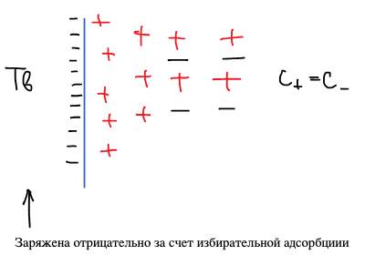
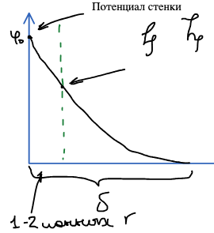
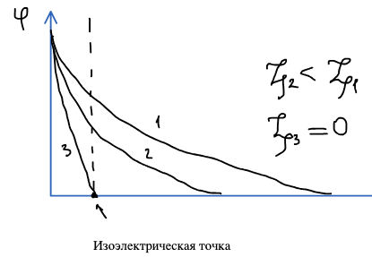
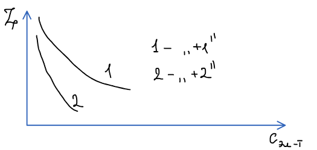
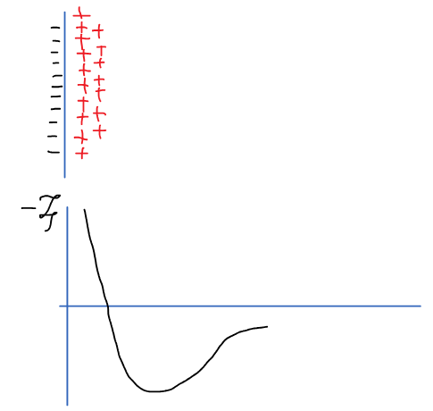
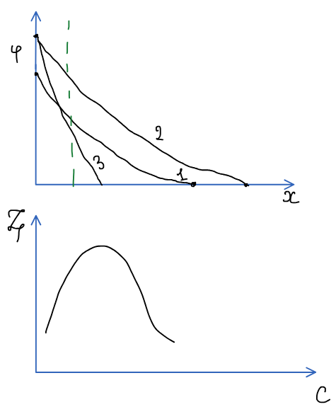

На границе твердое тело — раствор электролита поверхность частицы заряжается, и вокруг нее образуется **двойной электрический слой** (ДЭС). С ним связаны электрокинетические явления, строение коллоидной мицеллы, а в конечном счете — устойчивость и [коагуляция](../koagulyaciya/) коллоидных систем.

## Строение двойного электрического слоя

Поверхность твердого тела заряжается, например, отрицательно за счет избирательной адсорбции ионов из раствора. Противоионы (здесь — катионы) притягиваются к поверхности; часть их прочно удерживается у стенки, остальные распределены в растворе диффузно, и их концентрация убывает с расстоянием, пока не станет $c_+ = c_-$.

С образованием двойного электрического слоя возникает скачок потенциала. **Потенциал стенки** $\varphi_0$ — работа по перемещению единичного заряда с твердой стенки в нейтральный раствор. Прямыми методами этот потенциал определить нельзя.

**Дзета-потенциал** $\zeta$ — потенциал плоскости скольжения (границы между плотной и диффузной областями заряда): работа по перемещению заряда с плоскости скольжения в нейтральный раствор. Этот потенциал определяет все электрокинетические явления, и его можно определить экспериментально.

С ростом концентрации электролита диффузный слой сжимается, и дзета-потенциал уменьшается ($\zeta_2 < \zeta_1$). Когда весь диффузный слой «уходит» за плоскость скольжения, $\zeta_3 = 0$ — это **изоэлектрическая точка**.

Толщина ДЭС уменьшается:

- с ростом концентрации противоиона;
- с увеличением заряда противоиона;
- с увеличением радиуса противоиона (крупные слабо гидратированные ионы сильнее притягиваются к поверхности).

🙏 Если вам нравится сайт, подпишитесь на наш <a href="https://t.me/+JfpTv9CJlwQ0MThi">🔗 Телеграм-канал</a>.

## Определение дзета-потенциала

### По скорости электрофореза

**Электрофорез** — перемещение частиц дисперсной фазы относительно неподвижной дисперсионной среды при наложении постоянного электрического поля. Дзета-потенциал связан со скоростью этого движения, $\zeta = f(u)$, где $u$ — линейная скорость движения частиц дисперсной фазы.

Вывод (уравнение Гельмгольца — Смолуховского; в конспекте — «уравнение Перрена») опирается на предпосылки:

- ДЭС рассматривается как плоский конденсатор;
- толщина слоя $\delta$ очень мала, но конечна;
- электрический ток не влияет на распределение заряда.

Частицы движутся под действием электрической силы

$$
F_1 = \frac{V}{l}\,q,
$$

где $V$ — разность потенциалов, $l$ — расстояние между электродами, $q$ — заряд плоского конденсатора. Заряд равен $q = C\zeta$, где емкость плоского конденсатора (на единицу площади)

$$
C = \frac{\varepsilon\varepsilon_0}{\delta},
$$

$\varepsilon$ — диэлектрическая проницаемость среды, $\varepsilon_0 = 8{,}85\cdot 10^{-12}$ Ф/м. Тогда

$$
F_1 = \frac{V}{l}\,\frac{\varepsilon\varepsilon_0}{\delta}\,\zeta .
$$

Движению препятствует сила вязкого трения

$$
F_2 = \eta S\,\frac{du}{dz},
$$

где $\eta$ — вязкость, $S$ — сечение, $du/dz$ — градиент скорости в направлении, перпендикулярном движению. На единицу площади в слое толщиной $\delta$: $F_2 = \eta\,u/\delta$. В условиях равновесия силы равны:

$$
\frac{V\varepsilon\varepsilon_0}{l\delta}\,\zeta = \eta\,\frac{u}{\delta}
\quad\Rightarrow\quad
\zeta = \frac{\eta u l}{V\varepsilon\varepsilon_0} .
$$

### По скорости электроосмоса

**Электроосмос** — движение дисперсионной среды относительно неподвижной дисперсной фазы (например, пористой перегородки) в электрическом поле. Здесь измеряют объемную скорость течения жидкости $v$, $\zeta = f(v)$:

$$
v = uS, \qquad u = \frac{v}{S}, \qquad V = IR = I\,\frac{1}{\varkappa}\,\frac{l}{S},
$$

где $I$ — сила тока, $\varkappa$ — удельная электропроводность. Подставляя в формулу для $\zeta$:

$$
\zeta = \frac{\eta v l \varkappa S}{S I l\,\varepsilon\varepsilon_0} = \frac{\eta v \varkappa}{I\varepsilon\varepsilon_0} .
$$

## Влияние электролитов на двойной электрический слой

Электролиты делятся на две группы:

- **Индифферентные** — не способны достраивать решетку твердого тела и не изменяют $\varphi_0$-потенциал.
- **Неиндифферентные** — достраивают решетку твердого тела и изменяют $\varphi_0$-потенциал стенки.

### Индифферентные электролиты

Одно- и двухзарядные ионы влияют на ДЭС не сильно: с ростом концентрации дзета-потенциал плавно падает, для двухзарядного противоиона — быстрее.

Если в растворе присутствуют ионы высокой валентности (+3, +4) и большого размера — $\text{Al}^{3+}$, $\text{Th}^{4+}$, $\text{CNS}^-$, — их адсорбция очень велика. Они притягиваются не только за счет электрических, но и за счет адсорбционных сил и могут адсорбироваться в сверхэквивалентных количествах — это **специфическая адсорбция**.

При специфической адсорбции дзета-потенциал изменяет не только величину, но и знак (перезарядка).

### Неиндифферентные электролиты

Ион, способный достраивать решетку, того же знака, что и потенциалопределяющие ионы, увеличивает $\varphi_0$. Поэтому при малых концентрациях дзета-потенциал растет, но дальнейшее увеличение концентрации сжимает двойной электрический слой, и $\zeta$ проходит через максимум.

Если ион, способный встраиваться в решетку, имеет противоположный знак, происходит полная перестройка ДЭС: $\varphi_0$ уменьшается до нуля, а затем растет с обратным знаком. Происходит полная перезарядка и внутренней, и внешней частей двойного электрического слоя.

Все эти эффекты важны для [коагуляции](../koagulyaciya/) коллоидных систем.
