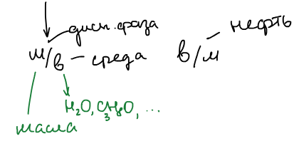
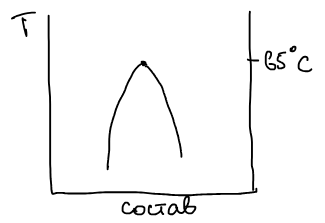
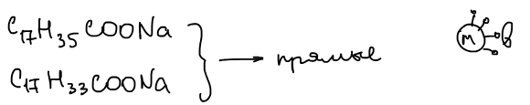
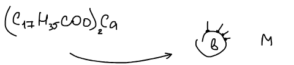
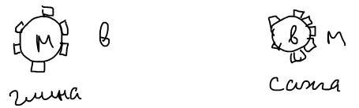

**Эмульсия** — дисперсная система, в которой и дисперсионная среда, и дисперсная фаза являются жидкостями. Разрушаются эмульсии слиянием капель — [коалесценцией](../koagulyaciya/).

## Классификация эмульсий

**Прямые и обратные.** В обозначении сначала пишут дисперсную фазу, затем среду:

- **прямые** эмульсии «масло в воде» (м/в): капли масла в воде или другой полярной жидкости ($\text{H}_2\text{O}$, $\text{C}_3\text{H}_7\text{OH}$…);
- **обратные** эмульсии «вода в масле» (в/м), например нефть.

**По концентрации дисперсной фазы:**

| Эмульсия | Доля дисперсной фазы | Особенности |
|---|---|---|
| Разбавленная | ≤ 0,1 % | расстояние между каплями превышает их размеры, капли не взаимодействуют |
| Концентрированная | 0,1–74 % | капли взаимодействуют между собой |
| Желатинированная | > 74 % | капли упакованы очень плотно, дисперсионная среда — тонкая прослойка |

74 % — доля объема, занимаемая шарами одинакового размера при плотнейшей упаковке; при большей концентрации капли деформируются.

## Получение эмульсий

Эмульсии, как и другие дисперсные системы, бывают лиофильными и лиофобными.

### 1. Лиофильные (критические) эмульсии

Лиофильные — так называемые **критические эмульсии**, которые самопроизвольно образуются очень близко к критической температуре расслоения бинарной системы жидкость — жидкость. Например, вблизи верхней критической температуры системы фенол — вода (около 65 °C) образуется высокодисперсная эмульсия фенола в воде.

Межфазное натяжение в таких системах очень мало, $\sigma \sim 1\cdot 10^{-4}$ Дж/м², размер капель $r < 100$ нм. Рост поверхностной энергии компенсируется возрастанием энтропии ([условие образования лиофильных систем](../poluchenie-i-ochistka/)), поэтому такие эмульсии устойчиво существуют вблизи критической температуры. Их отличают высокая дисперсность, термодинамическая устойчивость и узкий температурный интервал существования.

### 2. Лиофобные эмульсии

Лиофобные эмульсии получают методом диспергирования: перемешиванием, вибрацией, ультразвуком, в коллоидных мельницах. Чтобы такие системы существовали, нужны стабилизаторы — **эмульгаторы**, которые предотвращают разрушение (коалесценцию) эмульсий.

- Для разбавленных эмульсий эмульгатором служит небольшая добавка электролита.
- Для концентрированных и желатинированных эмульсий используют ПАВ, которые адсорбируются на границе раздела фаз. Нужен длинный углеводородный радикал, поскольку должен соблюдаться баланс между полярной и неполярной частями молекулы. Используют мыла с числом атомов углерода от 12 до 18, например стеарат натрия.

🙏 Если вам нравится сайт, подпишитесь на наш <a href="https://t.me/+JfpTv9CJlwQ0MThi">🔗 Телеграм-канал</a>.

**Тип эмульсии определяется природой эмульгатора.** Эмульгатор должен лучше взаимодействовать с дисперсионной средой и располагаться снаружи капли, защищая ее от внешнего воздействия; ПАВ при этом понижают межфазное натяжение. Дисперсионной средой становится та жидкость, которая лучше взаимодействует с эмульгатором.

Натриевые мыла — стеарат $\text{C}_{17}\text{H}_{35}\text{COONa}$ и олеат $\text{C}_{17}\text{H}_{33}\text{COONa}$ — лучше растворимы в воде и стабилизируют **прямые** эмульсии:

Кальциевое мыло $(\text{C}_{17}\text{H}_{35}\text{COO})_2\text{Ca}$ растворимо в масле и стабилизирует **обратные** эмульсии:

Эмульгаторами могут быть и твердые высокодисперсные порошки. Гидрофильная глина стабилизирует прямые эмульсии, гидрофобная сажа — обратные:

## Обращение фаз

Для эмульсий характерно **обращение фаз**: тип эмульсии можно поменять, меняя природу эмульгатора. Например, прямую эмульсию, стабилизированную олеатом натрия, обрабатывают раствором хлорида кальция. Гидрофильный олеат натрия превращается в гидрофобный олеат кальция:

$$
2\,\text{C}_{17}\text{H}_{33}\text{COONa} + \text{CaCl}_2 \longrightarrow (\text{C}_{17}\text{H}_{33}\text{COO})_2\text{Ca} + 2\,\text{NaCl},
$$

и эмульсия становится обратной. Затем нужно убедиться, что обращение фаз произошло (методы — ниже). Этот прием используется, чтобы разрушать эмульсию молока (при сбивании масла).

## Определение типа эмульсии

1. **Метод электропроводности.** Вода и водные системы проводят электрический ток, а масла — нет. Если дисперсионной средой является вода, ток будет, если масло — не будет.
2. **Метод окрашивания.** В систему вносят краситель, растворимый в одной из фаз, например жирорастворимый Судан III: окрашивается масляная фаза, и под микроскопом видно, капли это или среда.
3. **Смешение.** Капля эмульсии сливается с той жидкостью, которая является ее дисперсионной средой.

## Разрушение эмульсий

Разрушение эмульсий происходит путем коалесценции. Способы:

1. Если прямые эмульсии стабилизированы ионогенным эмульгатором, можно добавить электролиты с поливалентными ионами: двойной электрический слой сожмется.
2. Эмульгатор нейтрализуют другим эмульгатором, который способствует образованию обратной эмульсии.
3. Добавляют вещество, более поверхностно-активное, чем эмульгатор, но не образующее прочных пленок, — например, спирты (амиловый): они вытесняют эмульгатор, но пленок не образуют.
4. Повышение температуры.
5. Электрическое поле.
6. Центрифугирование.
7. Фильтрование.
