Хроматография — практическое применение [адсорбции](../adsorbciya/): компоненты смеси по-разному удерживаются сорбентом и поэтому движутся вдоль него с разной скоростью.

## Опыт Цвета

Хроматографию («цветописание») открыл М. С. Цвет в 1903 г.: при пропускании экстракта растительных пигментов через трубку с адсорбентом в трубке обнаружились окрашенные зоны разных пигментов. Такая трубка — **колонка**, разделение — **хроматографическое**, картина зон — **хроматограмма**.

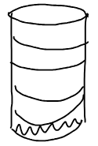

**Хроматография** — физико-химическое разделение компонентов подвижной фазы при ее движении относительно неподвижной фазы (слоя сорбента). Чем дольше вещество удерживается сорбентом, тем позднее оно выходит из колонки: раньше всего выходят вещества, которые плохо адсорбируются, позже — сильно адсорбирующиеся.

## Виды хроматографии

**1. По агрегатному состоянию подвижной фазы:**

- **газовая** — подвижная фаза смесь газов, для разделения летучих веществ;
- **жидкостная** — подвижная фаза раствор, для разделения нелетучих веществ.

**2. По агрегатному состоянию неподвижной фазы:** твердая (твердый сорбент) или жидкая (твердый носитель, смоченный жидкостью). Сочетая оба признака, получают четыре варианта:

| Подвижная фаза | Неподвижная фаза твердая | Неподвижная фаза жидкая |
|---|---|---|
| Газ | газоадсорбционная | газожидкостная |
| Жидкость | жидкостно-адсорбционная | жидкость-жидкостная |

**3. По механизму разделения:**

- **адсорбционная** — компоненты по-разному адсорбируются;
- **распределительная** — основана на разной растворимости компонентов подвижной фазы в неподвижной;
- **осадочная** — на разной растворимости осадков, образуемых компонентами с реагентом.

**4. По способу проведения:** колоночная и плоскостные — бумажная и тонкослойная (тонкий слой сорбента на пластинке).

**5. По способу продвижения подвижной фазы вдоль неподвижной:**

- **Фронтальный анализ.** Через колонку непрерывно пропускают смесь компонентов, которые адсорбируются в ряду $A > B > C$. Первым выходит компонент $C$, затем смесь $B + C$ и т. д. В чистом виде можно выделить только компонент, который адсорбируется хуже всех, поэтому метод неудобен и мало применяется.

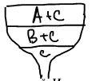

- **Проявительный (элюентный) анализ.** Пробу смеси промывают потоком газа-проявителя или растворителя — **элюента** $E$, который адсорбируется хуже всех компонентов ($A > B > C \gg E$). Компоненты разделяются на зоны, разделенные чистым элюентом.

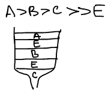

- **Вытеснительный анализ.** Используют газ- или жидкость-**вытеснитель** $D$, который адсорбируется лучше всех компонентов ($D \gg A > B > C$). Компоненты выходят примыкающими друг к другу зонами.

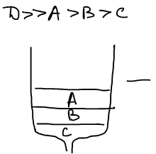

Наиболее удобна **элюентная хроматография**; элюентом служит растворитель или газ в зависимости от типа хроматографии.

**Гель-хроматография.** Неподвижной фазой служит набухший полимерный гель, через который пропускают раствор смеси полимеров. Большие макромолекулы не могут проникнуть в поры геля и выходят из колонки первыми, последними выходят низкомолекулярные вещества. Так полимеры разделяют по молекулярным массам (подробнее — в статье ВМС [«Молекулярные массы»](../../vms/fizika-polimerov/molekulyarnye-massy/)).

🙏 Если вам нравится сайт, подпишитесь на наш <a href="https://t.me/+JfpTv9CJlwQ0MThi">🔗 Телеграм-канал</a>.

## Газовый хроматограф

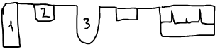

1. Баллон с газом-носителем.
2. Устройство для ввода пробы.
3. Хроматографическая колонка.
4. Детектор.
5. Самописец, который выдает хроматограмму.

Работа детектора основана на изменении какого-либо свойства газа-носителя в зависимости от состава. **Катарометр** реагирует на теплопроводность: через две ячейки идут чистый газ-носитель $E$ и газ из колонки $E + c$. Когда состав одинаков, тока в измерительной схеме нет; когда из колонки выходит компонент, возникает ток за счет разности теплопроводности.

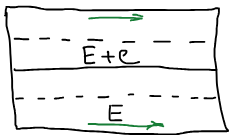

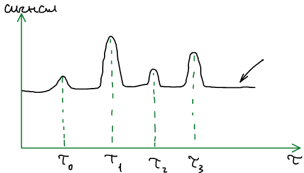

**Нулевая линия** соответствует выходу чистого газа-носителя. $\tau_0$ — время выхода компонента, который практически не адсорбируется. **Исправленное время удерживания**

$$
\tau'_{\text{уд}} = \tau_i - \tau_0 .
$$

Время удерживания служит для качественного анализа, высота (площадь) пика — для количественного. Время удерживания зависит от прибора и условий опыта — скорости газа-носителя $v$, температуры, количества сорбента $q$: $\tau'_{\text{уд}} = f(v, T, q)$. Поэтому используют **удерживаемый объем**

$$
V_{\text{уд}} = \tau'_{\text{уд}}\,v,
$$

который от скорости не зависит; удельные удерживаемые объемы — табулированные характеристики системы.

## Требования к фазам

**Элюент** — газ-носитель или растворитель. Он должен быть инертным по отношению к неподвижной фазе и компонентам подвижной фазы; растворитель должен обладать малой вязкостью. **Элюат** — раствор, который вытекает из колонки в жидкостной хроматографии.

**Неподвижная фаза (сорбент)** должна обладать прочностью и жесткостью, быть инертной по отношению к элюенту и определенно селективной; к размерам частиц предъявляются жесткие требования. Один из основных сорбентов — силикагель, который сильно модифицируют.

## Принципы разделения на неподвижной фазе

**Неполярный сорбент.** На нем хроматографически разделяют неполярные молекулы, например изомерные алканы. Действуют только дисперсионные силы, а они аддитивно суммируются: взаимодействие тем больше, чем больше контактов отдельных атомов с поверхностью. Поэтому линейный октан удерживается сильнее разветвленных изомеров.

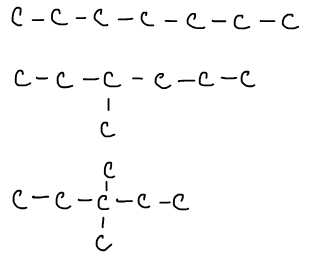

**Полярный сорбент.** Здесь действуют индукционные силы: чем сильнее молекула поляризуется, тем больше взаимодействие. В ряду этан, этилен, ацетилен удерживание растет вместе с числом π-связей:

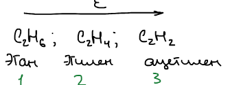

Изомеры дихлорбензола разделяются по дипольному моменту: у пара-изомера $\mu = 0$, у мета- и орто- $\mu_1 < \mu_3$, и удерживание растет в том же порядке.

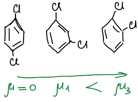

В зависимости от природы неподвижной и подвижной фаз можно подобрать условия разделения.

## Основное уравнение равновесной хроматографии

Рассмотрим слой колонки толщиной $\Delta x$ с площадью сечения $S = 1$ м². Через него за время $\Delta\tau$ проходит объем подвижной фазы $v\,\Delta\tau$ ($v$ — объем фазы, протекающей за единицу времени), концентрация которой меняется от $c$ до $c - \Delta c$; $q$ — количество сорбента на единицу длины колонки, $a$ — адсорбция.

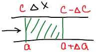

Количество вещества, ушедшее из подвижной фазы, равно количеству, пришедшему в неподвижную:

$$
v\,\Delta\tau\,\Delta c = q\,\Delta a\,\Delta x
\quad\Rightarrow\quad
v\,d\tau\,dc = q\,da\,dx .
$$

Линейная скорость перемещения вещества вдоль колонки

$$
u = \frac{dx}{d\tau} = \frac{v}{q\,\dfrac{da}{dc}},
$$

то есть определяется видом **изотермы сорбции**:

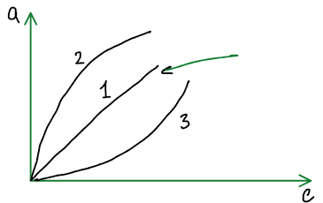

1. **Линейная изотерма** (уравнение Генри): адсорбция прямо пропорциональна концентрации, $da/dc = \text{const}$, поэтому $u \ne f(c)$ — все части зоны движутся с одной скоростью, и пик симметричен.

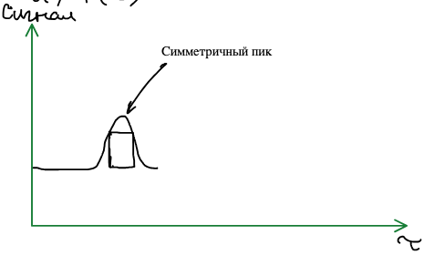

2. **Выпуклая изотерма:** $da/dc \ne \text{const}$; с ростом концентрации $da/dc$ убывает, и $u$ растет. Центр зоны обгоняет края — **размывание тыла** хроматографического пика.

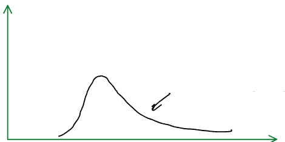

3. **Вогнутая изотерма:** с ростом $c$ $da/dc$ растет, $u$ падает — размывается фронт пика.

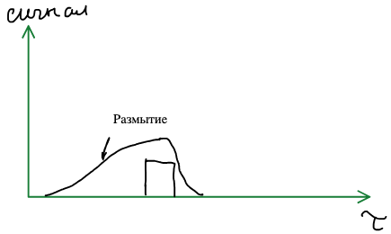

Размывание хроматографических пиков ухудшает разделение компонентов, его надо избегать: нужно работать в области выполнения уравнения Генри.

## Задачи и преимущества хроматографии

- **Аналитические цели:** качественный и количественный анализ многокомпонентных систем.
- **Препаративные цели:** хроматография — способ разделения смеси на компоненты.
- **Физико-химические цели:** исследование процессов на границах раздела твердое тело — газ, газ — жидкость, жидкость — твердое тело.

Преимущества метода: автоматизация, экспрессность, высокая чувствительность — хроматографически обнаруживаются количества до $10^{-6}$ г.
