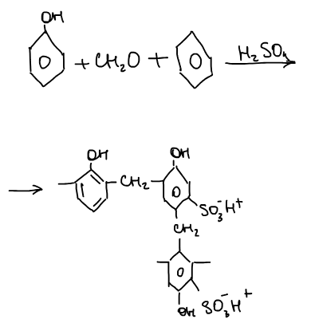
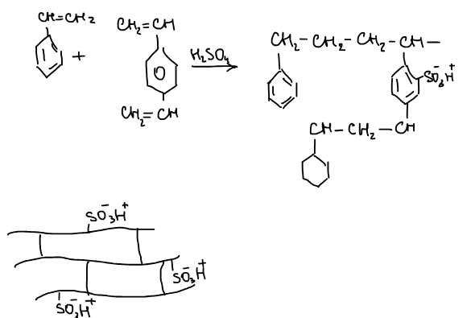
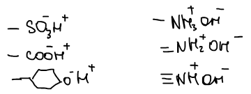
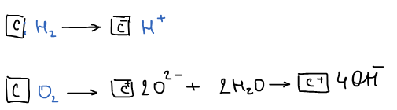

На границе твердое тело — раствор электролита адсорбируются не молекулы, а ионы, и процесс тесно связан с [двойным электрическим слоем](../dvojnoj-elektricheskij-sloj/). Адсорбция ионов бывает:

1. **Эквивалентная** — катионы и анионы адсорбируются в эквивалентных количествах.
2. **Избирательная** — поверхность преимущественно адсорбирует ионы одного знака (так заряжается поверхность при образовании ДЭС).
3. **Специфическая** — сверхэквивалентная адсорбция многозарядных и крупных ионов за счет не только электрических, но и адсорбционных сил.
4. **Ионообменная.**

## Ионообменная адсорбция

**Ионообменная адсорбция** — избирательная адсорбция одного из ионов, сопровождаемая вытеснением эквивалентного количества другого иона того же знака из адсорбционного слоя в раствор. Подвижные ионы двойного электрического слоя способны обмениваться с ионами раствора. Ионный обмен меняет солевой состав воды и используется для разделения важных веществ.

В 1850 г. Томпсон и Уэй впервые обнаружили солевой обмен в почвах. Первые синтетические ионообменные смолы получили Адамс и Холмс в 1935 г.

### Классификация ионообменников

- По происхождению — **природные** и **синтетические**.
- По составу — **органические** и **неорганические**.
- По знаку заряда обмениваемого иона — **катиониты**, **аниониты** и **амфолиты**.

Природный ионообменник — почва; природные неорганические — цеолиты (алюмосиликаты). Синтетические неорганические — алюмогели, силикагели. В промышленности используют синтетические органические **ионообменные смолы** — сетчатые полимеры, содержащие ионогенные группы.

### Ионообменные смолы

**Универсальный катионит 1** — сетчатый сополимер фенола с формальдегидом, сульфированный серной кислотой:

**Универсальный катионит 2** — сополимер стирола с дивинилбензолом (сшивающий агент), сульфированный серной кислотой:

Ионогенные группы:

| Катиониты | Аниониты |
|---|---|
| $\text{—SO}_3^-\,\text{H}^+$ (сильнокислотные) | $\text{—NH}_3^+\,\text{OH}^-$ |
| $\text{—COO}^-\,\text{H}^+$ | $\text{=NH}_2^+\,\text{OH}^-$ |
| $\text{—C}_6\text{H}_4\text{O}^-\,\text{H}^+$ (фенольные) | $\equiv\text{NH}^+\,\text{OH}^-$ |

Для регенерации катиониты обрабатывают растворами кислот (аниониты — растворами щелочей).

🙏 Если вам нравится сайт, подпишитесь на наш <a href="https://t.me/+JfpTv9CJlwQ0MThi">🔗 Телеграм-канал</a>.

### Обменная емкость

**Емкость** — количественная характеристика способности ионообменника обменивать ионы.

- **Статическая обменная емкость** (СОЕ) — полная емкость, которая характеризует количество ионогенных групп на единицу массы или объема. Для природных ионообменников она составляет 0,2–0,3 мэкв/г, для синтетических — 3–10 мэкв/г.
- **Динамическая обменная емкость** — емкость, которая реализуется в данных условиях эксплуатации (при фильтрации раствора через колонку). Она зависит от природы ионов и от конкретного проведения эксперимента.

## Гидролитическая адсорбция

**Гидролитическая адсорбция** — обменная адсорбция на угле, сопровождаемая изменением pH среды.

**Теория Фрумкина.** Уголь в процессе активации может адсорбировать разные газы. Адсорбируя водород, уголь выступает акцептором электронов: поверхность заряжается отрицательно, а в раствор переходят ионы $\text{H}^+$. Адсорбируя кислород, уголь, наоборот, заряжается положительно, а в раствор переходят ионы $\text{OH}^-$:

**Теория Шилова** (процессы на твердой поверхности). При взаимодействии угля с кислородом воздуха на поверхности образуются оксиды. В воде они диссоциируют и образуют карбоксильные ($\text{—COOH}$) и гидроксильные ($\equiv\text{C—OH}$) группы. Протоны этих групп могут обмениваться на катионы раствора, и раствор подкисляется.
