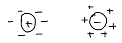
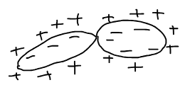
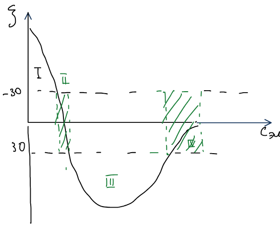
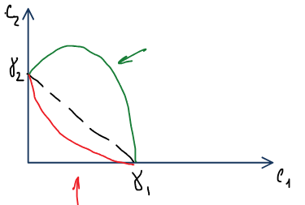
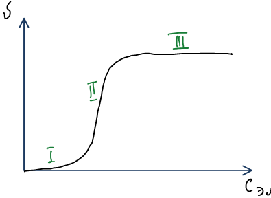
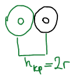

**Коагуляция** — слипание частиц дисперсной фазы в агрегаты, ведущее к потере агрегативной устойчивости и разрушению коллоидной системы. Слияние капель эмульсии или пузырьков пены в более крупные называют **коалесценцией**. Механизм устойчивости описан в [теории ДЛФО](../teoriya-dlfo/).

Разрушать коллоидные системы приходится, например, при очистке сточных вод, в сахарной и целлюлозно-бумажной промышленности.

## Причины и способы коагуляции

Любое воздействие достаточной интенсивности может вызвать разрушение коллоидной системы: нагрев, охлаждение, электричество, химический агент, механическое воздействие. При этом метастабильное состояние переходит в устойчивое.

### 1. Взаимная коагуляция (гетерокоагуляция)

Смешивают два золя с противоположно заряженными частицами — они слипаются за счет электростатических сил.

Так очищают воду на водопроводных станциях: добавляют $\text{FeCl}_3$ или $\text{Al}_2(\text{SO}_4)_3$, продукты гидролиза которых образуют положительно заряженные золи, и те коагулируют с отрицательно заряженными примесями.

### 2. Механическая коагуляция

При перемешивании или встряхивании частицы сталкиваются участками, где двойной электрический слой тоньше (например, концами вытянутых частиц), и слипаются.

### 3. Температурная коагуляция

Повышение температуры приводит к коагуляции. При понижении температуры до замерзания дисперсионной среды коагуляция резко возрастает: кристаллизующаяся вода выжимает частицы и приводит к их слипанию.

### Флокуляция

Коагуляцию вызывают и высокомолекулярные соединения, которые собирают коллоидные частицы в рыхлые хлопья, — **флокуляция**. ВМС-**флокулянты** — водорастворимые полимеры, например полиакриламид.

🙏 Если вам нравится сайт, подпишитесь на наш <a href="https://t.me/+JfpTv9CJlwQ0MThi">🔗 Телеграм-канал</a>.

## Коагуляция золей электролитами

Индифферентный электролит сжимает двойной электрический слой, дзета-потенциал уменьшается, и ДЭС перестает защищать частицы.

**Правила коагуляции золей электролитами:**

1. Коагулирующим действием обладает ион, знак заряда которого совпадает со знаком противоиона (противоположен заряду частицы).
2. Любой электролит в определенном количестве может коагулировать коллоидную систему. Минимальная концентрация электролита, вызывающая коагуляцию, — **порог коагуляции** $\gamma$ (ммоль-экв/л); обратная величина $1/\gamma$ — **коагулирующая способность**.
3. Коагулирующая способность растет с зарядом иона: чем больше заряд, тем меньше иона нужно добавить, чтобы скоагулировать систему (**правило Шульце — Гарди**):

$$
z\uparrow,\quad \gamma\downarrow,\quad \frac{1}{\gamma}\uparrow; \qquad \frac{1}{\gamma} \sim z^6 .
$$

4. При одинаковом заряде коагулирующая способность растет с радиусом иона: $r\uparrow$, $\gamma\downarrow$, $1/\gamma\uparrow$.

Коагуляция происходит не при нулевом дзета-потенциале, а уже при его снижении до критического значения:

$$
\zeta_{\text{кр}} \approx 30\ \text{мВ}.
$$

### Коллоидная защита

Золи можно защитить молекулами ВМС (**коллоидная защита**): ВМС адсорбируется на частице и повышает устойчивость золя к действию электролита. Например, золь серебра, защищенный белком, применяется как лекарство. Защитные вещества: альбумин, желатин, крахмал, метилцеллюлоза.

Защитное действие оценивают **золотым числом** — массой стабилизатора в миллиграммах, которая предотвращает коагуляцию 10 мл золя золота при добавлении к нему 1 мл 10%-ного раствора NaCl. Коагуляцию легко заметить: исходный золь красный, а коагулированный — синий.

| Вещество | Золотое число, мг |
|---|---|
| Желатин | 0,01 |
| Крахмал | 2,0 |

Чем меньше золотое число, тем сильнее защитное действие.

## Особые явления при коагуляции электролитами

### Явление неправильных рядов

Первое явление связано с добавлением электролитов, ионы которых специфически адсорбируются. С ростом концентрации такого электролита дзета-потенциал падает, проходит через ноль, меняет знак (перезарядка), а затем снова уменьшается по модулю:

Зоны устойчивости (I, III) и коагуляции (II, IV) чередуются: золь коагулирует там, где $|\zeta| < 30$ мВ.

### Смеси электролитов

Если для коагуляции используют смесь двух электролитов с порогами $\gamma_1$ и $\gamma_2$, возможны три случая:

- **Аддитивность** — пороги складываются (штриховая прямая).
- **Антагонизм** — электролитов нужно больше (кривая выше прямой). Если ионы сильно различаются по коагулирующей способности, между ними происходит конкуренция.
- **Синергизм** — в смеси электролитов нужно меньше (кривая ниже прямой).

## Кинетика коагуляции

Скорость коагуляции $v$ зависит от концентрации электролита:

- **I** — $v = 0$, система устойчива.
- **II** — участок **медленной коагуляции**: чем больше концентрация, тем больше активных столкновений, $v = f(c)$.
- **III** — участок **быстрой коагуляции**: все столкновения становятся активными, $v \ne f(c)$.

### Теория быстрой коагуляции Смолуховского

Теория основана на предпосылках: частицы монодисперсные, сферической формы и сталкиваются в результате броуновского движения; каждое столкновение приводит к слипанию, когда расстояние между центрами достигает $h_{\text{кр}} = 2r$.

Слипание двух частиц — аналог бимолекулярной реакции $A + B \to AB$. Пусть $\nu$ — частичная концентрация (общее число частиц всех порядков в единице объема, $\nu = \nu_1 + \nu_2 + \ldots$), при $\tau = 0$ она равна $\nu_0$. Скорость коагуляции

$$
v = -\frac{d\nu}{d\tau} = k\nu^2 .
$$

Разделяя переменные и интегрируя,

$$
-\int_{\nu_0}^{\nu}\frac{d\nu}{\nu^2} = \int_0^{\tau} k\,d\tau
\quad\Rightarrow\quad
\frac{1}{\nu} - \frac{1}{\nu_0} = k\tau,
$$

$$
\nu = \frac{\nu_0}{1 + k\tau\nu_0} .
$$

**Время половинной коагуляции** $\theta$ — время, за которое число частиц уменьшается вдвое, $\nu = \nu_0/2$:

$$
\frac{\nu_0}{2} = \frac{\nu_0}{1 + k\theta\nu_0}
\quad\Rightarrow\quad
\frac{1}{\theta} = k\nu_0,
\qquad
\nu = \frac{\nu_0}{1 + \tau/\theta} .
$$

Если частицы сталкиваются в результате броуновского движения, **константа Смолуховского** выражается через коэффициент диффузии $D = \dfrac{kT}{6\pi\eta r}$ (здесь $k$ — постоянная Больцмана):

$$
k_{\text{см}} = 4\pi D h_{\text{кр}} = \frac{8\pi r\,kT}{6\pi\eta r} = \frac{4}{3}\,\frac{kT}{\eta} .
$$

Константа быстрой коагуляции не зависит от размера частиц и определяется только температурой и вязкостью среды.
