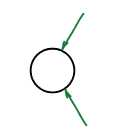
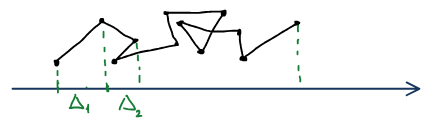
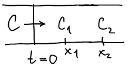
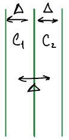
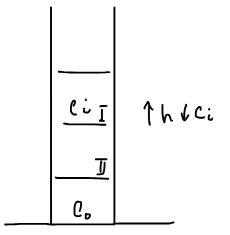
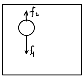
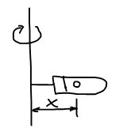
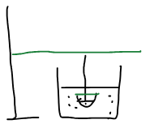
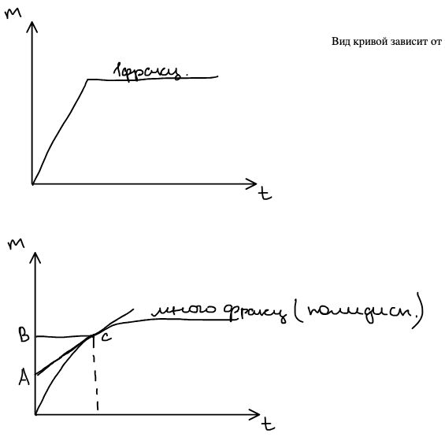

Частицы коллоидных систем участвуют в тепловом движении так же, как молекулы, только медленнее. Отсюда броуновское движение, диффузия и равновесие между оседанием частиц и их диффузией — **молекулярно-кинетические свойства** дисперсных систем.

## Броуновское движение

**Броуновское движение** — беспорядочное движение микроскопических взвешенных в жидкости или газе частиц твердого вещества, вызываемое тепловым движением частиц жидкости или газа.

Удары молекул среды о частицу с разных сторон не скомпенсированы, и частица хаотически смещается. Теорию разработали Мариан **Смолуховский** и Альберт **Эйнштейн**, экспериментальное доказательство дал Жан Батист **Перрен**.

Броуновское движение — это хаотическое движение, поэтому смещение частицы оценивают **среднеквадратичным перемещением**. Среднеквадратичное перемещение частицы — среднее расстояние, на которое броуновская частица удаляется от начального положения за промежуток времени, значительно больший времени среднего пробега молекул.

Количественная характеристика броуновского движения:

$$
\overline{\Delta^2} = \frac{\sum \Delta_i^2}{N},
$$

где $\Delta_i$ — проекции смещений на выбранную ось, $N$ — число частиц (наблюдений).

## Диффузия

**Диффузия** — перенос вещества в неподвижной среде под влиянием градиента химического потенциала; направленное движение частиц, приводящее к выравниванию химического потенциала. Движущей силой диффузии является градиент химического потенциала:

$$
\mu_i = \mu_i^0 + RT\ln c_i, \qquad \frac{d\mu_i}{dx} = \frac{RT}{c_i}\,\frac{dc_i}{dx}.
$$

**Самодиффузия** — связана с тепловым движением частиц одного сорта в многокомпонентной системе, без градиента концентрации.

Скорость диффузии определяется:

- **величиной потока** — количеством вещества, проходящего через данное поперечное сечение в единицу времени;
- **плотностью потока** — количеством вещества, проходящего через поперечное сечение единичной площади в единицу времени, $J = \dfrac{1}{S}\dfrac{dm}{d\tau}$.

### Первый закон Фика

Количество вещества $Q$, продиффундировавшее за время $\tau$ через площадь $S$:

$$
Q = -D\tau S\,\frac{dc}{dx}, \qquad J = \frac{Q}{\tau S} = -D\,\frac{dc}{dx}, \qquad [D] = \text{м}^2/\text{с}.
$$

**Стационарный поток** — поток, в котором градиент концентрации не зависит от времени и постоянен.

### Второй закон Фика

Если поток нестационарный, градиент концентрации зависит от координаты, $dc/dx = f(x)$. Для слоя толщиной $dx$ с площадью сечения $S$ количество вещества в нем $Q = cSx$, а разность входящего и выходящего потоков меняет концентрацию:

$$
dQ = -DS\,\frac{dc}{dx}\,d\tau, \qquad \frac{\partial^2 Q}{\partial x\,\partial t} = -DS\,\frac{\partial^2 c}{\partial x^2}.
$$

Отсюда **второй закон Фика**:

$$
\frac{\partial c}{\partial t} = D\,\frac{\partial^2 c}{\partial x^2}.
$$

Если в момент $t = 0$ вещество сосредоточено у начала трубки, то через время $t$ отношение концентраций в точках $x_1$ и $x_2$

$$
\frac{c_1}{c_2} = \exp\!\left(-\frac{x_1^2 - x_2^2}{4Dt}\right).
$$

🙏 Если вам нравится сайт, подпишитесь на наш <a href="https://t.me/+JfpTv9CJlwQ0MThi">🔗 Телеграм-канал</a>.

## Уравнение Эйнштейна — Смолуховского

Свяжем среднеквадратичное смещение с коэффициентом диффузии, $\overline{\Delta^2} = f(D)$. Выделим два соседних слоя толщиной $\Delta$ с концентрациями $c_1$ и $c_2$ (площадь сечения $S = 1$):

За время $t$ половина частиц каждого слоя смещается вправо, половина — влево, поэтому через границу переходит

$$
m = \frac{1}{2}c_1\Delta - \frac{1}{2}c_2\Delta = \frac{1}{2}\Delta(c_1 - c_2) = -\frac{1}{2}\Delta^2\,\frac{dc}{dx},
$$

так как $\dfrac{c_1 - c_2}{\Delta} = -\dfrac{dc}{dx}$. По первому закону Фика то же количество равно $m = -DS\,\dfrac{dc}{dx}\,t$. Приравнивая,

$$
\overline{\Delta^2} = 2Dt, \qquad D = \frac{\overline{\Delta^2}}{2t}.
$$

## Уравнение Эйнштейна для коэффициента диффузии

Коэффициент диффузии зависит от размера частиц, $D = f(r)$. На одну частицу действует движущая сила — градиент химического потенциала в расчете на частицу:

$$
f_1 = -\frac{1}{N_A}\frac{d\mu_i}{dx} = -\frac{RT}{c N_A}\,\frac{dc}{dx}.
$$

Движению препятствуют силы вязкого трения (закон Стокса):

$$
f_2 = 6\pi\eta r u,
$$

где $u$ — линейная скорость движения частиц. При равномерном движении $f_1 = f_2$, и поток частиц

$$
J = uc = -\frac{RT}{6\pi\eta r N_A}\,\frac{dc}{dx}.
$$

Сравнивая с законом Фика $J = -D\,dc/dx$, получаем **уравнение Эйнштейна**:

$$
D = \frac{RT}{6\pi\eta r N_A} = \frac{kT}{6\pi\eta r}.
$$

По измеренному $D$ (или $\overline{\Delta^2}$) можно найти радиус частиц.

## Седиментационно-диффузионное равновесие

Частицы в поле тяжести оседают, а диффузия стремится выровнять концентрацию. В равновесии химический потенциал частиц одинаков на любой высоте (с учетом потенциальной энергии):

$$
\mu_i^0 + RT\ln c_1 + mgh_1 = \mu_i^0 + RT\ln c_2 + mgh_2,
$$

$$
RT\ln\frac{c_1}{c_2} = mg(h_2 - h_1),
$$

где $m$ — масса моля частиц. Пусть $c_2 = c_0$ у дна ($h_2 = 0$), $c_1 = c$ на высоте $h$:

$$
\ln\frac{c}{c_0} = -\frac{mgh}{RT}, \qquad c = c_0\exp\!\left(-\frac{mgh}{RT}\right)
$$

— **гипсометрический закон Лапласа**. С учетом архимедовой силы эффективная масса частицы $\frac{4}{3}\pi r^3(\rho - \rho_0)$, а на моль частиц — в $N_A$ раз больше:

$$
c = c_0\exp\!\left(-\frac{4\pi r^3(\rho - \rho_0)\,g h N_A}{3RT}\right).
$$

## Седиментационный анализ

**Седиментация** — оседание частиц. На оседающую частицу действуют сила тяжести за вычетом архимедовой силы и сила вязкого трения:

$$
f_1 = V(\rho - \rho_0)g, \qquad f_2 = 6\pi\eta r u,
$$

где $u$ — скорость оседания. При равномерном оседании $f_1 = f_2$:

$$
\frac{4}{3}\pi r^3(\rho - \rho_0)g = 6\pi\eta r u \quad\Rightarrow\quad r = \sqrt{\frac{9\eta u}{2(\rho - \rho_0)g}} .
$$

Мелкие коллоидные частицы в поле тяжести практически не оседают. Центрифугирование для их анализа предложил Думанский, а ультрацентрифугу реализовал Сведберг. Ускорение $g$ заменяют центробежным $\omega^2 x$, где $x$ — расстояние от оси вращения:

$$
\frac{4}{3}\pi r^3(\rho - \rho_0)\,\omega^2 x = 6\pi\eta r\,\frac{dx}{dt} \quad\Rightarrow\quad r = \sqrt{\frac{9}{2}\,\frac{\eta\, dx/dt}{(\rho - \rho_0)\,\omega^2 x}} .
$$

### Метод накопления осадка

Седиментационный анализ коллоидных систем методом накопления осадка: чашечку весов опускают в суспензию и регистрируют массу осевших частиц $m$ во времени.

Вид кривой седиментации зависит от размера частиц:

- **Одна фракция** (монодисперсная система): масса осадка растет линейно, пока не осядут все частицы, затем кривая выходит на горизонталь.
- **Много фракций** (полидисперсная система): кривая плавная. Проведем касательную в точке $C$ (момент $t_1$). Масса осадка к этому моменту складывается из массы $F_1$ полностью осевших фракций и массы еще оседающих:

$$
m = F_1 + \frac{dm}{dt}\,t_1, \qquad \frac{dm}{dt} = \frac{AB}{BC} = \frac{AB}{t_1},
$$

$$
F_1 = m - \frac{dm}{dt}\,t_1 = m - AB = OA .
$$

Повторяя построение для разных моментов времени, получают распределение частиц по размерам.
