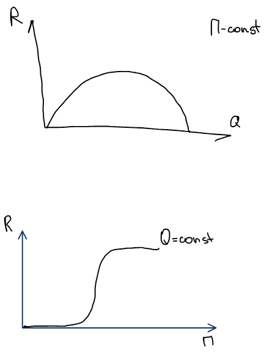
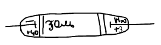
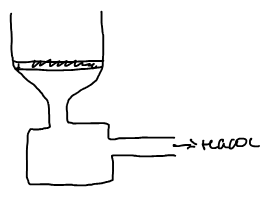

Как получить золь и как очистить его от примесей электролитов, которые, как показано на странице о [коагуляции](../koagulyaciya/), разрушают систему.

## Методы получения лиофобных коллоидных систем

Лиофобные коллоидные системы получают двумя группами методов:

1. **Диспергационные** — измельчают более крупные частицы.
2. **Конденсационные** — укрупняют молекулы или ионы до частиц коллоидного размера.

### Диспергационные методы

Физические методы диспергирования:

- **механическое диспергирование** — шаровые и коллоидные мельницы;
- **распыление жидких металлов** — так получают золи легкоплавких металлов; металл нагревают в плазме либо в высокочастотном разряде;
- **ультразвук**.

Химическое диспергирование — **пептизация**: переход свежеобразованного осадка в коллоидную систему. Так можно перевести в коллоидную систему и осадок, образовавшийся при коагуляции. **Пептизатор** — специальное вещество, при добавлении которого осадок образует коллоидную систему (обычно электролит, ионы которого адсорбируются на частицах и заряжают их).

Количество пептизированного вещества $R$ зависит от количества осадка $Q$ и пептизатора $\Pi$ — **правило осадка Оствальда**:

- При постоянном количестве пептизатора количество пептизированного вещества сначала растет с количеством осадка, а затем падает: пептизатора не хватает, чтобы зарядить все частицы.
- При постоянном количестве осадка пептизация идет лишь после того, как пептизатора добавлено достаточно, а затем выходит на предел.

### Конденсационные методы

**Физическая конденсация:**

- **Конденсация из паров.** Понижаем температуру, пар становится пересыщенным ($T\downarrow \Rightarrow p > p_s$) и конденсируется в виде мелких частиц. Так образуются, например, туманы $\text{ZnO}$, $\text{P}_2\text{O}_5$.
- **Замена растворителя.** К раствору серы в спирте добавляем воду — сера выпадает в коллоидном виде.

**Химическая конденсация** — выделение из раствора малорастворимого вещества в коллоидном состоянии. Растворы должны быть очень разбавленными, а один из реагентов — в избытке (его ионы стабилизируют частицы).

Реакция обмена:

$$
\text{AgNO}_3 + \text{KCl} \longrightarrow \text{AgCl} + \text{KNO}_3 .
$$

Восстановление:

$$
2\,\text{HAuCl}_4 + 3\,\text{H}_2\text{O}_2 \longrightarrow 2\,\text{Au} + 8\,\text{HCl} + 3\,\text{O}_2 .
$$

Окисление сероводорода:

$$
2\,\text{H}_2\text{S} + \text{O}_2 \longrightarrow 2\,\text{S} + 2\,\text{H}_2\text{O};
$$

промежуточный продукт — пентатионовая кислота $\text{H}_2\text{S}_5\text{O}_6 \rightleftharpoons 2\text{H}^+ + \text{S}_5\text{O}_6^{2-}$, ее анионы стабилизируют частицы серы.

Гидролиз хлорида железа(III):

$$
\text{FeCl}_3 + 3\,\text{H}_2\text{O} \rightleftharpoons \text{Fe(OH)}_3 + 3\,\text{HCl}.
$$

Стабилизатор образуется при частичном гидролизе:

$$
\begin{aligned}
&\text{FeCl}_3 + 2\,\text{H}_2\text{O} \rightleftharpoons \text{Fe(OH)}_2\text{Cl} + 2\,\text{HCl}, \\
&\text{Fe(OH)}_2\text{Cl} \longrightarrow \text{FeOCl} + \text{H}_2\text{O}, \\
&\text{FeOCl} \rightleftharpoons \text{FeO}^+ + \text{Cl}^- ,
\end{aligned}
$$

где $\text{FeO}^+$ — **потенциалопределяющий ион**: он адсорбируется на частицах $\text{Fe(OH)}_3$ и заряжает их положительно.

🙏 Если вам нравится сайт, подпишитесь на наш <a href="https://t.me/+JfpTv9CJlwQ0MThi">🔗 Телеграм-канал</a>.

## Условия образования лиофильных коллоидных систем

Лиофильные системы образуются самопроизвольно. При диспергировании растет поверхностная энергия ($\Delta\Omega$ — прирост площади поверхности, $N_2$ — число частиц радиусом $r$):

$$
\Delta G_{\text{пов}} = \sigma\,\Delta\Omega = 4\pi r^2 N_2\,\sigma .
$$

Но за счет вовлечения частиц в тепловое движение растет энтропия, и коллоидная система образуется самопроизвольно, если

$$
\Delta G_{\text{пов}} \le T\Delta S .
$$

Для частиц произвольной формы $\Delta G_{\text{пов}} = N_2\,\sigma\,\alpha d^2$, где $d$ — размер частицы, $\alpha$ — коэффициент формы ($\alpha_{\text{сфер}} = \pi$).

Энтропия смешения $N_1$ молей дисперсионной среды и $N_2 = N/N_A$ молей частиц:

$$
\Delta S = -R\left(N_1\ln\frac{N_1}{N_1 + N_2} + N_2\ln\frac{N_2}{N_1 + N_2}\right).
$$

Число молей дисперсионной среды намного больше, чем фазы, $N_1 \gg N_2$:

$$
\Delta S \approx -R\left(N_1\ln 1 + N_2\ln\frac{N_2}{N_1}\right) = RN_2\beta, \qquad \beta = \ln\frac{N_1}{N_2} \approx 15\text{–}30 .
$$

В расчете на число частиц $N$: $\Delta S = kN\beta$. Условие самопроизвольного диспергирования $4\pi r^2 N\sigma \le kTN\beta$ дает **критическое межфазное натяжение**:

$$
\sigma_{\text{кр}} \le \frac{kT\beta}{4\pi r^2} = \frac{kT\beta}{\alpha d^2} .
$$

При $r \sim 10^{-8}$ м получаем $\sigma_{\text{кр}} \sim 10^{-4}\text{–}10^{-5}$ Дж/м²: лиофильные системы образуются только при очень малом межфазном натяжении.

## Методы очистки коллоидных систем

1. **Диализ** — примеси электролитов и низкомолекулярных веществ удаляют через мембрану, размер пор которой сравним с размером молекул ($r_{\text{пор}} \sim r_{\text{мол}}$): ионы и молекулы проходят, коллоидные частицы — нет.
2. **Электродиализ** — диализ, ускоренный электрическим полем: золь помещают между мембранами, за которыми находятся электроды в воде, и ионы примесей быстро уходят к электродам.

3. **Ультрафильтрация** — метод очистки и концентрирования коллоидных систем с помощью перегородки, через которую под давлением (или при отсасывании насосом) проходит жидкая фаза.

Требования к мембранам:

1. проницаемость;
2. селективность;
3. стойкость к действию среды;
4. механическая прочность.

Материалы мембран: полимерные пленки, пористое стекло, керамика, ионообменные материалы.
