**Структура** — взаимное расположение дисперсных частиц в пространстве, их упаковка и взаимодействие. Зависимость свойств систем от их структуры изучает **физико-химическая (структурная) механика**, основанная П. А. Ребиндером.

## Типы структур

Частицы могут закрепиться в первичном или во вторичном минимуме потенциальной кривой ([теория ДЛФО](../teoriya-dlfo/)):

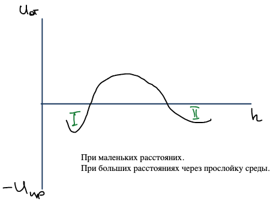

- **Конденсационно-кристаллизационные структуры** (первичный минимум) возникают при непосредственном слипании (химическом взаимодействии) и срастании частиц, например через связи $\text{—Si—O—Si—}$. Они прочные, хрупкие и не восстанавливаются после разрушения: сплавы, керамика, бетоны.
- **Коагуляционные структуры** (вторичный минимум) возникают за счет межмолекулярных сил, когда система теряет устойчивость, но частицы остаются на большом расстоянии через прослойку среды. Они слабее: непрочные, эластичные, ползучие, разрушаются обратимо. В них удобно регулировать состав и однородность, проводить формование. Так образуются гели (например, $\text{V}_2\text{O}_5$); к гелям можно отнести и торф, бумагу.

Для гелей характерны два процесса:

1. **Синерезис** — необратимый процесс старения геля: самопроизвольное уменьшение его объема с выделением дисперсионной среды. Например, $\text{SiO}_2$ → силикагель → опал; в природе ряд опал → халцедон → кварц.
2. **Тиксотропия** — обратимый переход геля в золь при механическом воздействии и обратно в покое: гель ⇄ золь.

## Реология: идеальные модели

Вязкость, прочность, упругость, эластичность изучает **реология** — наука о деформациях и течении материальных систем. **Деформация** — относительное смещение точек системы, при котором не нарушается ее сплошность (до разрушения); бывают объемные и сдвиговые деформации. Реология описывает механические свойства с помощью идеализированных моделей, в основе которых лежат три идеальных закона, связывающих напряжение $\sigma$ и деформацию $\varepsilon$.

### 1. Идеально упругое тело Гука

$$
\sigma = E\varepsilon, \qquad \varepsilon = \frac{l - l_0}{l_0},
$$

где $E$ — **модуль Юнга**. Модель — пружина:

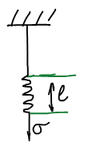

Деформация не зависит от времени: происходит мгновенно и обратима. При $\varepsilon = 1$ ($l = 2l_0$) $\sigma = E$: модуль Юнга — напряжение, которое нужно приложить, чтобы растянуть тело вдвое. Для кристаллов $E \approx 10^9\text{–}10^{11}$ Па, для ВМС $E \approx 10^5$ Па.

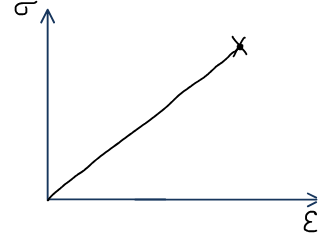

### 2. Идеально вязкая жидкость Ньютона

Модель — поршень, движущийся в вязкой жидкости:

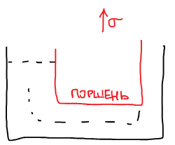

$$
\sigma = \frac{F}{S} = \eta\,\frac{du}{dz},
$$

$\eta$ — коэффициент пропорциональности (вязкость). Деформация сдвига $\gamma = dx/dz$:

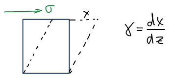

$$
\frac{du}{dz} = \frac{d(dx/d\tau)}{dz} = \frac{d(dx/dz)}{d\tau} = \frac{d\gamma}{d\tau} = \dot\gamma
$$

— **скорость сдвига**. Закон Ньютона:

$$
\sigma = \eta\dot\gamma, \qquad [\eta] = \text{Па}\cdot\text{с}.
$$

Деформация необратима; вязкость — основная реологическая характеристика идеальной жидкости. Вязкость 1 Па·с соответствует силе, которую нужно приложить, чтобы поддерживать разность скоростей 1 м/с между слоями площадью 1 м², находящимися на расстоянии 1 м.

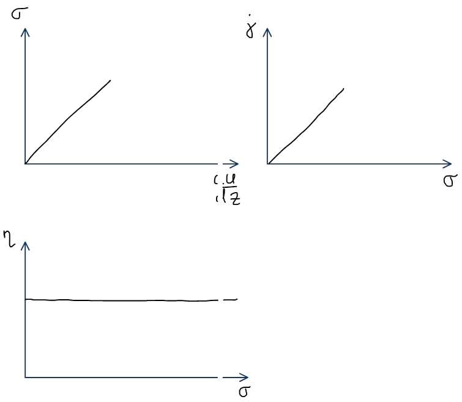

🙏 Если вам нравится сайт, подпишитесь на наш <a href="https://t.me/+JfpTv9CJlwQ0MThi">🔗 Телеграм-канал</a>.

### 3. Идеально пластическое тело Сен-Венана — Кулона

Модель — тело на плоскости, при движении которого трение постоянно:

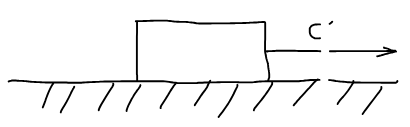

$$
\sigma < \sigma_{\text{кр}}:\ \gamma = 0,\ \dot\gamma = 0; \qquad
\sigma = \sigma_{\text{кр}}:\ \gamma > 0,\ \dot\gamma > 0 .
$$

При критическом напряжении начинается движение, и напряжение больше не повышается.

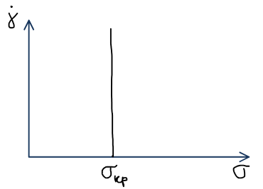

Критическое напряжение характеризует прочность структуры: при его достижении структура разрушается и начинается движение. Такие свойства характерны для порошков — снега, песка, пасты; так моделируется пластичность сырой глины.

### Вязкопластическое тело Бингама

Для дисперсных систем очень продуктивной оказалась модель Бингама — сочетание идеально вязкого тела Ньютона и идеально пластического тела Сен-Венана — Кулона, соединенных параллельно: деформации элементов одинаковы, а напряжения складываются.

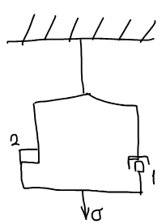

$$
\sigma = \sigma_{\text{кр}} + \eta'\dot\gamma,
$$

где $\eta'$ — **пластическая вязкость**. Ньютоновская вязкость учитывает все виды сопротивления течению, а пластическая не учитывает прочность структуры. До достижения критического напряжения деформации нет. $\sigma_{\text{кр}}$ — **предел текучести**, необходимый для разрушения структуры; чтобы система текла, нужно превысить его, и течение определяет разность $\sigma - \sigma_{\text{кр}}$.

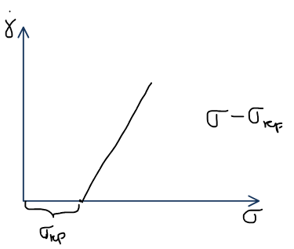

## Жидкообразные и твердообразные системы

По реологическому поведению дисперсные системы делятся на:

- **жидкообразные** — $\sigma_{\text{кр}} = 0$;
- **твердообразные** — $\sigma_{\text{кр}} > 0$.

### Вязкость жидкообразных систем

Основная характеристика жидкообразных систем — вязкость. Она зависит от ряда факторов.

**1. Межмолекулярные взаимодействия:** чем они сильнее, тем больше вязкость.

| Жидкость | $\eta$, $10^{-3}$ Па·с |
|---|---|
| $\text{H}_2\text{O}$ | 1 |
| $\text{C}_6\text{H}_6$ | 0,67 |
| Глицерин | 1499 |

**2. Температура.** Вязкость резко зависит от температуры: $T\uparrow$, свободный объем $V\uparrow$, $\eta\downarrow$ (уравнение Френкеля — Эйринга):

$$
\eta = A\,e^{\Delta U/RT} .
$$

**3. Объемная доля дисперсной фазы** $\varphi$. Для разбавленных систем — **уравнение Эйнштейна**:

$$
\begin{aligned}
\eta &= \eta_0(1 + 2{,}5\varphi) &&\text{— для сферических частиц},\\
\eta &= \eta_0(1 + \alpha\varphi) &&\text{— для частиц другой формы},
\end{aligned}
$$

$\eta_0$ — вязкость дисперсионной среды. Условия применимости: система несжимаема, частицы не взаимодействуют, нет турбулентности и скольжения частиц относительно среды. Относительная и удельная вязкости:

$$
\eta_{\text{отн}} = \frac{\eta}{\eta_0} = 1 + 2{,}5\varphi, \qquad
\eta_{\text{уд}} = \frac{\eta - \eta_0}{\eta_0} = \eta_{\text{отн}} - 1 = 2{,}5\varphi, \qquad \eta \sim \varphi .
$$

Уравнение Эйнштейна не учитывает сольватных слоев на поверхности частиц, из-за которых вязкость увеличивается. С учетом объемной доли слоев $\varphi_s$, $\varphi_s/\varphi = k$:

$$
\eta_{\text{уд}} = 2{,}5(\varphi + \varphi_s) = 2{,}5\varphi(1 + k).
$$

С ростом дисперсности и удельной поверхности растет $\varphi_s$, а с ней и вязкость. Если в систему добавить электролит, ДЭС сжимается, объем слоев уменьшается, и вязкость падает.

### Зависимость вязкости от напряжения сдвига

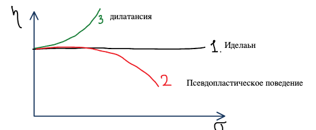

- **Псевдопластическое поведение** — вязкость падает с ростом напряжения: вытянутые частицы ориентируются по потоку ($\eta_0 > \eta_1$).

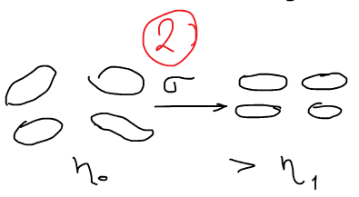

- **Дилатансия** наблюдается в высококонцентрированных дисперсных системах. При малых напряжениях среда играет роль смазки; при больших среда как бы выжимается из зазоров, и вязкость растет. Перемешивание таких систем требует больших энергетических затрат.

Зависимость вязкости от напряжения сдвига выражается **полной реологической кривой**:

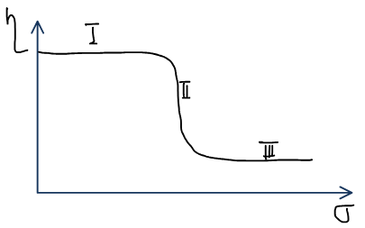

На ней три участка, где по-разному соотносятся скорости разрушения и восстановления структуры:

1. $v_{\text{разр}} < v_{\text{восст}}$ — течение системы с неразрушенной структурой, участок **наибольшей ньютоновской вязкости** $\eta^{\text{Н}}_{\text{макс}}$.
2. $v_{\text{разр}} \approx v_{\text{восст}}$ — участок **эффективной вязкости**.
3. $v_{\text{разр}} > v_{\text{восст}}$ — структура разрушена, течение жидкости с разрушенной структурой, участок **наименьшей ньютоновской вязкости**.

Чем больше разница между наибольшей и наименьшей вязкостями, тем прочнее структура. Пример — 10%-ная бентонитовая глина.

### Твердообразные системы

В системах, у которых предел текучести больше нуля ($\sigma_{\text{кр}} > 0$), течение начинается только после разрушения структуры:

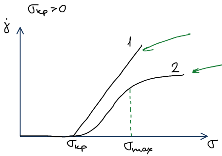

- **1** — бингамовские твердообразные системы, например смазки типа солидола.
- **2** — системы, у которых разрушение структуры происходит во времени: чем больше напряжение, тем сильнее разрушена структура и тем меньше вязкость. Это шламы, пульпы, буровые растворы, зубные пасты.

## Методы определения вязкости

**1. Капиллярная вискозиметрия** — для маловязких (разбавленных) систем. Закон Пуазейля:

$$
V = \frac{\pi r^4 P\tau}{8l\eta},
$$

$r$ — радиус капилляра, $l$ — его длина, $\tau$ — время, $P$ — давление. Закон работает только для ламинарного течения. Характеристика режима течения — **число Рейнольдса**:

$$
\text{Re} = \frac{2rU\rho}{\eta},
$$

$U$ — скорость течения жидкости, $\rho$ — плотность. Критерий ламинарности: $\text{Re}_{\text{кр}} \approx 2300$.

**2. Метод падающего шарика** — для более вязких систем. На шарик действуют сила тяжести за вычетом архимедовой и сила сопротивления:

$$
F_{\text{действ}} = \frac{4}{3}\pi r^3(\rho - \rho_0)g, \qquad F_{\text{сопр}} = 6\pi\eta r U
\quad\Rightarrow\quad
\eta = \frac{2r^2(\rho - \rho_0)g}{9U} .
$$

**3. Ротационная вискозиметрия** — для высоковязких систем. Внутренний цилиндр подвешен на упругой нити; один цилиндр вращается, второй неподвижен, исследуемая система помещается в зазоре между ними.

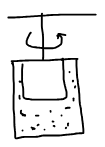

Угол закручивания нити пропорционален моменту вращения, а момент пропорционален вязкости жидкости: $M \sim \eta$.
