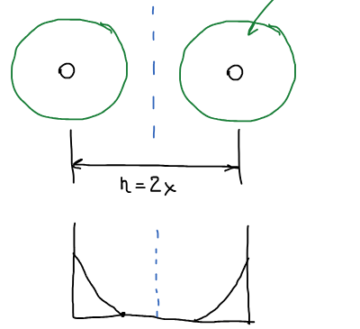
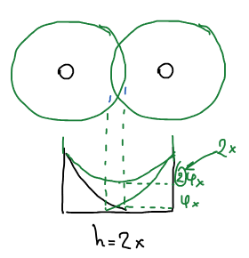
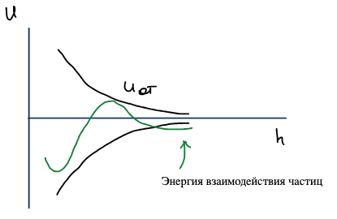

Почему одни золи живут годами, а другие быстро слипаются? Количественный ответ дает **теория ДЛФО** — теория устойчивости коллоидных систем, созданная Б. В. **Д**ерягиным, Л. Д. **Л**андау, Э. **Ф**ервеем и Я. **О**вербеком. Она учитывает два вклада: молекулярное притяжение частиц и электростатическое отталкивание одноименно заряженных частиц, связанное с [двойным электрическим слоем](../dvojnoj-elektricheskij-sloj/).

## Энергия взаимодействия частиц

Две крупные частицы рассматриваются как пластины, $h$ — расстояние между пластинами. Энергия их взаимодействия (на единицу площади) складывается из энергии притяжения и энергии отталкивания:

$$
U = U_{\text{пр}} + U_{\text{от}},
$$

где $U_{\text{пр}}$ обусловлена межмолекулярными силами, а $U_{\text{от}}$ — электростатическим отталкиванием, связанным с наличием ДЭС. Каждой составляющей соответствует сила, отнесенная к единице площади, $\Pi = F/S$:

$$
dU_{\text{пр}} = \Pi_{\text{пр}}\,dh, \qquad dU_{\text{от}} = \Pi_{\text{от}}\,dh,
$$

$\Pi_{\text{от}}$ — **расклинивающее давление**.

## Энергия электростатического отталкивания

Пока частицы далеко, их двойные слои не перекрываются. Если $x$ — расстояние от поверхности частицы до «нейтрального» раствора, то при сближении до $h = 2x$ диффузные слои начинают перекрываться.

В середине зазора потенциалы обоих слоев складываются: вместо $\varphi_x$ получается $2\varphi_x$.

Расклинивающее давление находим из $d\Pi = \rho\,d\varphi$, где плотность заряда в диффузном слое $\rho = \dfrac{\varepsilon\varepsilon_0}{\delta^2}\,\varphi$ ($\delta$ — толщина диффузного слоя):

$$
\Pi_{\text{от}} = \int_0^{2\varphi_x} \rho\,d\varphi = \int_0^{2\varphi_x} \frac{\varepsilon\varepsilon_0}{\delta^2}\,\varphi\,d\varphi = \frac{2\varepsilon\varepsilon_0}{\delta^2}\,\varphi_x^2 .
$$

Потенциал в диффузном слое спадает экспоненциально, $\varphi_x = \zeta e^{-x/\delta}$, и при $h = 2x$

$$
\Pi_{\text{от}} = \frac{2\varepsilon\varepsilon_0}{\delta^2}\,\zeta^2 e^{-h/\delta} .
$$

Энергия отталкивания — работа по сближению пластин из бесконечности до расстояния $h$:

$$
U_{\text{от}} = \int_h^{\infty} \frac{2\varepsilon\varepsilon_0}{\delta^2}\,\zeta^2 e^{-h/\delta}\,dh
= \frac{2\varepsilon\varepsilon_0}{\delta}\,\zeta^2 e^{-h/\delta} .
$$

🙏 Если вам нравится сайт, подпишитесь на наш <a href="https://t.me/+JfpTv9CJlwQ0MThi">🔗 Телеграм-канал</a>.

## Энергия притяжения

Молекулярное притяжение двух пластин:

$$
U_{\text{пр}} = -\frac{A}{12\pi h^2},
$$

где $A$ — **константа Гамакера**. Она связана с природой взаимодействия частиц, измеряется в джоулях и по порядку величины составляет $10^{-20}$ Дж: в конспекте приведены $A = 28\cdot 10^{-20}$ Дж (алмаз) и $A = 0{,}4\cdot 10^{-20}$ Дж (подпись неразборчива, вероятно полистирол).

## Потенциальная кривая

Суммарная энергия взаимодействия:

$$
U = \frac{2\varepsilon\varepsilon_0}{\delta}\,\zeta^2 e^{-h/\delta} - \frac{A}{12\pi h^2}.
$$

Знак «+» соответствует отталкиванию, «−» — притяжению. Чем больше $\zeta$ и чем меньше $A$, тем устойчивее система.

Отталкивание убывает экспоненциально, $U_{\text{от}} \sim e^{-h}$, а притяжение — по степенному закону, $U_{\text{пр}} \sim 1/h^2$. Поэтому притяжение преобладает и на очень малых расстояниях ($h \to 0$), и на больших ($h \to \infty$), а отталкивание — на средних.

На суммарной кривой видны:

1. **Первичный минимум** — частицы очень близко подошли друг к другу; попадание в него означает необратимую коагуляцию.
2. **Вторичный минимум** — взаимодействие частиц через прослойку среды; частицы слабо связаны и легко разделяются (обратимая коагуляция, флокуляция).
3. **Потенциальный барьер** между ними — область устойчивости коллоидных систем: пока барьер высок по сравнению с $kT$, частицы не слипаются.

Электролиты сжимают ДЭС и снижают $\zeta$, барьер уменьшается — это и есть механизм [коагуляции](../koagulyaciya/) электролитами.
