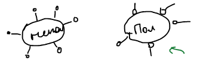
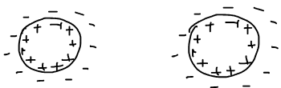

Почему коллоидные системы вообще разрушаются и что удерживает их от разрушения. Количественная теория электростатической стабилизации — [теория ДЛФО](../teoriya-dlfo/), а процесс разрушения — [коагуляция](../koagulyaciya/).

## Истинные растворы и коллоидные системы

| Истинные растворы | Коллоидные системы |
|---|---|
| гомогенные | гетерогенные |
| образуются самопроизвольно: $dF < 0$, $dG < 0$ | $dF > 0$, $dG > 0$ |
| термодинамически устойчивы | термодинамически неустойчивы: частицы стремятся агрегировать |

Термодинамическая неустойчивость лиофобных коллоидных систем связана с избыточной поверхностной энергией

$$
\Delta F \approx \Delta G = \sigma S,
$$

где $\sigma$ — избыточная поверхностная энергия на единицу поверхности (поверхностное натяжение), $S$ — площадь поверхности раздела фаз. Самопроизвольное уменьшение $S$ — слипание частиц — снижает энергию системы.

Различают два вида устойчивости:

- **кинетическая (седиментационная)** — сохранение равномерного распределения частиц по высоте;
- **агрегативная** — сохранение размера частиц (частицы не слипаются).

🙏 Если вам нравится сайт, подпишитесь на наш <a href="https://t.me/+JfpTv9CJlwQ0MThi">🔗 Телеграм-канал</a>.

## Факторы стабилизации

### 1. Структурно-механический барьер

Механический фактор стабилизации ввел П. А. Ребиндер. Молекулы ПАВ или полимеров адсорбируются на поверхности частиц (пузырьков пены, капель) и создают барьер на границе раздела. Адсорбционный слой ПАВ обладает особыми механическими свойствами: повышенной вязкостью, упругостью, прочностью, сопротивлением сдвигу — и мешает частицам сблизиться.

### 2. Термодинамический (адсорбционный) фактор

Есть вещества — мыла, белки, желатин (средства коллоидной защиты), — которые резко понижают поверхностное натяжение. При этом уменьшается избыточная поверхностная энергия:

$$
\sigma\downarrow \;\Rightarrow\; \Delta G\downarrow ,
$$

и движущая сила агрегации ослабевает.

### 3. Электрический фактор

Частицы окружены [двойным электрическим слоем](../dvojnoj-elektricheskij-sloj/). Одинаково заряженные частицы отталкиваются, и для слипания им нужно преодолеть электростатический барьер. Наличие ДЭС — фактор стабилизации коллоидных систем.

