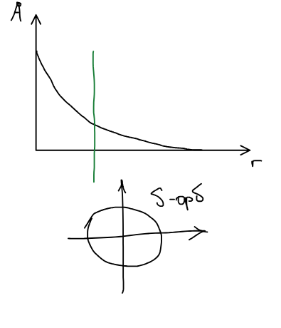
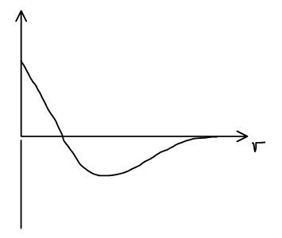
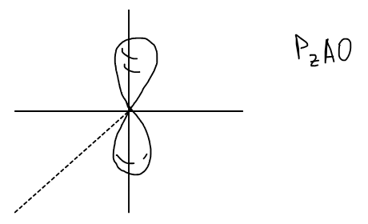
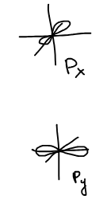
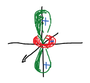
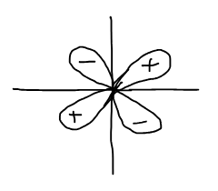
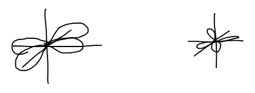

Волновая функция, описывающая движение отдельного электрона в атоме и зависящая от трех квантовых чисел $n, l, m$, называется **атомной орбиталью** (АО). Орбиталь — функция для одного электрона!

В [предыдущем параграфе](../vodorodopodobnyj-atom/) было получено, что орбиталь водородоподобного атома есть произведение радиальной и угловой частей:

$$
\psi_{n,l,m}(r, \theta, \varphi) = R_{n,l}(r)\,Y_{l,m}(\theta, \varphi), \qquad R_{n,l} = C\rho^{\,l}\,e^{-\rho/2}\,L(\rho), \qquad \rho = 2\alpha r = \frac{2Z}{n a_0}\,r
$$

Здесь $a_0$ — **боровский радиус**, естественная единица длины в атоме:

$$
a_0 = \frac{\hbar^2}{m_e e^2} \approx 0{,}53\ \text{Å}
$$

Рассмотрим орбитали с наименьшими $n$ в явном виде.

## n = 1: орбиталь 1s

$$
n = 1, \qquad l = 0, \qquad m = 0
$$

Радиальная часть при $l = 0$ и $n = 1$ сводится к экспоненте $\rho^{\,0}\,e^{-\rho/2}$, а угловая часть при $l = 0$ не зависит от углов:

$$
Y_{0,0}(\theta, \varphi) = \text{const}
$$

Поэтому вся орбиталь — одна убывающая экспонента (постоянный множитель найден из условия нормировки):

$$
\psi_{1,0,0} = \frac{1}{\sqrt{\pi}}\left( \frac{Z}{a_0} \right)^{3/2} e^{-\frac{Zr}{a_0}}
$$

Функция монотонно убывает с расстоянием от ядра и одинакова по всем направлениям: это **s-орбиталь**, ее форма — сфера.

## n = 2: орбитали 2s и 2p

### Орбиталь 2s

$$
n = 2, \qquad l = 0, \qquad m = 0
$$

$$
\psi_{2,0,0} = \frac{1}{4\sqrt{2\pi}}\left( \frac{Z}{a_0} \right)^{3/2}\left( 2 - \frac{Zr}{a_0} \right) e^{-\frac{Zr}{2a_0}}
$$

Множитель в скобках обращается в нуль при $r = \dfrac{2a_0}{Z}$: функция меняет знак, у нее есть **узел**. На практике означает, что внутри есть функция другого знака.

### Орбитали 2p

$$
n = 2, \qquad l = 1, \qquad m = 0, \pm 1
$$

При $m = 0$ угловая часть $Y_{1,0} \sim \cos\theta$, и орбиталь вещественна:

$$
\psi_{2,1,0} = \frac{1}{4\sqrt{2\pi}}\left( \frac{Z}{a_0} \right)^{5/2} r\,e^{-\frac{Zr}{2a_0}}\cos\theta
$$

Это **$p_z$-орбиталь**: две «гантели» вдоль оси $z$ с разным знаком функции, разделенные узловой плоскостью $xy$.

🙏 Если вам нравится сайт, подпишитесь на наш <a href="https://t.me/+JfpTv9CJlwQ0MThi">🔗 Телеграм-канал</a>.

При $m = \pm 1$ функции комплексные — они содержат множитель

$$
\Phi(\varphi) = \frac{1}{\sqrt{2\pi}}\,e^{im\varphi}
$$

В химии удобнее вещественные орбитали. Состояния с $m = +1$ и $m = -1$ имеют одну и ту же энергию, поэтому любая их линейная комбинация — тоже решение уравнения Шрёдингера с той же энергией. Складывая и вычитая $Y_{1,1}$ и $Y_{1,-1}$, получаем вещественные функции:

$$
\frac{1}{\sqrt{2}}\left( Y_{1,1} + Y_{1,-1} \right) \sim \sin\theta\cos\varphi \qquad \Rightarrow \qquad
\psi_{2p_x} = \frac{1}{4\sqrt{2\pi}}\left( \frac{Z}{a_0} \right)^{5/2} r\,e^{-\frac{Zr}{2a_0}}\sin\theta\cos\varphi
$$

$$
\frac{1}{i\sqrt{2}}\left( Y_{1,1} - Y_{1,-1} \right) \sim \sin\theta\sin\varphi \qquad \Rightarrow \qquad
\psi_{2p_y} = \frac{1}{4\sqrt{2\pi}}\left( \frac{Z}{a_0} \right)^{5/2} r\,e^{-\frac{Zr}{2a_0}}\sin\theta\sin\varphi
$$

Так как $r\sin\theta\cos\varphi = x$, а $r\sin\theta\sin\varphi = y$, эти орбитали — такие же «гантели», как $p_z$, но вытянутые вдоль осей $x$ и $y$.

Абсолютно бессмысленен вопрос, какому числу $m$ отвечает $p_x$- или $p_y$-орбиталь: каждая из них — смесь состояний с $m = +1$ и $m = -1$, и определенного значения $m$ у нее нет.

Вещественные орбитали удобны еще и тем, что для них $\psi^* = \psi$, и условие нормировки упрощается:

$$
\int \psi^*\psi\,d\tau \equiv \int \psi^2\,d\tau
$$

## n = 3: орбитали 3s, 3p и 3d

$$
n = 3, \quad l = 0, \quad m = 0 \qquad \longrightarrow \qquad 3s\text{-АО}
$$

$$
n = 3, \quad l = 1, \quad m = 0, \pm 1 \qquad \longrightarrow \qquad 3p_x,\ 3p_y,\ 3p_z
$$

$$
n = 3, \quad l = 2, \quad m = 0, \pm 1, \pm 2 \qquad \longrightarrow \qquad \text{пять } 3d\text{-АО}
$$

Орбитали $3s$ и $3p$ устроены так же, как $2s$ и $2p$, только с бо́льшим числом узлов в радиальной части. Новыми являются **d-орбитали**. При $m = 0$ функция вещественна сама по себе:

$$
\psi_{3,2,0} = \psi_{3d_{z^2}}
$$

Остальные четыре получаются из комплексных $Y_{2,\pm 1}$ и $Y_{2,\pm 2}$ так же, как $p_x$ и $p_y$ — сложением и вычитанием функций с $\pm m$:

$$
\frac{1}{\sqrt{2}}\left( Y_{2,+1} + Y_{2,-1} \right) = 3d_{xz}
$$

$$
\frac{1}{i\sqrt{2}}\left( Y_{2,+1} - Y_{2,-1} \right) = 3d_{yz}
$$

$$
\frac{1}{\sqrt{2}}\left( Y_{2,+2} + Y_{2,-2} \right) = 3d_{x^2 - y^2}
$$

$$
\frac{1}{i\sqrt{2}}\left( Y_{2,+2} - Y_{2,-2} \right) = 3d_{xy}
$$

Угловые части этих комбинаций — с точностью до множителя — просто декартовы выражения, которые и дали орбиталям их названия:

| Орбиталь | Угловая часть $\sim$ | В декартовых координатах $\sim$ |
|:-:|:-:|:-:|
| $d_{z^2}$ | $3\cos^2\theta - 1$ | $3z^2 - r^2$ |
| $d_{xz}$ | $\sin\theta\cos\theta\cos\varphi$ | $xz$ |
| $d_{yz}$ | $\sin\theta\cos\theta\sin\varphi$ | $yz$ |
| $d_{x^2 - y^2}$ | $\sin^2\theta\cos 2\varphi$ | $x^2 - y^2$ |
| $d_{xy}$ | $\sin^2\theta\sin 2\varphi$ | $xy$ |

Орбитали $d_{xz}$, $d_{yz}$, $d_{xy}$ — четырехлепестковые «клеверы», лежащие между осями координат; $d_{x^2-y^2}$ — такой же клевер, но с лепестками вдоль осей $x$ и $y$; $d_{z^2}$ — гантель вдоль $z$ с кольцом противоположного знака в плоскости $xy$.

## Почему это важно

Водородоподобный атом — единственная система, которая может быть точно решена. Для многоэлектронных атомов уравнение Шрёдингера точно не решается, и приходится использовать приближения — например, [метод Хартри-Фока](../metod-hartri-foka/). Но и в них одноэлектронные функции строятся по образцу орбиталей водородоподобного атома.
