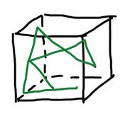
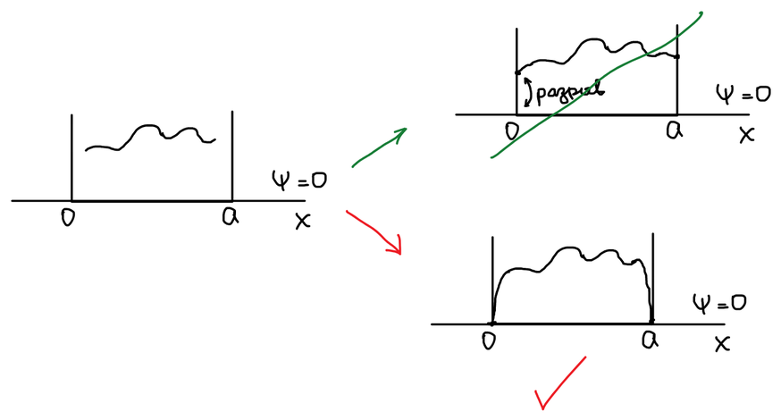

Частица движется внутри ящика, но в любом направлении. Описать частицу — значит найти ее волновую функцию и найти ее энергию.

## Гамильтониан

$$
\widehat{H} = \widehat{T} + \widehat{U}
$$

$$
\widehat{T} = -\frac{\hbar^2}{2m}\nabla^2 = -\frac{\hbar^2}{2m} \left( \frac{\partial^2}{\partial x^2} + \frac{\partial^2}{\partial y^2} + \frac{\partial^2}{\partial z^2} \right)
$$

Потенциальная энергия:

- $\widehat{U} = 0$ — внутри ящика;
- $\widehat{U} = \infty$ — снаружи.

Внутри ящика частица есть, и волновая функция отлична от нуля:

$$
\begin{cases}
0 \le x \le a \\
0 \le y \le b \\
0 \le z \le c
\end{cases}
\qquad U = 0, \quad \psi \neq 0
$$

Снаружи ящика частицы нет:

$$
\begin{cases}
x > a, \ x < 0 \\
y > b, \ y < 0 \\
z > c, \ z < 0
\end{cases}
\qquad U = \infty, \quad \psi = 0
$$

## Граничные условия

А что происходит на границе? Снаружи ящика $\psi = 0$. Если бы на стенке волновая функция была отлична от нуля, то она имела бы разрыв. Волновая функция должна быть непрерывной, поэтому на стенках ящика она обращается в нуль.

Следствие условия непрерывности:

$$
\left.
\begin{aligned}
x &= 0, \quad x = a \\
y &= 0, \quad y = b \\
z &= 0, \quad z = c
\end{aligned}
\right\} \quad \psi = 0
$$

## Уравнение Шрёдингера

Уравнение Шрёдингера снаружи ящика лишено смысла, можем записать его только для внутренней области:

$$
-\frac{\hbar^2}{2m} \left( \frac{\partial^2}{\partial x^2} + \frac{\partial^2}{\partial y^2} + \frac{\partial^2}{\partial z^2} \right) \psi = E\psi
$$

$$
\frac{\partial^2 \psi}{\partial x^2} + \frac{\partial^2 \psi}{\partial y^2} + \frac{\partial^2 \psi}{\partial z^2} + \frac{2mE}{\hbar^2}\psi = 0
$$

Это линейное дифференциальное уравнение второго порядка с постоянными коэффициентами **в частных производных**. Общего решения в явном виде у такого уравнения нет, поэтому используем метод **разделения переменных**.

## Разделение переменных

Гамильтониан представляет собой сумму трех независимых частей, каждая из которых действует только на свою координату: $\widehat{H} = \widehat{H}_x + \widehat{H}_y + \widehat{H}_z$. Смещения по осям $x$, $y$, $z$ не зависят друг от друга, поэтому функцию $\psi$ можно искать в виде произведения трех функций, каждая из которых зависит только от одной координаты:

$$
\psi = X(x) \, Y(y) \, Z(z)
$$

При прямолинейном движении декартовы координаты являются независимыми.

$$
\frac{\partial^2 XYZ}{\partial x^2} + \frac{\partial^2 XYZ}{\partial y^2} + \frac{\partial^2 XYZ}{\partial z^2} + \frac{2mE}{\hbar^2} XYZ = 0
$$

$$
YZ\frac{d^2 X}{dx^2} + XZ\frac{d^2 Y}{dy^2} + XY\frac{d^2 Z}{dz^2} + \frac{2mE}{\hbar^2} XYZ = 0
$$

Делим на $XYZ$:

$$
\frac{1}{X}\frac{d^2 X}{dx^2} + \frac{1}{Y}\frac{d^2 Y}{dy^2} + \frac{1}{Z}\frac{d^2 Z}{dz^2} + \frac{2mE}{\hbar^2} = 0
$$

$$
\frac{\hbar^2}{2m} \left( \frac{1}{Y}\frac{d^2 Y}{dy^2} + \frac{1}{Z}\frac{d^2 Z}{dz^2} \right) + E = -\frac{\hbar^2}{2m}\frac{1}{X}\frac{d^2 X}{dx^2} = \text{const} = E_x
$$

Сейчас мы имеем уравнение: слева содержится функция от $y$ и $z$, при этом они независимые, а справа — функция от $x$. При этом выполняется равенство. Это возможно, только если обе эти части не зависят от переменных, а равняются константе.

**$x$-уравнение:**

$$
-\frac{\hbar^2}{2m}\frac{1}{X}\frac{d^2 X}{dx^2} = E_x
$$

Оставшаяся часть:

$$
\frac{\hbar^2}{2m} \left( \frac{1}{Y}\frac{d^2 Y}{dy^2} + \frac{1}{Z}\frac{d^2 Z}{dz^2} \right) + E = E_x
$$

$$
\frac{\hbar^2}{2m}\frac{1}{Z}\frac{d^2 Z}{dz^2} + E - E_x = -\frac{\hbar^2}{2m}\frac{1}{Y}\frac{d^2 Y}{dy^2} = \text{const}_1 = E_y
$$

**$y$-уравнение:**

$$
-\frac{\hbar^2}{2m}\frac{1}{Y}\frac{d^2 Y}{dy^2} = E_y
$$

**$z$-уравнение:**

$$
E - E_x - E_y = -\frac{\hbar^2}{2m}\frac{1}{Z}\frac{d^2 Z}{dz^2} = E_z
$$

Полная энергия складывается из трех частей:

$$
E = E_x + E_y + E_z
$$

🙏 Если вам нравится сайт, подпишитесь на наш <a href="https://t.me/+JfpTv9CJlwQ0MThi">🔗 Телеграм-канал</a>.

## Решение x-уравнения

$$
-\frac{\hbar^2}{2m}\frac{1}{X(x)}\frac{d^2 X(x)}{dx^2} = E_x
$$

Делим на $-\dfrac{\hbar^2}{2m}\dfrac{1}{X}$:

$$
\frac{d^2 X(x)}{dx^2} + \frac{2mE_x}{\hbar^2} X(x) = 0
$$

Это линейное дифференциальное уравнение второго порядка с постоянными коэффициентами — такое же, как для [свободной частицы](../dvizhenie-svobodnyh-chastic/):

$$
X(x) = C\exp(\pm kx) = C \cdot \exp\left( \pm i\frac{\sqrt{2mE_x}}{\hbar} x \right)
$$

$$
k^2 + \frac{2mE_x}{\hbar^2} = 0
$$

$$
k = i\frac{\sqrt{2mE_x}}{\hbar}
$$

Должно выполняться $E_x > 0$. Иначе в показателе экспоненты окажется $i \cdot i$ — действительное значение, то есть $X(x)$ станет суммой действительных экспонент. Такая функция может обратиться в нуль на обеих стенках ящика, только если она равна нулю всюду, — а это означает, что частицы в ящике нет.

Общее решение — сумма двух экспонент:

$$
X(x) = C_1 \exp\left( i\frac{\sqrt{2mE_x}}{\hbar} x \right) + C_2 \exp\left( -i\frac{\sqrt{2mE_x}}{\hbar} x \right)
$$

### Граничное условие на левой стенке

$$
\begin{aligned}
X(0) &= C_1 \exp\left( i\frac{\sqrt{2mE_x}}{\hbar} \cdot 0 \right) + C_2 \exp\left( -i\frac{\sqrt{2mE_x}}{\hbar} \cdot 0 \right) = \\
&= C_1 + C_2 = 0 \quad \Rightarrow \quad C_1 = -C_2
\end{aligned}
$$

Тогда:

$$
\begin{aligned}
X(x) &= C \left( \exp\left( i\frac{\sqrt{2mE_x}}{\hbar} x \right) - \exp\left( -i\frac{\sqrt{2mE_x}}{\hbar} x \right) \right) = \\
&= C \left( \cos\frac{\sqrt{2mE_x}}{\hbar}x + i\sin\frac{\sqrt{2mE_x}}{\hbar}x - \left( \cos\frac{\sqrt{2mE_x}}{\hbar}x - i\sin\frac{\sqrt{2mE_x}}{\hbar}x \right) \right)
\end{aligned}
$$

Косинусы сокращаются:

$$
X(x) = 2 \cdot C \cdot i \sin\frac{\sqrt{2mE_x}}{\hbar}x
$$

Обозначим постоянный множитель $2Ci = A$:

$$
X(x) = A \sin\frac{\sqrt{2mE_x}}{\hbar}x
$$

Значение $A$ найдем из условия нормировки — но после того, как определим $E_x$.

### Граничное условие на правой стенке. Квантование энергии

$$
X(a) = A \sin\frac{\sqrt{2mE_x}}{\hbar}a = 0
$$

Синус равен нулю, когда его аргумент равен $0, \pi, 2\pi, \dots$:

$$
\frac{\sqrt{2mE_x}}{\hbar}a = \pi n_x
$$

$$
\frac{2mE_x}{\hbar^2}a^2 = \pi^2 n_x^2 \quad \Rightarrow \quad E_x = \frac{\pi^2 n_x^2 \hbar^2}{2ma^2}
$$

Энергия не может быть любой, она зависит от $n$. Возникло **квантование**: энергия располагается по уровням.

$$
X(x) = A \sin\frac{\pi n_x}{a}x
$$

### Нормировка

Вероятность найти частицу где-либо внутри ящика равна единице:

$$
\int\limits_0^a |X|^2 \, dx = |A|^2 \int\limits_0^a \sin^2\frac{\pi n_x}{a}x \, dx = |A|^2 \cdot \frac{a}{2} = 1 \quad \Rightarrow \quad |A| = \sqrt{\frac{2}{a}}
$$

Интеграл равен $\dfrac{a}{2}$ именно потому, что на длине ящика укладывается целое число полуволн, — поэтому нормировать функцию можно только после квантования.

Условие нормировки определяет только модуль $A$. Множитель $i$, который был в $A = 2Ci$, — общий фазовый множитель: он не влияет на плотность вероятности $\psi^*\psi$, поэтому $A$ выбирают действительным.

$$
X(x) = \sqrt{\frac{2}{a}} \sin\frac{\pi n_x}{a}x
$$

## Волновая функция и энергия частицы в ящике

Для $Y(y)$ и $Z(z)$ решение такое же. Перемножаем три части:

$$
\psi(x, y, z) = \sqrt{\frac{8}{abc}} \cdot \sin\frac{\pi n_x}{a}x \cdot \sin\frac{\pi n_y}{b}y \cdot \sin\frac{\pi n_z}{c}z
$$

$$
E = \frac{\pi^2\hbar^2}{2ma^2}n_x^2 + \frac{\pi^2\hbar^2}{2mb^2}n_y^2 + \frac{\pi^2\hbar^2}{2mc^2}n_z^2
$$

Квантовые числа $n_x, n_y, n_z$ — целые, но все они не равны нулю: $n_{x,y,z} = 1, 2, 3, \dots$ При $n = 0$ волновая функция всюду равна нулю — частицы в ящике нет.
