[Метод Хюккеля](../metod-hyukkelya/) хорошо описывает сопряженные системы (даже нелинейные). Опишем им ароматические системы.

## Бензол

Описание молекулы бензола методом Хюккеля. Пронумеровали атомы; все 6 атомов имеют $p_z$-электроны:

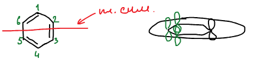

$$
\psi = c_1\chi_1 + \dots + c_6\chi_6
$$

Секулярный определитель отличается от [линейной цепи](../metod-hyukkelya/) единицами в углах: атомы 1 и 6 тоже соседи. Каждый $x$ на диагонали — это $H_{ii}$, то есть $x = \dfrac{\alpha - \varepsilon}{\beta}$:

$$
\begin{vmatrix}
x & 1 & 0 & 0 & 0 & 1 \\
1 & x & 1 & 0 & 0 & 0 \\
0 & 1 & x & 1 & 0 & 0 \\
0 & 0 & 1 & x & 1 & 0 \\
0 & 0 & 0 & 1 & x & 1 \\
1 & 0 & 0 & 0 & 1 & x
\end{vmatrix} = 0
\qquad\qquad
\begin{cases}
c_1 x + c_2 + c_6 = 0 \\
c_1 + c_2 x + c_3 = 0 \\
c_2 + c_3 x + c_4 = 0 \\
c_3 + c_4 x + c_5 = 0 \\
c_4 + c_5 x + c_6 = 0 \\
c_1 + c_5 + c_6 x = 0
\end{cases}
$$

Систему сложно решить в лоб, поэтому используем элементы симметрии. Плоскость симметрии, проходящая через атомы 1 и 4, переводит 2 в 6 и 3 в 5 — но лектор берет плоскость, при которой $c_1 = \pm c_4$, $c_2 = \pm c_3$, $c_5 = \pm c_6$ (ось через середины связей 2–3 и 5–6).

**Симметричные орбитали** ($S$): $c_1 = c_4$, $c_2 = c_3$, $c_5 = c_6$. Шесть уравнений сводятся к трем:

$$
\begin{cases}
c_1 x + c_2 + c_5 = 0 \\
c_1 + c_2 x + c_2 = 0 \\
c_1 + c_5\left( x + 1 \right) = 0
\end{cases}
\qquad \Rightarrow \qquad
\begin{vmatrix}
x & 1 & 1 \\
1 & x + 1 & 0 \\
1 & 0 & x + 1
\end{vmatrix} = 0
\qquad \Rightarrow \qquad
x = -2, \quad x = \pm 1
$$

**Антисимметричные орбитали** ($A$): $c_1 = -c_4$, $c_2 = -c_3$, $c_5 = -c_6$:

$$
\begin{cases}
c_1 x + c_2 - c_5 = 0 \\
c_1 + c_2\left( x - 1 \right) = 0 \\
-c_1 + c_5\left( x - 1 \right) = 0
\end{cases}
\qquad \Rightarrow \qquad
\begin{vmatrix}
x & 1 & -1 \\
1 & x - 1 & 0 \\
-1 & 0 & x - 1
\end{vmatrix} = 0
\qquad \Rightarrow \qquad
x = 2, \quad x = \pm 1
$$

Шесть корней: $-2, -1, -1, 1, 1, 2$. Уровни $x = \pm 1$ дважды вырождены. Шесть электронов занимают три нижние орбитали — $\alpha + 2\beta$ и пару $\alpha + \beta$:

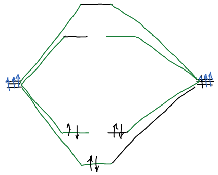

### Энергия резонанса

$$
E_{св} = 2\left( \alpha + 2\beta \right) + 4\left( \alpha + \beta \right) - 6\alpha = 6\alpha + 8\beta - 6\alpha = 8\beta
$$

$$
E_{рез} = E_{св} - 3E_F = 8\beta - 6\beta = 2\beta
$$

Величина $2\beta$ — энергия π-связи. В бензоле есть как бы еще одна двойная связь (дополнительная). Для сравнения: если бы кольцо было бутадиеновым фрагментом плюс изолированная двойная связь, то

$$
E_{св} = 2\beta + 4{,}48\beta = 6{,}48\beta
$$

, а не $8\beta$. $\beta$ намного превышает энергию теплового движения. Двойная связь не выделяется в бензоле.

🙏 Если вам нравится сайт, подпишитесь на наш <a href="https://t.me/+JfpTv9CJlwQ0MThi">🔗 Телеграм-канал</a>.

### Вид орбиталей

Нижняя орбиталь ($x = -2$) — все коэффициенты одинаковы, узлов нет:

$$
\psi_{-2} = \frac{1}{\sqrt{6}}\left( \chi_1 + \chi_2 + \chi_3 + \chi_4 + \chi_5 + \chi_6 \right)
$$

Вырожденная пара $x = -1$ — симметричная и антисимметричная орбитали с одной узловой плоскостью каждая:

$$
\psi_{-1}^S = \frac{1}{2}\left( \chi_2 + \chi_3 - \chi_5 - \chi_6 \right)
$$

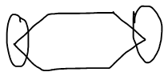

$$
\psi_{-1}^A = \frac{1}{\sqrt{12}}\left( 2\chi_1 + \chi_2 - \chi_3 - 2\chi_4 - \chi_5 + \chi_6 \right)
$$

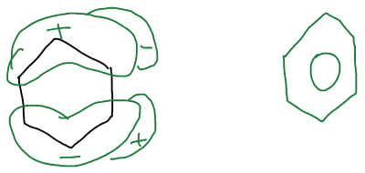

В сумме по трем занятым орбиталям электронная плотность абсолютно вся выровнена: $q_\nu = 1$ на каждом атоме.

## Общая формула и диаграмма Фроста

Общая схема для циклических соединений — определитель с единицами в углах:

$$
\begin{vmatrix}
x & 1 & & & 0 & 1 \\
1 & x & 1 & & & 0 \\
& 1 & x & \ddots & & \\
& & \ddots & \ddots & 1 & \\
0 & & & 1 & x & 1 \\
1 & 0 & & & 1 & x
\end{vmatrix} = 0
$$

Его корни для любого $N$-членного цикла:

$$
x_k = -2\cos\frac{2\pi k}{N}, \qquad k = 0, 1, \dots, N - 1
$$

Эта формула имеет наглядное изображение — **диаграмма Фроста**: в окружность радиуса $2$ вписывают правильный $N$-угольник вершиной вниз; высоты вершин и есть уровни $x_k$. Для бензола — вершины на $-2$, $-1$ (две), $1$ (две), $2$:

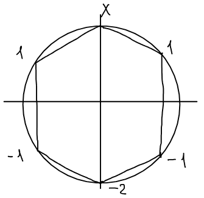

### Правило 4n + 2

Циклопентадиенил $\text{C}_5\text{H}_5$ — пять π-электронов на пяти орбиталях:

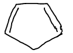

По диаграмме Фроста для пятиугольника — одна нижняя орбиталь и вырожденная пара связывающих. Пять электронов заполняют их не до конца; добавим один $(+\bar{e})$ — получим замкнутую оболочку из шести электронов:

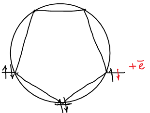

Система является ароматической, когда число π-электронов равно

$$
4n + 2
$$

Анион — ароматическое соединение. Циклопентадиенил-анион входит в **ферроцен** и другие металлоцены:

Циклогептатриенил — семь электронов; чтобы получить $4n + 2 = 6$, надо один электрон убрать $(-\bar{e})$:

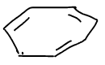

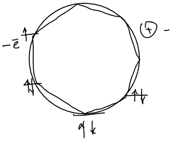

**Тропилий-катион** — ароматический.

Циклооктатетраен — восемь электронов. По диаграмме Фроста для восьмиугольника у него есть вырожденная пара несвязывающих орбиталей ($x = 0$), и два последних электрона попадают на них по одному:

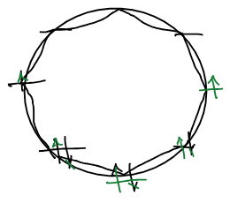

2 электрона на несвязывающих орбиталях. Эта система не подчиняется правилам ароматичности. Эта система не обладает ароматическими свойствами, а является бирадикалом. Такие системы называют **антиароматическими**: $4n$ π-электронов — антиароматичность.

## Системы с гетероатомами

Акролеин:

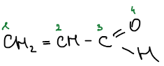

Чередующиеся двойные связи! Может быть, сопряженные? Эта система может быть рассмотрена в методе Хюккеля:

$$
\psi_{МО} = c_1\chi_1 + c_2\chi_2 + c_3\chi_3 + c_4\chi_4
$$

Для атомов углерода матричные элементы прежние: $H_{11} = H_{22} = H_{33} = \alpha$, $H_{12} = H_{23} = \beta$. Но у кислорода другой кулоновский интеграл $\alpha_O$, а для связи C–O другой резонансный интеграл $\beta_{CO}$:

$$
\begin{cases}
c_1\left( \alpha - \varepsilon \right) + c_2\beta = 0 \\
c_1\beta + c_2\left( \alpha - \varepsilon \right) + c_3\beta = 0 \\
c_2\beta + c_3\left( \alpha - \varepsilon \right) + c_4\beta_{CO} = 0 \\
c_3\beta_{CO} + c_4\left( \alpha_O - \varepsilon \right) = 0
\end{cases}
$$

Стрейтвизер предложил выражать их через углеродные $\alpha$ и $\beta$:

$$
\beta_{CO} = k\beta, \qquad \alpha_O = \alpha + h\beta
$$

$k$ и $h$ — **константы Стрейтвизера**, табулированные для каждого гетероатома и типа связи.

$$
\begin{cases}
c_1\left( \alpha - \varepsilon \right) + c_2\beta = 0 \\
c_1\beta + c_2\left( \alpha - \varepsilon \right) + c_3\beta = 0 \\
c_2\beta + c_3\left( \alpha - \varepsilon \right) + c_4 k\beta = 0 \\
c_3 k\beta + c_4\left( \alpha + h\beta - \varepsilon \right) = 0
\end{cases}
\qquad\qquad
x = \frac{\alpha - \varepsilon}{\beta}
$$

$$
\begin{cases}
c_1 x + c_2 = 0 \\
c_1 + c_2 x + c_3 = 0 \\
c_2 + c_3 x + k c_4 = 0 \\
k c_3 + c_4\left( x + h \right) = 0
\end{cases}
\qquad \Rightarrow \qquad
\begin{vmatrix}
x & 1 & 0 & 0 \\
1 & x & 1 & 0 \\
0 & 1 & x & k \\
0 & 0 & k & x + h
\end{vmatrix} = 0
$$

Дальше все как для углеводородов: корни, коэффициенты, плотности и порядки связей — только с табулированными $k$ и $h$ в определителе.
