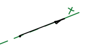

**Свободная частица** — частица, на которую не действуют никакие силы. По первому закону Ньютона такая частица движется равномерно и прямолинейно, поэтому мы можем подстроить ось $x$ под направление ее движения — задача становится одномерной.

## Уравнение Шрёдингера для свободной частицы

Гамильтониан складывается из операторов потенциальной и кинетической энергии:

$$
\widehat{H} = \widehat{U} + \widehat{T}
$$

$$
\widehat{T} = -\frac{\hbar^2 \nabla^2}{2m} = -\frac{\hbar^2}{2m} \left( \frac{\partial^2}{\partial x^2} + \frac{\partial^2}{\partial y^2} + \frac{\partial^2}{\partial z^2} \right) = -\frac{\hbar^2}{2m} \frac{d^2}{dx^2}
$$

На свободную частицу силы не действуют, поэтому:

$$
\widehat{U} = 0
$$

$$
\widehat{H} = -\frac{\hbar^2}{2m} \frac{d^2}{dx^2}
$$

Подставляем гамильтониан в уравнение Шрёдингера $\widehat{H}\psi = E\psi$:

$$
-\frac{\hbar^2}{2m} \frac{d^2\psi}{dx^2} = E\psi
$$

$$
-\frac{\hbar^2}{2m} \frac{d^2\psi}{dx^2} - E\psi = 0
$$

Делим обе части на $-\dfrac{\hbar^2}{2m}$:

$$
\frac{d^2\psi}{dx^2} + \frac{2mE}{\hbar^2}\psi = 0
$$

Это линейное дифференциальное уравнение второго порядка с постоянными коэффициентами.

## Решение уравнения

Общее решение для линейных дифференциальных уравнений второго порядка:

$$
\psi = C \cdot e^{\pm kx}
$$

, где $k$ — корень характеристического многочлена:

$$
k^2 + \frac{2mE}{\hbar^2} = 0
$$

$$
k^2 = -\frac{2mE}{\hbar^2} \quad \Rightarrow \quad k = i\frac{\sqrt{2mE}}{\hbar}
$$

Получаем волновую функцию:

$$
\psi = C \cdot \exp\left( \pm i\frac{\sqrt{2mE}}{\hbar} x \right)
$$

🙏 Если вам нравится сайт, подпишитесь на наш <a href="https://t.me/+JfpTv9CJlwQ0MThi">🔗 Телеграм-канал</a>.

## Проверка волновой функции

Волновая функция должна быть непрерывной и конечной.

**Непрерывность.** Производная от функции берется, значит функция непрерывна.

**Конечность.** Функции $e^{x}$ и $e^{-x}$ не конечны. Функция $e^{i\varphi}$ конечна, т. к.

$$
e^{i\varphi} = \cos\varphi + i\sin\varphi
$$

Поэтому все зависит от знака энергии:

- $E > 0 \Rightarrow \sqrt{2mE}$ — действительное число. Функция конечна:

$$
\psi = \cos\frac{\sqrt{2mE}}{\hbar}x \pm i\sin\frac{\sqrt{2mE}}{\hbar}x
$$

- $E < 0 \Rightarrow \sqrt{2mE}$ — мнимое число, а значит $\psi$ — действительная экспонента. Функция не конечна:

$$
\psi = C \cdot \exp\left( \pm i^2\frac{\sqrt{2m|E|}}{\hbar} x \right)
$$

Отрицательные значения $E$ — **запрещенные**.

Для свободной частицы энергия может принимать **любое положительное значение**. Знак $\pm$ в показателе экспоненты означает направление движения по оси $x$.

$$
\psi = C \cdot \exp\left( i\frac{\sqrt{2mE}}{\hbar} x \right)
$$

Это функция волны:

$$
\psi = \cos\frac{\sqrt{2mE}}{\hbar}x + i\sin\frac{\sqrt{2mE}}{\hbar}x
$$

Свободная частица представляет собой **волну**, которая описывается этой функцией, и единственное ограничение — $E > 0$.

## Импульс свободной частицы

Посчитаем что-нибудь для этой частицы, например импульс. Среднее значение физической величины находится с помощью ее оператора:

$$
p_x = \int \psi^* \widehat{p}_x \psi \, d\tau
$$

$$
p = \int\limits_{-\infty}^{+\infty} C \exp\left( -i\frac{\sqrt{2mE}}{\hbar} x \right) (-i\hbar) \frac{d}{dx} \, C \exp\left( i\frac{\sqrt{2mE}}{\hbar} x \right) dx
$$

Производная от волновой функции:

$$
\frac{d}{dx} \left( C \exp\left( i\frac{\sqrt{2mE}}{\hbar} x \right) \right) = C \cdot i\frac{\sqrt{2mE}}{\hbar} \exp\left( i\frac{\sqrt{2mE}}{\hbar} x \right)
$$

Подставляем:

$$
\begin{aligned}
p &= \int\limits_{-\infty}^{+\infty} C \exp\left( -i\frac{\sqrt{2mE}}{\hbar} x \right) (-i\hbar) \cdot C \cdot i\frac{\sqrt{2mE}}{\hbar} \exp\left( i\frac{\sqrt{2mE}}{\hbar} x \right) dx = \\
&= -i^2 \hbar \frac{\sqrt{2mE}}{\hbar} \, C^2 \int\limits_{-\infty}^{+\infty} \underbrace{\exp\left( -i\frac{\sqrt{2mE}}{\hbar} x \right)}_{f^*} \cdot \underbrace{\exp\left( i\frac{\sqrt{2mE}}{\hbar} x \right)}_{f} dx
\end{aligned}
$$

$C$ — нормировочный множитель:

$$
C = \frac{1}{\sqrt{\int f^* f \, d\tau}} \qquad C^2 = \frac{1}{\int f^* f \, d\tau}
$$

Интегралы сокращаются:

$$
p = \sqrt{2mE} \cdot \frac{1}{\int f^* f \, d\tau} \cdot \int f^* f \, d\tau = \sqrt{2mE}
$$

Получили **точное значение** импульса свободной частицы.

## Плотность вероятности

$$
\begin{aligned}
\psi^*\psi &= C \exp\left( -i\frac{\sqrt{2mE}}{\hbar} x \right) \cdot C \exp\left( i\frac{\sqrt{2mE}}{\hbar} x \right) = \\
&= C^2 \exp\left( -i\frac{\sqrt{2mE}}{\hbar} x + i\frac{\sqrt{2mE}}{\hbar} x \right) = C^2
\end{aligned}
$$

Плотность вероятности представляет собой константу (квадрат нормировочного множителя): независимо от точки расположения частицы плотность вероятности одна и та же. Частица может с равной вероятностью находиться в любой точке.

Импульс частицы мы знаем точно, а о ее положении не знаем ничего: координату и импульс мы не можем знать одновременно точно.
