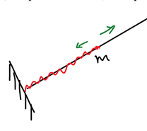
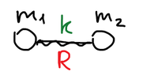
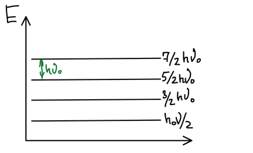
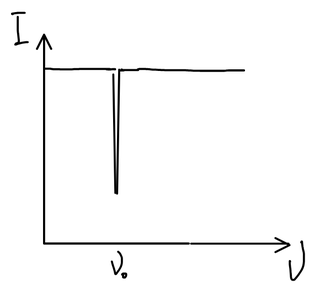

Колебания шарика на пружинке — классический пример колебаний. Такая система называется **гармоническим осциллятором**: возвращающая сила пропорциональна смещению от положения равновесия.

$$
F = -kx
$$

, где $k$ — жесткость пружины (силовая постоянная), $x$ — смещение.

## Уравнение Шрёдингера для осциллятора

Потенциальная энергия пружины — квадратичная функция смещения:

$$
\widehat{U} = \frac{kx^2}{2}
$$

Задача одномерная, поэтому оператор кинетической энергии содержит одну производную:

$$
\widehat{T} = -\frac{\hbar^2}{2m}\nabla^2 = -\frac{\hbar^2}{2m}\frac{d^2}{dx^2}
$$

$$
\widehat{H} = \widehat{T} + \widehat{U} = -\frac{\hbar^2}{2m}\frac{d^2}{dx^2} + \frac{kx^2}{2}
$$

Подставляем гамильтониан в уравнение Шрёдингера $\widehat{H}\psi = E\psi$:

$$
-\frac{\hbar^2}{2m}\frac{d^2\psi}{dx^2} + \frac{kx^2}{2}\psi = E\psi
$$

Делим обе части на $-\dfrac{\hbar^2}{2m}$:

$$
\frac{d^2\psi}{dx^2} + \frac{2mE}{\hbar^2}\psi - \frac{km}{\hbar^2}x^2\psi = 0
$$

В отличие от [свободной частицы](../dvizhenie-svobodnyh-chastic/) и [частицы в ящике](../chastica-v-potencialnom-yashchike/), это линейное дифференциальное уравнение второго порядка **с переменными коэффициентами**: перед $\psi$ стоит множитель, зависящий от $x$.

Введем обозначения:

$$
a = \frac{2mE}{\hbar^2}, \qquad b = \frac{\sqrt{km}}{\hbar}
$$

$$
\frac{d^2\psi}{dx^2} + \left( a - b^2x^2 \right)\psi = 0
$$

Перейдем к безразмерной координате $\xi = \sqrt{b}\,x$. Тогда $\dfrac{d^2}{dx^2} = b\dfrac{d^2}{d\xi^2}$, и после деления на $b$:

$$
\frac{d^2\psi}{d\xi^2} + \left( \frac{a}{b} - \xi^2 \right)\psi = 0
$$

## Решение уравнения

### Частное решение на бесконечности

При $x \to \infty$ (а значит и $\xi \to \infty$) слагаемым $\dfrac{a}{b}$ можно пренебречь по сравнению с $\xi^2$:

$$
\frac{d^2\psi}{d\xi^2} - \xi^2\psi = 0
$$

Частное решение этого уравнения:

$$
\psi = e^{\pm\xi^2/2}
$$

Знак «плюс» отбрасываем: такая функция неограниченно растет и не может быть волновой. Остается $\psi = e^{-\xi^2/2}$.

### Общее решение

Общее решение исходного уравнения ищем как произведение найденного частного решения на некоторую функцию $f(\xi)$:

$$
\psi = C \cdot f(\xi) \, e^{-\xi^2/2}
$$

Подставляем это выражение в уравнение $\dfrac{d^2\psi}{d\xi^2} + \left( \dfrac{a}{b} - \xi^2 \right)\psi = 0$. Экспонента сокращается, и для $f$ получается уравнение:

$$
f^{\prime\prime} - 2\xi f^{\prime} + \left( \frac{a}{b} - 1 \right) f = 0
$$

Это **уравнение Эрмита**. Его решение ищем в виде степенного ряда:

$$
f = \sum_{i=0}^{\infty} c_i \xi^i
$$

Подстановка ряда в уравнение дает способ вычисления коэффициентов $c_i$ — каждый следующий выражается через предыдущие. Но бесконечный ряд не годится: он растет на бесконечности быстрее, чем убывает $e^{-\xi^2/2}$, и волновая функция получается не конечной. Функция вида $\xi^n e^{-\xi^2/2}$ — многочлен на убывающую экспоненту — конечна, поэтому ряд должен **оборваться** на некотором члене $n$.

🙏 Если вам нравится сайт, подпишитесь на наш <a href="https://t.me/+JfpTv9CJlwQ0MThi">🔗 Телеграм-канал</a>.

### Полином Эрмита и квантование

Ряд обрывается, только если коэффициент при $f$ в уравнении Эрмита равен четному числу:

$$
\frac{a}{b} - 1 = 2n, \qquad n = 0, 1, 2, \dots
$$

Это **условие для решения**. Тогда уравнение Эрмита принимает вид

$$
f^{\prime\prime} - 2\xi f^{\prime} + 2nf = 0
$$

, а его решение — многочлен степени $n$, **полином Эрмита** $H_n(\xi)$:

$$
f = \sum_{i=0}^{n} c_i \xi^i = H_n(\xi)
$$

$$
\psi = C \sum_{i=0}^{n} c_i \xi^i e^{-\xi^2/2} = C H_n(\xi) \, e^{-\xi^2/2}
$$

Условие обрыва ряда — это и есть условие квантования энергии. Подставляем $a$ и $b$:

$$
\frac{a}{b} = \frac{2mE}{\hbar^2} \cdot \frac{\hbar}{\sqrt{km}} = \frac{2E}{\hbar}\sqrt{\frac{m}{k}} = 2n + 1
$$

$$
E = \hbar\sqrt{\frac{k}{m}}\left( n + \frac{1}{2} \right)
$$

Величина $\sqrt{k/m}$ — круговая частота классического осциллятора $\omega_0$. Собственная частота колебаний:

$$
\nu_0 = \frac{1}{2\pi}\sqrt{\frac{k}{m}}
$$

С учетом $2\pi\hbar = h$:

$$
E = h\nu_0\left( n + \frac{1}{2} \right), \qquad n = 0, 1, 2, \dots
$$

**Энергия гармонического осциллятора квантуется.**

## Колебания двухатомной молекулы

Колебания двухатомных молекул полностью описываются моделью гармонического осциллятора, если вместо массы шарика взять **приведенную массу** молекулы:

$$
m = \frac{m_1 m_2}{m_1 + m_2}
$$

### Энергетический спектр осциллятора

$$
E = h\nu_0\left( n + \frac{1}{2} \right), \qquad \nu_0 = \frac{1}{2\pi}\sqrt{\frac{k}{m}}, \qquad n = 0, 1, 2, \dots
$$

| $n$ | $E$ |
|:-:|:-:|
| 0 | $\dfrac{1}{2}h\nu_0$ |
| 1 | $\dfrac{3}{2}h\nu_0$ |
| 2 | $\dfrac{5}{2}h\nu_0$ |
| 3 | $\dfrac{7}{2}h\nu_0$ |

Уровни расположены на одинаковом расстоянии $h\nu_0$ друг от друга, а самый нижний уровень лежит не в нуле, а на высоте $\dfrac{1}{2}h\nu_0$.

**Колебания существуют всегда!** Представим, что шарик остановился. Тогда мы знали бы его координату и одновременно импульс $p = 0$, а одновременно точно знать координату и импульс нельзя.

### Колебательный спектр

Получение спектра: берется система и облучается сплошным спектром. Поглотится только та волна, энергия которой соответствует переходу между уровнями:

$$
E_{эм} = h\nu_i
$$

Поглощается:

$$
E_{эм} = \Delta E
$$

Соседние уровни осциллятора отстоят друг от друга на $h\nu_0$, поэтому:

$$
h\nu_i = h\nu_0
$$

В электромагнитном спектре поглощается та частота, которая равна собственной частоте колебания осциллятора.

Колебательный спектр гармонического осциллятора состоит из одной полосы — **характеристической**.

Колебательные спектры лежат в инфракрасной (ИК) области. В ИК-спектроскопии вместо частоты используют **волновое число** — величину, обратную длине волны:

$$
\bar{\nu} = \frac{\nu}{c} \quad [\text{см}^{-1}]
$$

Характеристические полосы колебаний молекул лежат в диапазоне примерно $700 - 3000 \ \text{см}^{-1}$.
