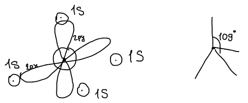
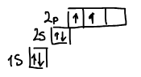
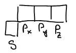
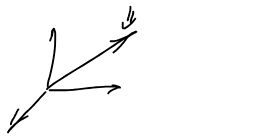

Полинг использовал [метод валентных схем](../metod-valentnyh-shem/) и ввел понятие **гибридизации**. Все органические соединения — производные углеродсодержащих соединений. Электронная оболочка углерода:

$$
1s^2\,2s^2\,2p^2
$$

Когда рисуется валентная схема, например для метана, четыре $1s$-орбитали водорода перекрываются с орбиталями углерода, а углы между связями — по $109^\circ$:

Вопрос в том, сколько таких валентных схем можно построить.

В методе валентных схем строится базис из валентных схем, в котором решается уравнение. Задача — построить маленький базис. Если использовать для построения валентных схем атомы в основном состоянии — приходится много строить. Число можно уменьшить существенно, если применить то понятие, которое предложил Полинг, — гибридизацию.

**Гибридизация** — математический прием записи волновых функций в виде линейных комбинаций вырожденных орбиталей.

## Какие орбитали являются вырожденными?

У [водородоподобного атома](../vodorodopodobnyj-atom/) энергия зависит только от главного квантового числа и не зависит от орбитали:

$$
\text{H:} \qquad E = f(n)
$$

Для атома углерода $s$- и $p$-орбитали не являются вырожденными, они обладают разной энергией:

Полинг предложил рассматривать $s$- и $p$-орбитали как вырожденные, для того чтобы упростить описание органических соединений:

Тогда из них можно составлять линейные комбинации — **гибридные атомные орбитали** (ГАО). В зависимости от того, сколько орбиталей смешивается, получается три типа гибридизации:

| Смешиваются | Результат | Остаются | Гибридная орбиталь |
|:-:|:-:|:-:|:-:|
| $s, p_x, p_y, p_z$ | 4 ГАО — $sp^3$ | — | $\psi_{гибр} = a_1 s + b_1 p_x + c_1 p_y + d_1 p_z$ |
| $s, p_x, p_y$ | 3 ГАО — $sp^2$ | $p_z$ | $\psi_{гибр} = a_1 s + b_1 p_x + c_1 p_y$ |
| $s, p_x$ | 2 ГАО — $sp$ | $p_y, p_z$ | $\psi_{гибр} = a_1 s + b_1 p_x$ |

Все соотношения между функциями, которые гибридизируются, выполняются и для гибридных функций.

🙏 Если вам нравится сайт, подпишитесь на наш <a href="https://t.me/+JfpTv9CJlwQ0MThi">🔗 Телеграм-канал</a>.

## Условия для гибридизируемых функций

Какие есть условия, которым подчиняются гибридизируемые волновые функции?

**1) Условие нормировки:**

$$
\int s^2\,d\tau = 1, \qquad \int p_x^2\,d\tau = 1, \qquad \int p_y^2\,d\tau = 1, \qquad \int p_z^2\,d\tau = 1
$$

**2) Ортогональность.** Сферические гармоники, относящиеся к разным атомным орбиталям, ортогональны:

$$
\int s\,p\,d\tau = \int p_x\,p_y\,d\tau = 0
$$

## Вывод sp³-гибридных орбиталей

Ищем четыре гибридные орбитали в виде

$$
\begin{aligned}
\psi_1 &= a_1 s + b_1 p_x + c_1 p_y + d_1 p_z \\
\psi_2 &= a_2 s + b_2 p_x + c_2 p_y + d_2 p_z \\
\psi_3 &= a_3 s + b_3 p_x + c_3 p_y + d_3 p_z \\
\psi_4 &= a_4 s + b_4 p_x + c_4 p_y + d_4 p_z
\end{aligned}
$$

Неизвестных коэффициентов 16. Условия на них:

**1. Нормировка.** Условие нормировки в ортогональном базисе: сумма квадратов равна единице (перекрестные члены исчезают из-за ортогональности $s$, $p_x$, $p_y$, $p_z$):

$$
a_i^2 + b_i^2 + c_i^2 + d_i^2 = 1 \qquad \text{— 4 условия}
$$

**2. Условие ортогональности** гибридных орбиталей друг другу:

$$
\int \psi_i\psi_j\,d\tau = 0 \qquad \Rightarrow \qquad a_i a_j + b_i b_j + c_i c_j + d_i d_j = 0
$$

Пар $(i, j)$ — $C_4^2 = 6$, значит 6 условий ортогональности. Всего 10 уравнений.

**3. $s$-орбиталь сферическая**, поэтому ее вклад во все гибридные орбитали будет одинаков:

$$
a_1 = a_2 = a_3 = a_4 \qquad \text{— 3 условия}
$$

**4.** Первую орбиталь направим по диагонали между осями — тогда на первой орбитали будет одинаковый вклад всех трех $p$-орбиталей:

$$
a_1 = b_1 = c_1 = d_1
$$

Это еще 3 условия — итого 16, по числу неизвестных. Из нормировки первой орбитали:

$$
a_1^2 + b_1^2 + c_1^2 + d_1^2 = 1 \qquad \Rightarrow \qquad 4a_1^2 = 1 \qquad \Rightarrow \qquad a_1 = \frac{1}{2}
$$

Остальные коэффициенты находятся из условий ортогональности — они равны $\pm\dfrac{1}{2}$, а знаки подбираются так, чтобы все четыре орбитали были взаимно ортогональны:

$$
\psi_1 = \frac{1}{2}s + \frac{1}{2}p_x + \frac{1}{2}p_y + \frac{1}{2}p_z
$$

$$
\psi_2 = \frac{1}{2}s + \frac{1}{2}p_x - \frac{1}{2}p_y - \frac{1}{2}p_z
$$

$$
\psi_3 = \frac{1}{2}s - \frac{1}{2}p_x + \frac{1}{2}p_y - \frac{1}{2}p_z
$$

$$
\psi_4 = \frac{1}{2}s - \frac{1}{2}p_x - \frac{1}{2}p_y + \frac{1}{2}p_z
$$

Легко проверить: сумма квадратов коэффициентов в каждой строке равна 1, а сумма произведений коэффициентов любых двух строк равна 0. Направления $p$-частей — $(1, 1, 1)$, $(1, -1, -1)$, $(-1, 1, -1)$, $(-1, -1, 1)$ — это четыре вершины тетраэдра; угол между любыми двумя равен $\arccos\left( -\dfrac{1}{3} \right) = 109{,}5^\circ$, тот самый угол из валентной схемы метана.
