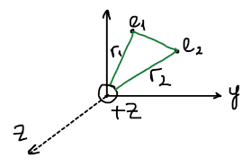
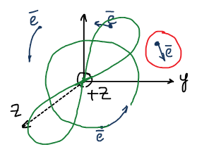

## Описание многоэлектронных атомов

### Невозможность точного решения уравнения Шрёдингера

Любая задача начинается с того, что мы пишем гамильтониан системы. Попробуем решить уравнение для атома гелия:

$$
\widehat{H} = \widehat{T}_1 + \widehat{T}_2 + \widehat{U}_1 + \widehat{U}_2 + \widehat{U}_{12}
$$

, где $\widehat{U}_1$ и $\widehat{U}_2$ — энергия притяжения электронов к ядру, $\widehat{U}_{12}$ — энергия отталкивания электронов друг от друга.

$$
\begin{aligned}
\widehat{H} &= -\frac{\hbar^2}{2m}\nabla_1^2 - \frac{\hbar^2}{2m}\nabla_2^2 - \frac{Ze^2}{r_1} - \frac{Ze^2}{r_2} + \frac{e^2}{r_{12}} = \\
&= \widehat{H}_1(r_1, \theta_1, \varphi_1) + \widehat{H}_2(r_2, \theta_2, \varphi_2) + \frac{e^2}{|\vec{r}_1 - \vec{r}_2|}
\end{aligned}
$$

Здесь $r_1, \theta_1, \varphi_1$ — координаты первого электрона, $r_2, \theta_2, \varphi_2$ — второго, а расстояние между электронами:

$$
\vec{r}_{12} = \vec{r}_1 - \vec{r}_2
$$

Гамильтониан зависит от шести переменных. Можно провести разделение с первыми двумя гамильтонианами, а вот с последним слагаемым ничего не сделать, т. к. эти две координаты всегда будут вместе: расстояние нельзя «расцепить», оно связано сразу с двумя электронами.

Ни в какой системе координат нельзя провести разделение переменных для электронов в атоме гелия, а раз невозможно провести такое разделение, то невозможно и решить уравнение Шрёдингера. Но эта невозможность означает невозможность **точного** решения. Необходимо вносить приближения физического характера.

Приближенные методы делятся на категории в зависимости от того, какие приближения делаются:

1. **Методы ab initio** («из первых принципов»). Используют только физические константы, не оперируют приближенными значениями величин.
2. **Полуэмпирические методы**. Вводятся приближенные параметры.

## Метод Хартри

В 1927 г. Хартри рассмотрел многоэлектронный атом в **одноэлектронном приближении**. Сформулируем задачу в целом:

$$
\widehat{H} = \sum_i \widehat{T}_i + \sum_i \widehat{U}_i + \sum_i \sum_j \widehat{U}_{ij}
$$

$$
\widehat{H} = \sum_i \left( -\frac{\hbar^2}{2m}\nabla_i^2 \right) - \sum_i \frac{Ze^2}{r_i} + \sum_i \sum_j \frac{e^2}{r_{ij}}
$$

С этим гамильтонианом невозможно решить уравнение Шрёдингера. В связи с этим Хартри вводит следующие приближения:

1. Решение для отдельного электрона не зависит от конкретного мгновенного положения всех остальных электронов. Волновые функции отдельных электронов **независимы**.
2. Движущийся электрон отталкивается от стационарных электронных облаков, представляющих собой усредненное распределение электронных плотностей. Т. е. отталкивание не выбрасывается, а заменяется отталкиванием от некой **усредненной плотности**.

Один электрон мы выделяем, а остальные «размазываем» по электронной плотности.

Для каждого электрона ищется своя волновая функция — **орбиталь**. Для $n$ электронов получаем $n$ атомных орбиталей $\psi_i$, а волновая функция атома записывается как их произведение:

$$
\psi_{атома} = \psi_1 \cdot \psi_2 \cdot \psi_3 \dots \psi_n
$$

Задача — найти каждую электронную волновую функцию. Мы должны решить уравнение Шрёдингера для каждого электрона в отдельности:

$$
\widehat{H}_1\psi_1 = \varepsilon_1\psi_1
$$

$$
\widehat{H}_2\psi_2 = \varepsilon_2\psi_2
$$

$$
\widehat{H}_n\psi_n = \varepsilon_n\psi_n
$$

Одноэлектронный гамильтониан:

$$
\widehat{H}_i = \widehat{T}_i + \widehat{U}_i + \sum_{j \neq i} \widehat{U}_{ij} = -\frac{\hbar^2}{2m}\nabla_i^2 - \frac{Ze^2}{r_i} + \sum_j \langle U_{эффект} \rangle
$$

Любая физическая величина может быть рассчитана в среднем:

$$
\langle U_{ij} \rangle = \int\limits_{\infty} \psi_j \frac{e^2}{r_{ij}} \psi_j \, d\tau_j
$$

🙏 Если вам нравится сайт, подпишитесь на наш <a href="https://t.me/+JfpTv9CJlwQ0MThi">🔗 Телеграм-канал</a>.

### Система уравнений Хартри

$$
\begin{cases}
\left\{ -\dfrac{\hbar^2}{2m}\nabla_1^2 - \dfrac{Ze^2}{r_1} + \sum\limits_{j \neq 1} \int\limits_{\infty} \psi_j \dfrac{e^2}{r_{1j}} \psi_j \, d\tau_j \right\} \psi_1 = \varepsilon_1\psi_1 \\
\left\{ -\dfrac{\hbar^2}{2m}\nabla_2^2 - \dfrac{Ze^2}{r_2} + \sum\limits_{j \neq 2} \int\limits_{\infty} \psi_j \dfrac{e^2}{r_{2j}} \psi_j \, d\tau_j \right\} \psi_2 = \varepsilon_2\psi_2 \\
\left\{ -\dfrac{\hbar^2}{2m}\nabla_n^2 - \dfrac{Ze^2}{r_n} + \sum\limits_{j \neq n} \int\limits_{\infty} \psi_j \dfrac{e^2}{r_{nj}} \psi_j \, d\tau_j \right\} \psi_n = \varepsilon_n\psi_n
\end{cases}
$$

Решением системы является набор орбиталей $\{\psi_i\}$.

### Метод самосогласования

Для того, чтобы найти одну функцию, надо знать все остальные. То же самое — с остальными. Такие задачи решаются итерациями. Простейшая иллюстрация — уравнение, в котором неизвестное стоит по обе стороны от знака равенства:

$$
\cos x = x
$$

Вводим пробный набор функций $\{\psi_i\}^0$, по нему находим $\psi^1$, затем $\psi^2$ и так далее — пока не получим равенство функций:

1. Записываем гамильтониан $\widehat{H}$.
2. Задаем пробный набор атомных орбиталей.
3. Рассчитываем средние энергии отталкивания $\langle U_{ij} \rangle$.
4. Подставляем их в уравнения Шрёдингера $\widehat{H}_i\psi_i = \varepsilon_i\psi_i$.
5. Получаем новый набор орбиталей $\{\psi_i\}^k$ и энергий $\{\varepsilon_i\}^k$.
6. Проверка по функции: если $\{\psi_i\}^k = \{\psi_i\}^{k-1}$, то атомные орбитали найдены. Если нет — возвращаемся к шагу 3 с новым набором.

### Энергия атомной орбитали

Энергия $i$-той атомной орбитали:

$$
\begin{aligned}
\varepsilon_i &= \int \psi_i \widehat{H}_i \psi_i \, d\tau = \\
&= \int \psi_i \left( -\frac{\hbar^2}{2m}\nabla_i^2 - \frac{Ze^2}{r_i} + \sum_{j \neq i} \int\limits_{\infty} \psi_j \frac{e^2}{r_{ij}} \psi_j \, d\tau_j \right) \psi_i \, d\tau_i = \\
&= \int \psi_i \left( -\frac{\hbar^2}{2m}\nabla_i^2 - \frac{Ze^2}{r_i} \right) \psi_i \, d\tau_i + \sum_{j \neq i} \int\limits_{\infty} \psi_i \psi_j \frac{e^2}{r_{ij}} \psi_j \psi_i \, d\tau_i \, d\tau_j
\end{aligned}
$$

- Первое слагаемое — **остовный интеграл** $H_i$. Связан с кинетической энергией и потенциальной энергией притяжения электрона к ядру.
- Второе слагаемое — **кулоновский интеграл** $J_{ij}$. Средняя энергия отталкивания между двумя орбиталями.

$$
\varepsilon_i = H_i + \sum_{j \neq i} J_{ij}
$$

Полная волновая функция и полная энергия атома:

$$
\psi = \psi_1 \psi_2 \psi_3 \dots \psi_n
$$

$$
E = \sum_i \varepsilon_i - \frac{1}{2} \sum_i \sum_j J_{ij}
$$

$$
E = \sum_i H_i + \frac{1}{2} \sum_i \sum_j J_{ij}
$$

### Недостаток метода Хартри

Волновая функция должна быть **антисимметрична** относительно перестановки координат двух электронов. Функция Хартри этому требованию не удовлетворяет — при перестановке она не меняет знак:

$$
\psi_1 \psi_2 \psi_3 \dots \psi_n = \psi_2 \psi_1 \psi_3 \dots \psi_n
$$

Функция Хартри не может описывать движение электронов, т. к. не подчиняется принципу Паули.

## Учет принципа Паули для многоэлектронного атома

Когда было установлено, что полная волновая функция по методу Хартри не годится, возникли попытки найти полную волновую функцию.

Слейтер предложил записывать полную волновую функцию в виде определителя (**детерминант Слейтера** — вид полной волновой функции):

$$
\psi = \frac{1}{\sqrt{n!}}
\begin{vmatrix}
\psi_1(1) & \psi_1(2) & \dots & \psi_1(n) \\
\psi_2(1) & \psi_2(2) & \dots & \psi_2(n) \\
\vdots & \vdots & & \vdots \\
\psi_n(1) & \psi_n(2) & \dots & \psi_n(n)
\end{vmatrix}
$$

Строка определителя соответствует одной орбитали, столбец — координатам одного электрона. Если два любых столбца или две строки поменять местами, то определитель меняет знак:

$$
\frac{1}{\sqrt{n!}}
\begin{vmatrix}
\psi_1(2) & \psi_1(1) & \dots & \psi_1(n) \\
\psi_2(2) & \psi_2(1) & \dots & \psi_2(n) \\
\vdots & \vdots & & \vdots \\
\psi_n(2) & \psi_n(1) & \dots & \psi_n(n)
\end{vmatrix}
= -\psi
$$

Принцип Паули учтен автоматически.

## Метод Хартри — Фока

Предложен В. А. Фоком в 1930 г.

Все основные положения и вся логика расчета в методе Хартри — Фока такие же, как в методе Хартри. Меняется лишь вид одноэлектронных уравнений: вместо системы Хартри решается система Хартри — Фока.

$$
\begin{aligned}
&\left( -\frac{\hbar^2}{2m}\nabla_1^2 - \frac{Ze^2}{r_1} \right) \psi_1(1) \, + \\
&+ \sum_{j \neq 1} \left( 2\psi_1(1) \int \psi_j(2) \frac{e^2}{r_{12}} \psi_j(2) \, d\tau_2 - \psi_j(1) \int \psi_1(2) \frac{e^2}{r_{12}} \psi_j(2) \, d\tau_2 \right) = \\
&= \varepsilon_1 \psi_1(1)
\end{aligned}
$$

Сумма в скобках отвечает за учет отталкивания электронов. Второе слагаемое в ней идет со знаком минус, значит энергия отталкивания уменьшается.
