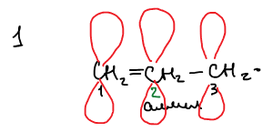
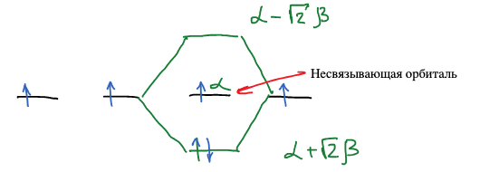
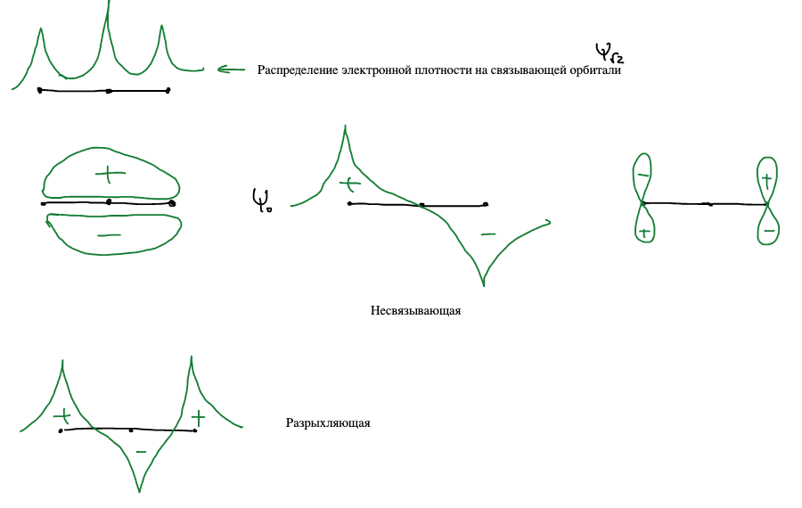
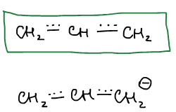
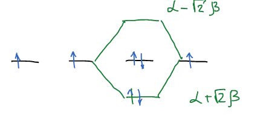
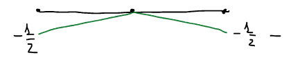
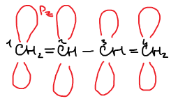
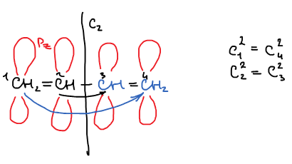
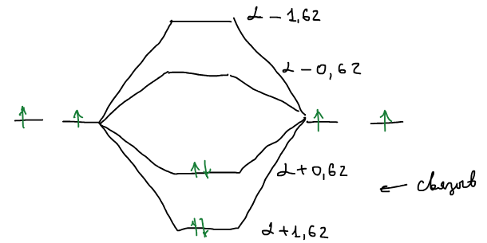

Второй простой метод квантовых расчетов — **метод Хюккеля** для сопряженных π-систем. Это [метод МО ЛКАО](../metod-molekulyarnyh-orbitalej/), в котором рассматриваются только $p_z$-орбитали атомов углерода сопряженной цепи, а матричные элементы не вычисляются, а задаются:

- $H_{\nu\nu} = \alpha$ — **кулоновский интеграл**, одинаковый для всех атомов углерода;
- $H_{\nu\mu} = \beta$ — **резонансный интеграл**, для соседних атомов (отрицательная величина); для несоседних $H_{\nu\mu} = 0$;
- $S_{\nu\nu} = 1$, $S_{\nu\mu} = 0$ — перекрыванием разных орбиталей пренебрегаем.

## Аллильный радикал

Три атома углерода, три $p_z$-орбитали $\chi_1, \chi_2, \chi_3$, три π-электрона:

$$
\psi_{МО} = c_1\chi_1 + c_2\chi_2 + c_3\chi_3
$$

Вариационная система с тремя уравнениями; подставляем хюккелевские значения матричных элементов ($H_{11} = \alpha$, $H_{12} = \beta$, $H_{13} = 0$, $S_{11} = 1$, $S_{12} = 0$, …):

$$
\begin{cases}
c_1\left( H_{11} - \varepsilon S_{11} \right) + c_2\left( H_{12} - \varepsilon S_{12} \right) + c_3\left( H_{13} - \varepsilon S_{13} \right) = 0 \\
c_1\left( H_{21} - \varepsilon S_{21} \right) + c_2\left( H_{22} - \varepsilon S_{22} \right) + c_3\left( H_{23} - \varepsilon S_{23} \right) = 0 \\
c_1\left( H_{31} - \varepsilon S_{31} \right) + c_2\left( H_{32} - \varepsilon S_{32} \right) + c_3\left( H_{33} - \varepsilon S_{33} \right) = 0
\end{cases}
$$

$$
\begin{cases}
c_1\left( \alpha - \varepsilon \right) + c_2\beta = 0 \\
c_1\beta + c_2\left( \alpha - \varepsilon \right) + c_3\beta = 0 \\
c_2\beta + c_3\left( \alpha - \varepsilon \right) = 0
\end{cases}
$$

Делим каждое уравнение на $\beta$ и вводим безразмерную переменную

$$
x = \frac{\alpha - \varepsilon}{\beta}
$$

$$
\begin{cases}
c_1 x + c_2 = 0 \\
c_1 + c_2 x + c_3 = 0 \\
c_2 + c_3 x = 0
\end{cases}
$$

### Секулярное уравнение

$$
\begin{vmatrix}
x & 1 & 0 \\
1 & x & 1 \\
0 & 1 & x
\end{vmatrix} = 0
\qquad \Rightarrow \qquad
x\left( x^2 - 1 \right) - x = 0 \qquad \Rightarrow \qquad x\left( x^2 - 2 \right) = 0
$$

Это секулярное уравнение. Корни:

$$
x = 0, \qquad x = \pm\sqrt{2}
$$

Энергии — из $\varepsilon = \alpha - \beta x$:

$$
\varepsilon = \alpha + \sqrt{2}\beta, \qquad \varepsilon = \alpha, \qquad \varepsilon = \alpha - \sqrt{2}\beta
$$

Так как $\beta < 0$, нижняя орбиталь — $\alpha + \sqrt{2}\beta$ (связывающая), верхняя — $\alpha - \sqrt{2}\beta$ (разрыхляющая), а орбиталь с энергией $\alpha$ — **несвязывающая**: ее энергия равна энергии исходной $p_z$-орбитали. Три электрона: два на связывающей, один на несвязывающей.

🙏 Если вам нравится сайт, подпишитесь на наш <a href="https://t.me/+JfpTv9CJlwQ0MThi">🔗 Телеграм-канал</a>.

### Коэффициенты

**$x = 0$.** Система дает

$$
\begin{cases}
c_2 = 0 \\
c_1 + c_3 = 0 \\
c_2 = 0
\end{cases}
\qquad \Rightarrow \qquad
\begin{cases}
c_2 = 0 \\
c_1 = -c_3
\end{cases}
$$

Условие нормировки:

$$
c_1^2 + c_2^2 + c_3^2 = 1 \qquad \Rightarrow \qquad c_1^2 + c_3^2 = 1 \qquad \Rightarrow \qquad 2c_1^2 = 1, \quad c_1 = \frac{1}{\sqrt{2}}
$$

$$
\psi_0 = \frac{1}{\sqrt{2}}\chi_1 - \frac{1}{\sqrt{2}}\chi_3
$$

**$x = -\sqrt{2}$.**

$$
\begin{cases}
-\sqrt{2}c_1 + c_2 = 0 \\
c_1 - \sqrt{2}c_2 + c_3 = 0 \\
c_2 - \sqrt{2}c_3 = 0
\end{cases}
\qquad \Rightarrow \qquad
\begin{cases}
c_2 = \sqrt{2}c_1 \\
c_2 = \sqrt{2}c_3
\end{cases}
\qquad \Rightarrow \qquad
\begin{cases}
c_1 = c_3 \\
c_2 = \sqrt{2}c_1
\end{cases}
$$

$$
c_1^2 + c_2^2 + c_3^2 = 1 \qquad \Rightarrow \qquad c_1^2 + 2c_1^2 + c_1^2 = 1 \qquad \Rightarrow \qquad 4c_1^2 = 1, \quad c_1 = \frac{1}{2}
$$

**$x = \sqrt{2}$** — так же, только $c_2 = -\sqrt{2}c_1$. Для удобства $\dfrac{\sqrt{2}}{\sqrt{2}\cdot\sqrt{2}} = \dfrac{\sqrt{2}}{2}$:

$$
\psi_{-\sqrt{2}} = \frac{1}{2}\chi_1 + \frac{\sqrt{2}}{2}\chi_2 + \frac{1}{2}\chi_3
$$

$$
\psi_{\sqrt{2}} = \frac{1}{2}\chi_1 - \frac{\sqrt{2}}{2}\chi_2 + \frac{1}{2}\chi_3
$$

### Вид орбиталей

На связывающей орбитали электронная плотность распределена по всем трем атомам с максимумом на среднем. Несвязывающая $\psi_0$ имеет узел на среднем атоме: ее электрон сидит только на крайних атомах. Разрыхляющая — с двумя узлами.

Не видим двойной связи. π-Связь охватывает всю структуру в целом. Так же мы не видим отдельного электрона. Мы видим его одновременно распределенным между 1 и 3 атомом с равной вероятностью.

### Электронная плотность и порядок связи

Матрица связей, известная из [метода МО](../metod-molekulyarnyh-orbitalej/),

$$
P_{\lambda\sigma} = 2\sum_j c_{j\lambda}c_{j\sigma}
$$

очень информативна — несет информацию об электронной плотности на атомах и о порядке связи. Ее диагональный элемент — **электронная плотность** $q_\nu$ на атоме $\nu$, сумма по занятым орбиталям с числом электронов $n_i$ на каждой:

$$
q_\nu = \sum_i^{зан} c_{\nu i}^2\,n_i
$$

Недиагональный элемент — **порядок π-связи** между атомами $\nu$ и $\mu$:

$$
P_{\nu\mu} = \sum_i^{зан} c_{i\nu}c_{i\mu}\,n_i
$$

Для аллильного радикала (два электрона на $\psi_{-\sqrt{2}}$, один на $\psi_0$):

$$
q_1 = \left( \frac{1}{2} \right)^2 \cdot 2 + \left( \frac{1}{\sqrt{2}} \right)^2 \cdot 1 = 1, \qquad
q_2 = \left( \frac{\sqrt{2}}{2} \right)^2 \cdot 2 = 1, \qquad
q_3 = 1
$$

Электронная плотность в единицах заряда электрона. **Избыточный заряд** на атоме — разность между числом электронов, которое атом отдал в π-систему, и плотностью:

$$
\eta_\nu = n_\nu - q_\nu
$$

Если на атоме выше, чем единица, то избыточный заряд — отрицательный; если ниже — положительный. В радикале все $q = 1$, зарядов нет.

Порядок π-связи между 1 и 2 атомом: произведение коэффициентов первого и второго на каждой занятой орбитали, умноженное на число электронов:

$$
P_{12} = 2 \cdot \frac{1}{2} \cdot \frac{\sqrt{2}}{2} + 1 \cdot \frac{1}{\sqrt{2}} \cdot 0 = \frac{\sqrt{2}}{2}, \qquad
P_{23} = 2 \cdot \frac{\sqrt{2}}{2} \cdot \frac{1}{2} = \frac{\sqrt{2}}{2}
$$

Обе связи одинаковы, порядок каждой $\approx 0{,}71$. Аллильный радикал — полностью делокализованная электронная структура:

## Аллил-анион

Из рассмотрения аллильного радикала методом Хюккеля легко получить анион: орбитали те же, добавляется один электрон на несвязывающую орбиталь.

$$
q_1 = \left( \frac{1}{2} \right)^2 \cdot 2 + \left( \frac{1}{\sqrt{2}} \right)^2 \cdot 2 = \frac{1}{2} + 1 = 1{,}5, \qquad
q_2 = \left( \frac{\sqrt{2}}{2} \right)^2 \cdot 2 = 1, \qquad
q_3 = 1{,}5
$$

$$
\eta_1 = \eta_3 = 1 - 1{,}5 = -0{,}5
$$

Избыточный отрицательный заряд — на концах.

Итак, метод Хюккеля решает три типа задач:

1. Дана молекула, надо найти энергии орбиталей.
2. Уже даны энергии орбиталей, и надо найти волновые функции.
3. Даны волновые функции, и надо найти распределение электронов.

## Бутадиен

Четыре атома, четыре $p_z$-орбитали, четыре π-электрона:

$$
\psi = c_1\chi_1 + c_2\chi_2 + c_3\chi_3 + c_4\chi_4, \qquad x = \frac{\alpha - \varepsilon}{\beta}
$$

$$
\begin{vmatrix}
x & 1 & 0 & 0 \\
1 & x & 1 & 0 \\
0 & 1 & x & 1 \\
0 & 0 & 1 & x
\end{vmatrix} = 0
\qquad\qquad
\begin{cases}
c_1 x + c_2 = 0 \\
c_1 + c_2 x + c_3 = 0 \\
c_2 + c_3 x + c_4 = 0 \\
c_3 + c_4 x = 0
\end{cases}
$$

### Учет симметрии

Определитель четвертого порядка раскрывать долго. Если провести учет свойств симметрии, задача упрощается. Элементы симметрии, которые имеются в молекулярной системе, одновременно действуют и на молекулярные орбитали. Если атомы являются симметричными относительно некоторой операции симметрии, то квадраты их коэффициентов в молекулярных орбиталях будут равны.

Ось $C_2$ переводит атом 1 в 4, а 2 в 3:

$$
c_1^2 = c_4^2, \qquad c_2^2 = c_3^2
$$

Значит, каждая орбиталь либо **симметрична** ($S$), либо **антисимметрична** ($A$) относительно этой оси — дополнительные условия связи коэффициентов.

**Симметричные орбитали:** $c_1 = c_4$, $c_2 = c_3$. Подставляем в систему — четыре уравнения сводятся к двум:

$$
\begin{cases}
c_1 x + c_2 = 0 \\
c_1 + c_2 x + c_2 = 0 \\
c_2 + c_2 x + c_1 = 0 \\
c_2 + c_1 x = 0
\end{cases}
\qquad \Rightarrow \qquad
\begin{vmatrix}
x & 1 \\
1 & x + 1
\end{vmatrix} = 0
$$

$$
x^2 + x - 1 = 0 \qquad \Rightarrow \qquad x = -1{,}62, \quad x = 0{,}62
$$

**Антисимметричные орбитали:** $c_1 = -c_4$, $c_2 = -c_3$:

$$
\begin{cases}
c_1 x + c_2 = 0 \\
c_1 + c_2\left( x - 1 \right) = 0
\end{cases}
\qquad \Rightarrow \qquad
\begin{vmatrix}
x & 1 \\
1 & x - 1
\end{vmatrix} = 0
$$

$$
x^2 - x - 1 = 0 \qquad \Rightarrow \qquad x = -0{,}62, \quad x = 1{,}62
$$

Четыре корня — четыре орбитали. Четыре электрона занимают две нижние, связывающие:

### Энергия делокализации

Энергия связывания сопряженной системы — энергия π-электронов на молекулярных орбиталях минус их энергия на изолированных $p_z$-орбиталях:

$$
E_{св} = 2\left( \alpha + 1{,}62\beta \right) + 2\left( \alpha + 0{,}62\beta \right) - 4\alpha = 4{,}48\beta
$$

Это отрицательная величина ($\beta < 0$). Принято сравнивать с молекулой этилена: в молекуле этилена два электрона на орбитали $\alpha + \beta$, и энергия связывания $E_F = 2\beta$. В бутадиене две «двойные связи» дали бы $2E_F = 4\beta$. Разность — есть **энергия резонанса**, или энергия делокализации:

$$
E_{рез} = E_{св} - 2E_F = 0{,}48\beta
$$

## Общая формула для линейной цепи

Секулярные определители аллила и бутадиена устроены одинаково: $x$ на диагонали, единицы рядом с ней, нули везде еще:

$$
\begin{vmatrix}
x & 1 & & & 0 \\
1 & x & 1 & & \\
& 1 & x & \ddots & \\
& & \ddots & \ddots & 1 \\
0 & & & 1 & x
\end{vmatrix} = 0
$$

Эта общность наталкивает на мысль, что существует какая-то общая формула. Для линейной цепи из $N$ атомов корни выражаются явно:

$$
x_k = -2\cos\frac{\pi k}{N + 1}, \qquad k = 1, 2, \dots, N
$$

, где $N$ — порядок определителя (число атомов в цепи сопряжения), $k$ — номер уровня. Проверка: при $N = 3$ получаем $-\sqrt{2}, 0, \sqrt{2}$, при $N = 4$ — $\pm 1{,}62$ и $\pm 0{,}62$.
