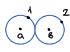
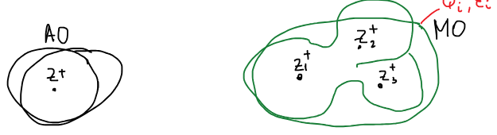
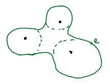
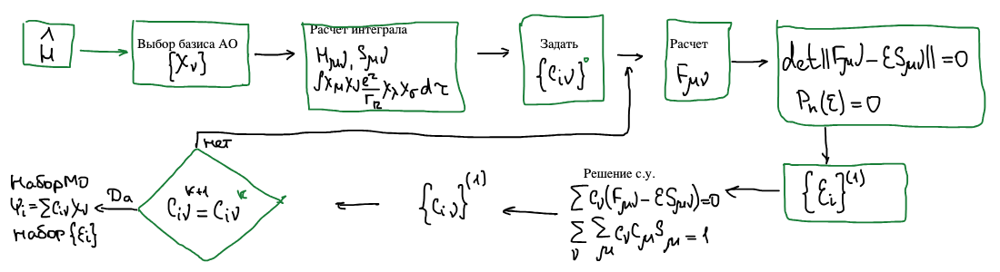

МО — тот теоретический метод, который используется практически.

## Почему метод МО вышел на первый план?

До 60-х годов [метод валентных схем](../metod-valentnyh-shem/) доминировал — был основной расчетный метод. Но к 60-м годам возникло препятствие. Для молекулы водорода с двумя электронами минимальное количество валентных схем — две (электроны можно переставить $2!$ способами):

$$
2e \longrightarrow 2!
$$

Если электронов $n$, число валентных схем растет как факториал:

$$
n\,\bar{e} \qquad \text{число ВС} = n!
$$

Пока числа маленькие — факториал маленький, валентных схем было счетное количество, а когда число электронов возрастало — их становилось бессчетное количество, даже если учитывались лишь валентные орбитали. Метод валентных схем уперся в $n!$. Технически он оказался непригодным.

Тогда теоретики обратили внимание на другой подход — МО, который развивался с 1929 года: Хунд, Леннард-Джонс, Малликен. Этот метод оставался в тени метода ВС и развивался физиками.

**МО** — волновая функция, описывающая движение одного электрона в молекуле. Если [атомная орбиталь](../atomnye-orbitali/) описывает электрон в поле одного ядра, то молекулярная орбиталь $\psi_i$ с энергией $\varepsilon_i$ — электрон в поле всех ядер $Z_1, Z_2, Z_3, \dots$ сразу.

Метод МО — [метод Хартри — Фока](../metod-hartri-foka/) для молекул со всеми вытекающими.

## Метод Рутана

1954 — ученик Малликена — Рутан (Roothaan; пишут и «Рутаан») предложил вариант метода МО, который стал общепринятым.

Как и для атома, для каждой молекулярной орбитали записывается уравнение с оператором Фока:

$$
\widehat{F}_i\psi_i = \varepsilon_i\psi_i
\qquad\qquad
\begin{cases}
\widehat{F}_1\psi_1 = \varepsilon_1\psi_1 \\
\widehat{F}_2\psi_2 = \varepsilon_2\psi_2 \\
\quad\vdots \\
\widehat{F}_n\psi_n = \varepsilon_n\psi_n
\end{cases}
$$

Полная волновая функция молекулы — детерминант Слейтера из молекулярных орбиталей со спиновыми функциями:

$$
\psi = \frac{1}{\sqrt{(2n)!}}
\begin{vmatrix}
\psi_1(1)\alpha(1) & \dots \\
\psi_1(1)\beta(1) & \dots \\
\vdots &
\end{vmatrix}
$$

Гамильтониан молекулы содержит кинетическую энергию электронов, притяжение электронов ко всем ядрам $\alpha$, отталкивание ядер друг от друга и отталкивание электронов друг от друга:

$$
\widehat{H} = \sum_i \left( -\frac{\hbar^2}{2m}\nabla_i^2 - \sum_\alpha \frac{Z_\alpha e^2}{r_{i\alpha}} \right) + \sum_\alpha\sum_\beta \frac{Z_\alpha Z_\beta e^2}{r_{\alpha\beta}} + \sum_i\sum_j \frac{e^2}{r_{ij}}
$$

Оператор Фока для $i$-той орбитали: одноэлектронная часть плюс оператор межэлектронного взаимодействия $g(i, j)$:

$$
\widehat{F}_i\psi_i = \left( -\frac{\hbar^2}{2m}\nabla_i^2 - \sum_\alpha \frac{Z_\alpha e^2}{r_{i\alpha}} + \sum_\alpha\sum_\beta \frac{Z_\alpha Z_\beta e^2}{r_{\alpha\beta}} \right)\psi_i + g(i, j)\,\psi_i
$$

Оператор $g(i, j) = g(\{\psi_i\})$ зависит от всех орбиталей — как и в атоме, искомые функции сидят внутри оператора.

🙏 Если вам нравится сайт, подпишитесь на наш <a href="https://t.me/+JfpTv9CJlwQ0MThi">🔗 Телеграм-канал</a>.

### МО ЛКАО

Рутан предложил для решения каждого из этих уравнений использовать [вариационный метод](../variacionnyj-metod/) и использовать в качестве базиса атомные орбитали.

$$
\widehat{F}_i\psi_i = \varepsilon_i\psi_i
$$

**МО ЛКАО** — молекулярные орбитали как линейные комбинации атомных орбиталей:

$$
\psi_i = \sum_\nu c_{i\nu}\,\chi_\nu, \qquad \text{АО} = \{\chi_\nu\}
$$

Атомные орбитали $\chi_\nu$ известны, неизвестны коэффициенты $c_{i\nu}$.

Базис АО с математической точки зрения не удобен, т. к. он не ортогональный. С ним труднее работать. Но базис из атомных орбиталей вносит химический смысл.

### Вариационная система

Каждое уравнение решается вариационным методом. Для одной молекулярной орбитали получается система уравнений относительно ее коэффициентов $c_\nu$ и энергии $\varepsilon$:

$$
\begin{cases}
\displaystyle\sum_\nu c_\nu\left( F_{1\nu} - \varepsilon S_{1\nu} \right) = 0 \\[2ex]
\displaystyle\sum_\nu c_\nu\left( F_{2\nu} - \varepsilon S_{2\nu} \right) = 0 \\
\quad\vdots \\
\displaystyle\sum_\nu c_\nu\left( F_{n\nu} - \varepsilon S_{n\nu} \right) = 0
\end{cases}
$$

В системе решается только одно уравнение $\widehat{F}\psi = \varepsilon\psi$ — для одной орбитали. Матричные элементы в ней:

$S$ — интеграл перекрывания:

$$
S_{\mu\nu} = \int \chi_\mu\chi_\nu\,d\tau
$$

$F$ — матричный элемент оператора Фока в базисе АО:

$$
\begin{aligned}
F_{\mu\nu} &= \int \chi_\mu\widehat{F}\chi_\nu\,d\tau = \\
&= \underbrace{\int \chi_\mu\left( -\frac{\hbar^2}{2m}\nabla_i^2 - \sum_\alpha \frac{Z_\alpha e^2}{r_{i\alpha}} + \sum_\alpha\sum_\beta \frac{Z_\alpha Z_\beta e^2}{r_{\alpha\beta}} \right)\chi_\nu\,d\tau}_{H_{\mu\nu}\ \text{— остовный интеграл}} + \int \chi_\mu\,g(i, j)\,\chi_\nu\,d\tau
\end{aligned}
$$

$$
F_{\mu\nu} = H_{\mu\nu} + \int \chi_\mu\,g(i, j)\,\chi_\nu\,d\tau
$$

### Матричный элемент оператора Фока

Оператор $g(i, j)$ — тот же, что в [уравнениях Хартри — Фока](../metod-hartri-foka/): кулоновское слагаемое с множителем 2 и обменное слагаемое, в которых стоят молекулярные орбитали $\psi_j$:

$$
\begin{aligned}
F_{\mu\nu} = H_{\mu\nu} + \sum_{j \neq i}\Big( &2\int \chi_\mu(1)\,\psi_j(2)\,\frac{e^2}{r_{12}}\,\psi_j(2)\,\chi_\nu(1)\,d\tau_1\,d\tau_2 \; - \\
&- \int \chi_\mu(2)\,\psi_j(1)\,\frac{e^2}{r_{12}}\,\psi_j(2)\,\chi_\nu(1)\,d\tau_1\,d\tau_2 \Big)
\end{aligned}
$$

Подставляем разложение молекулярных орбиталей по атомным, $\psi_j = \sum_\lambda c_{j\lambda}\chi_\lambda$:

$$
\begin{aligned}
F_{\mu\nu} = H_{\mu\nu} + \sum_{j \neq i}\Big( &2\int \chi_\mu(1)\sum_\lambda c_{j\lambda}\chi_\lambda(2)\,\frac{e^2}{r_{12}}\sum_\lambda c_{j\lambda}\chi_\lambda(2)\,\chi_\nu(1)\,d\tau_1\,d\tau_2 \; - \\
&- \int \chi_\mu(2)\sum_\lambda c_{j\lambda}\chi_\lambda(1)\,\frac{e^2}{r_{12}}\sum_\lambda c_{j\lambda}\chi_\lambda(2)\,\chi_\nu(1)\,d\tau_1\,d\tau_2 \Big)
\end{aligned}
$$

Чтобы учесть перекрестность (произведение двух сумм), вводим новый индекс $\sigma$ во второй сумме:

$$
\begin{aligned}
F_{\mu\nu} = H_{\mu\nu} + \sum_j\Big( &2\int \chi_\mu(1)\left[ \sum_\lambda\sum_\sigma c_{j\lambda}\chi_\lambda(2)\,\frac{e^2}{r_{12}}\,c_{j\sigma}\chi_\sigma(2) \right]\chi_\nu(1)\,d\tau_1\,d\tau_2 \; - \\
&- \int \chi_\mu(2)\left[ \sum_\lambda\sum_\sigma c_{j\lambda}\chi_\lambda(1)\,\frac{e^2}{r_{12}}\,c_{j\sigma}\chi_\sigma(2) \right]\chi_\nu(1)\,d\tau_1\,d\tau_2 \Big)
\end{aligned}
$$

Выносим суммы за знак интеграла:

$$
\begin{aligned}
F_{\mu\nu} = H_{\mu\nu} + \sum_\lambda\sum_\sigma\sum_j\Big( &2\int \chi_\mu(1)\,c_{j\lambda}\chi_\lambda(2)\,\frac{e^2}{r_{12}}\,c_{j\sigma}\chi_\sigma(2)\,\chi_\nu(1)\,d\tau_1\,d\tau_2 \; - \\
&- \int \chi_\mu(2)\,c_{j\lambda}\chi_\lambda(1)\,\frac{e^2}{r_{12}}\,c_{j\sigma}\chi_\sigma(2)\,\chi_\nu(1)\,d\tau_1\,d\tau_2 \Big)
\end{aligned}
$$

Коэффициенты не зависят от координат — их можно вынести и из-под интегралов:

$$
\begin{aligned}
F_{\mu\nu} = H_{\mu\nu} + \sum_\lambda\sum_\sigma\underbrace{\sum_j 2c_{j\lambda}c_{j\sigma}}_{P_{\lambda\sigma}}\Big( &\int \chi_\mu(1)\chi_\lambda(2)\,\frac{e^2}{r_{12}}\,\chi_\sigma(2)\chi_\nu(1)\,d\tau_1\,d\tau_2 \; - \\
&- \frac{1}{2}\int \chi_\mu(2)\chi_\lambda(1)\,\frac{e^2}{r_{12}}\,\chi_\sigma(2)\chi_\nu(1)\,d\tau_1\,d\tau_2 \Big)
\end{aligned}
$$

$$
P_{\lambda\sigma} = \sum_j 2c_{j\lambda}c_{j\sigma} \qquad \text{— матрица связей}
$$

Интегралы в скобках зависят только от базиса — их можно вычислить один раз в начале расчета. А все неизвестные коэффициенты собраны в матрице связей $P_{\lambda\sigma}$: именно через нее оператор Фока зависит от искомых орбиталей.

## Схема метода МО

Система

$$
\begin{cases}
\displaystyle\sum_\nu c_\nu\left( F_{1\nu} - \varepsilon S_{1\nu} \right) = 0 \\[2ex]
\displaystyle\sum_\nu c_\nu\left( F_{2\nu} - \varepsilon S_{2\nu} \right) = 0 \\
\quad\vdots \\
\displaystyle\sum_\nu c_\nu\left( F_{n\nu} - \varepsilon S_{n\nu} \right) = 0
\end{cases}
$$

решается самосогласованно, как и уравнения Хартри — Фока для атома:

1. Записываем гамильтониан $\widehat{H}$.
2. Выбираем базис АО $\{\chi_\nu\}$.
3. Рассчитываем интегралы: $H_{\mu\nu}$, $S_{\mu\nu}$ и двухэлектронные $\int \chi_\mu\chi_\nu\dfrac{e^2}{r_{12}}\chi_\lambda\chi_\sigma\,d\tau$.
4. Задаем начальные коэффициенты $\{c_{i\nu}\}^0$.
5. Рассчитываем $F_{\mu\nu}$.
6. Решаем секулярное уравнение $\det\lVert F_{\mu\nu} - \varepsilon S_{\mu\nu} \rVert = 0$ — многочлен $P_n(\varepsilon) = 0$ — и получаем набор энергий $\{\varepsilon_i\}^{(1)}$.
7. Решаем секулярные уравнения $\sum_\nu c_\nu\left( F_{\mu\nu} - \varepsilon S_{\mu\nu} \right) = 0$ с условием нормировки $\sum_\nu\sum_\mu c_\nu c_\mu S_{\mu\nu} = 1$ — получаем коэффициенты $\{c_{i\nu}\}^{(1)}$.
8. Сравниваем: $c_{i\nu}^{k+1} = c_{i\nu}^{k}$? Если нет — возвращаемся к шагу 5 с новыми коэффициентами. Если да — расчет окончен: получен набор МО $\psi_i = \sum_\nu c_{i\nu}\chi_\nu$ и набор энергий $\{\varepsilon_i\}$.
