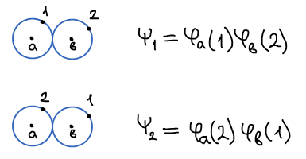
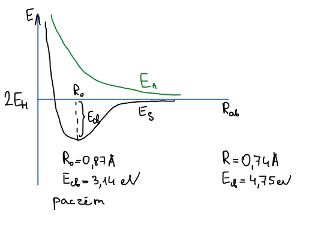

Молекула водорода: два ядра $a$ и $b$ и два электрона, 1 и 2. Каждый атом водорода в отдельности описывается орбиталью $\varphi_a$ или $\varphi_b$. Задача — найти волновую функцию и энергию молекулы [вариационным методом](../variacionnyj-metod/).

## Пробная функция

Волновая функция должна быть задана в виде линейной комбинации:

$$
\psi = c_1\psi_1 + c_2\psi_2
$$

$$
\psi_1 = \varphi_a(1)\,\varphi_b(2)
$$

$$
\psi_2 = \varphi_a(2)\,\varphi_b(1)
$$

В $\psi_1$ электрон 1 находится у ядра $a$, а электрон 2 — у ядра $b$; в $\psi_2$ электроны поменялись местами. Каждая такая функция — **валентная схема**, отсюда название метода.

## Вариационная система

Для двух базисных функций вариационная система состоит из двух уравнений:

$$
\begin{cases}
c_1\left( H_{11} - ES_{11} \right) + c_2\left( H_{12} - ES_{12} \right) = 0 \\
c_1\left( H_{21} - ES_{21} \right) + c_2\left( H_{22} - ES_{22} \right) = 0
\end{cases}
$$

В ней присутствуют матричные элементы, представляющие матричное представление оператора в базисе. Вычислим их.

### Матричные элементы гамильтониана

$$
H_{11} = \int \psi_1\widehat{H}\psi_1\,d\tau = \int \varphi_a(1)\varphi_b(2)\,\widehat{H}\,\varphi_a(1)\varphi_b(2)\,d\tau_1\,d\tau_2 = H_{22}
$$

$$
H_{22} = \int \psi_2\widehat{H}\psi_2\,d\tau = \int \varphi_a(2)\varphi_b(1)\,\widehat{H}\,\varphi_a(2)\varphi_b(1)\,d\tau_1\,d\tau_2
$$

Но первый и второй электрон ничем не отличаются, это просто метки. Тогда физически эти интегралы одинаковы.

$$
H_{12} = \int \psi_1\widehat{H}\psi_2\,d\tau = \int \varphi_a(1)\varphi_b(2)\,\widehat{H}\,\varphi_a(2)\varphi_b(1)\,d\tau_1\,d\tau_2 = H_{21}
$$

$$
H_{21} = \int \psi_2\widehat{H}\psi_1\,d\tau = \int \varphi_a(2)\varphi_b(1)\,\widehat{H}\,\varphi_a(1)\varphi_b(2)\,d\tau_1\,d\tau_2
$$

Поскольку оператор является самосопряженным, то эти интегралы тоже равны.

### Интегралы перекрывания

$$
S_{11} = \int \psi_1\psi_1\,d\tau = \int \varphi_a(1)\varphi_b(2)\,\varphi_a(1)\varphi_b(2)\,d\tau_1\,d\tau_2
= \int \varphi_a^2(1)\,d\tau_1 \cdot \int \varphi_b^2(2)\,d\tau_2 = 1
$$

$S_{11} = 1$, т. к. это произведение двух нормировок.

$$
S_{22} = \int \psi_2\psi_2\,d\tau = \int \varphi_a(2)\varphi_b(1)\,\varphi_a(2)\varphi_b(1)\,d\tau_1\,d\tau_2
= \int \varphi_a^2(2)\,d\tau_2 \cdot \int \varphi_b^2(1)\,d\tau_1 = 1
$$

$$
S_{12} = S_{21} = \int \varphi_a(1)\varphi_b(2)\,\varphi_a(2)\varphi_b(1)\,d\tau_1\,d\tau_2
= \int \varphi_a(1)\varphi_b(1)\,d\tau_1 \cdot \int \varphi_a(2)\varphi_b(2)\,d\tau_2 = S_{ab}^2
$$

$S_{ab} = \int \varphi_a\varphi_b\,d\tau$ — **интеграл перекрывания двух орбиталей**.

🙏 Если вам нравится сайт, подпишитесь на наш <a href="https://t.me/+JfpTv9CJlwQ0MThi">🔗 Телеграм-канал</a>.

## Секулярное уравнение

Подставляем найденные матричные элементы в вариационную систему:

$$
\begin{cases}
c_1\left( H_{11} - E \right) + c_2\left( H_{12} - ES_{ab}^2 \right) = 0 \\
c_1\left( H_{12} - ES_{ab}^2 \right) + c_2\left( H_{11} - E \right) = 0
\end{cases}
$$

Условие: определитель $= 0$.

$$
\begin{vmatrix}
H_{11} - E & H_{12} - ES_{ab}^2 \\
H_{12} - ES_{ab}^2 & H_{11} - E
\end{vmatrix} = 0
$$

$$
\left( H_{11} - E \right)^2 - \left( H_{12} - ES_{ab}^2 \right)^2 = 0
$$

Это **секулярное уравнение** относительно $E$. Решение:

$$
\left( H_{11} - E \right)^2 = \left( H_{12} - ES_{ab}^2 \right)^2
\qquad \Rightarrow \qquad
\begin{aligned}
H_{11} - E &= H_{12} - ES_{ab}^2 \\
H_{11} - E &= -\left( H_{12} - ES_{ab}^2 \right)
\end{aligned}
$$

Из первого уравнения:

$$
H_{11} - H_{12} = E\left( 1 - S_{ab}^2 \right) \qquad \Rightarrow \qquad E_A = \frac{H_{11} - H_{12}}{1 - S_{ab}^2}
$$

Из второго:

$$
H_{11} + H_{12} = E\left( 1 + S_{ab}^2 \right) \qquad \Rightarrow \qquad E_S = \frac{H_{11} + H_{12}}{1 + S_{ab}^2}
$$

Два корня — два состояния молекулы: $E_S$ (симметричное) и $E_A$ (антисимметричное).

## Коэффициенты

Подставим $E_S$ в вариационную систему:

$$
\begin{cases}
c_1\left( H_{11} - \dfrac{H_{11} + H_{12}}{1 + S_{ab}^2} \right) + c_2\left( H_{12} - \dfrac{H_{11} + H_{12}}{1 + S_{ab}^2}\,S_{ab}^2 \right) = 0 \\
c_1\left( H_{12} - \dfrac{H_{11} + H_{12}}{1 + S_{ab}^2}\,S_{ab}^2 \right) + c_2\left( H_{11} - \dfrac{H_{11} + H_{12}}{1 + S_{ab}^2} \right) = 0
\end{cases}
$$

Приведем скобки первого уравнения к общему знаменателю:

$$
c_1\left( \frac{H_{11} + H_{11}S_{ab}^2 - H_{11} - H_{12}}{1 + S_{ab}^2} \right) + \left( \frac{H_{12} + H_{12}S_{ab}^2 - H_{11}S_{ab}^2 - H_{12}S_{ab}^2}{1 + S_{ab}^2} \right) c_2 = 0
$$

$$
c_1\left( H_{11}S_{ab}^2 - H_{12} \right) + c_2\left( H_{12} - H_{11}S_{ab}^2 \right) = 0
$$

$$
c_1\left( H_{11}S_{ab}^2 - H_{12} \right) - c_2\left( H_{11}S_{ab}^2 - H_{12} \right) = 0
$$

Скобки одинаковые и сокращаются:

$$
c_1 = c_2
$$

Точно так же для $E_A$ получается $c_1 = -c_2$. Решение вариационной системы позволяет найти только отношение коэффициентов, а сами коэффициенты найти нельзя. Недостающее условие — нормировка:

$$
\begin{cases}
c_1 = c_2 \\
\int \psi^2\,d\tau = 1
\end{cases}
$$

$$
\int \left( c_1\psi_1 + c_2\psi_2 \right)^2 d\tau = 1
$$

$$
\int \left( c_1^2\psi_1^2 + 2c_1c_2\psi_1\psi_2 + c_2^2\psi_2^2 \right) d\tau = 1
$$

$$
c_1^2\underbrace{\int \psi_1^2\,d\tau}_{S_{11} = 1} + 2c_1c_2\underbrace{\int \psi_1\psi_2\,d\tau}_{S_{12} = S_{ab}^2} + c_2^2\underbrace{\int \psi_2^2\,d\tau}_{S_{22} = 1} = 1
$$

С учетом $c_1 = c_2$:

$$
c_1^2 + 2c_1^2S_{ab}^2 + c_1^2 = 1 \qquad \Rightarrow \qquad 2c_1^2 + 2c_1^2S_{ab}^2 = 1 \qquad \Rightarrow \qquad c_1^2 = \frac{1}{2 + 2S_{ab}^2}
$$

$$
c_1 = \frac{1}{\sqrt{2 + 2S_{ab}^2}} \qquad \text{или} \qquad c_1 = \frac{-1}{\sqrt{2 + 2S_{ab}^2}}
$$

$$
\psi = \frac{1}{\sqrt{2 + 2S_{ab}^2}}\left( \psi_1 + \psi_2 \right) = \frac{1}{\sqrt{2 + 2S_{ab}^2}}\Big( \varphi_a(1)\varphi_b(2) + \varphi_a(2)\varphi_b(1) \Big)
$$

$$
\psi = \frac{-1}{\sqrt{2 + 2S_{ab}^2}}\left( \psi_1 + \psi_2 \right) = \frac{-1}{\sqrt{2 + 2S_{ab}^2}}\Big( \varphi_a(1)\varphi_b(2) + \varphi_a(2)\varphi_b(1) \Big)
$$

Физического смысла волновая функция не имеет, а имеет только ее квадрат, который будет равен тому же, что и функция с отрицательным знаком. Поэтому знак выбираем любой.

### Два состояния молекулы

$$
E_S = \frac{H_{11} + H_{12}}{1 + S_{ab}^2}, \qquad
\psi_S = \frac{1}{\sqrt{2 + 2S_{ab}^2}}\Big( \varphi_a(1)\varphi_b(2) + \varphi_a(2)\varphi_b(1) \Big)
$$

$$
E_A = \frac{H_{11} - H_{12}}{1 - S_{ab}^2}, \qquad
\psi_A = \frac{1}{\sqrt{2 - 2S_{ab}^2}}\Big( \varphi_a(1)\varphi_b(2) - \varphi_a(2)\varphi_b(1) \Big)
$$

Для $\psi_A$ коэффициенты $c_1 = -c_2$, поэтому в нормировке знак перед $2c_1^2S_{ab}^2$ меняется и под корнем получается $2 - 2S_{ab}^2$.

## Вычисление матричных элементов

Гамильтониан молекулы разбивается на три части:

$$
\widehat{H} = \widehat{H}_a + \widehat{H}_b + \widehat{H}_{ab}
$$

$\widehat{H}_a$ и $\widehat{H}_b$ — гамильтонианы изолированных атомов: кинетическая энергия электрона + потенциальная энергия притяжения к своему ядру. $\widehat{H}_{ab}$ — все остальное: взаимодействие между атомами (отталкивание электронов, притяжение каждого электрона к чужому ядру, отталкивание ядер).

$$
H_{11} = \int \psi_1\,\widehat{H}\psi_1\,d\tau, \qquad
H_{12} = H_{21} = \int \psi_2\,\widehat{H}\psi_1\,d\tau
$$

У обоих интегралов общая часть — $\widehat{H}\psi_1$. Вычислим ее. Орбиталь $\varphi_a$ — собственная функция атомного гамильтониана с энергией атома водорода $E_H$:

$$
\widehat{H}_a\varphi_a = E_H\varphi_a
$$

$$
\begin{aligned}
\widehat{H}\psi_1 &= \left( \widehat{H}_a + \widehat{H}_b + \widehat{H}_{ab} \right)\psi_1
= \underbrace{\widehat{H}_a\varphi_a(1)}_{E_H\varphi_a(1)}\varphi_b(2) + \underbrace{\widehat{H}_b\varphi_b(2)}_{E_H\varphi_b(2)}\varphi_a(1) + \widehat{H}_{ab}\psi_1 = \\
&= E_H\varphi_a(1)\varphi_b(2) + E_H\varphi_b(2)\varphi_a(1) + \widehat{H}_{ab}\psi_1
\end{aligned}
$$

$$
\widehat{H}\psi_1 = 2E_H\psi_1 + \widehat{H}_{ab}\psi_1
$$

Теперь $H_{11}$:

$$
H_{11} = \int \psi_1\left( 2E_H\psi_1 + \widehat{H}_{ab}\psi_1 \right) d\tau
= 2E_H\int \psi_1\psi_1\,d\tau + \int \psi_1\widehat{H}_{ab}\psi_1\,d\tau
$$

$$
H_{11} = 2E_H + \int \psi_1\widehat{H}_{ab}\psi_1\,d\tau = 2E_H + J
$$

$J$ — **кулоновский интеграл**. И $H_{12}$:

$$
H_{12} = H_{21} = \int \psi_2\left( 2E_H\psi_1 + \widehat{H}_{ab}\psi_1 \right) d\tau
= \int \psi_2\,2E_H\psi_1\,d\tau + \int \psi_2\widehat{H}_{ab}\psi_1\,d\tau
$$

$$
H_{12} = 2E_H S_{ab}^2 + \int \psi_2\widehat{H}_{ab}\psi_1\,d\tau = 2E_H S_{ab}^2 + K
$$

$K$ — **обменный интеграл**. Подставляем в энергии:

$$
E_S = 2E_H + \frac{J + K}{1 + S_{ab}^2}
$$

$$
E_A = 2E_H + \frac{J - K}{1 - S_{ab}^2}
$$

## Кривая энергии

Энергия зависит от расстояния между ядрами $R_{ab}$ — через интегралы $J$, $K$ и $S_{ab}$:

При $R_{ab} \to \infty$ обе энергии стремятся к $2E_H$ — энергии двух изолированных атомов. Энергия $E_A$ везде выше $2E_H$: в этом состоянии молекула не образуется. Энергия $E_S$ имеет минимум при $R_0$ — это равновесная длина связи, а глубина минимума $E_{св}$ — энергия связи.

| | $R_0$ | $E_{св}$ |
|:-:|:-:|:-:|
| Расчет | 0,87 Å | 3,14 эВ |
| Эксперимент | 0,74 Å | 4,75 эВ |

## Учет спина

Это без учета спина. С учетом:

$$
\psi_S = c_1\left( \psi_1 + \psi_2 \right) \cdot \frac{1}{\sqrt{2}}\Big( \alpha(1)\beta(2) - \alpha(2)\beta(1) \Big)
$$

— **синглетное состояние** водорода: пространственная часть симметрична, спиновая — антисимметрична.

$$
\psi_A = c_2\left( \psi_1 - \psi_2 \right) \cdot
\begin{cases}
\alpha(1)\alpha(2) \\
\beta(1)\beta(2) \\
\dfrac{1}{\sqrt{2}}\Big( \alpha(1)\beta(2) + \alpha(2)\beta(1) \Big)
\end{cases}
$$

— **триплетное состояние**: антисимметричная пространственная часть на любую из трех симметричных спиновых функций. В обоих случаях полная функция антисимметрична, как и требует принцип Паули.
