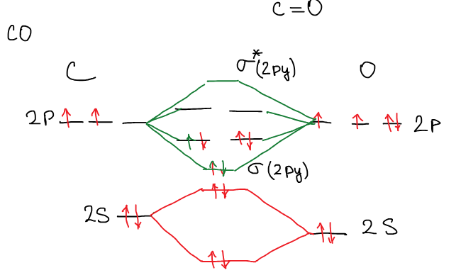
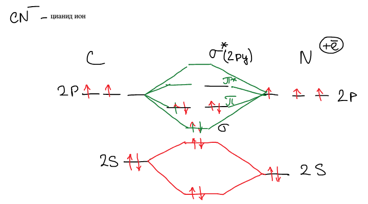
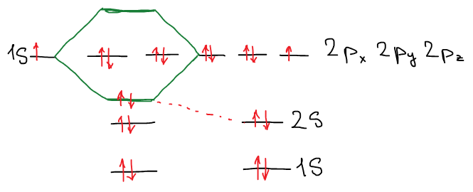
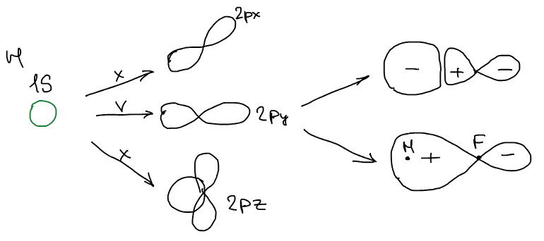

Соответствующие атомные орбитали имеют одинаковую энергию — для [гомоядерных молекул](../mo-gomoyadernyh-molekul/). Правая и левая часть диаграммы находились на одном уровне. Когда мы рассматриваем орбитали гетероядерных молекул, то соответствующие атомные орбитали разных ядер имеют разную энергию.

$2s$-орбитали лития не равны $2s$-орбитали натрия. Для них нет точного соответствия. Но для одного периода можно рассматривать по тем же принципам, что и гомоядерные молекулы.

## Молекула CO

Рассмотрим молекулу CO. Углерод и кислород — атомы одного периода, но у кислорода заряд ядра больше, и его $2s$- и $2p$-орбитали лежат ниже, чем у углерода:

Электронов на валентных орбиталях $4 + 6 = 10$: они заполняют $\sigma(2s)$, $\sigma^*(2s)$, $\sigma(2p_y)$ и две $\pi$-орбитали. Порядок связи:

$$
P = \frac{8 - 2}{2} = 3
$$

$$
\text{CO}: \quad \sigma(2s)^2\,\sigma^*(2s)^2\,\sigma(2p_y)^2\,\pi(2p_x)^2\,\pi(2p_z)^2
$$

Связь в CO тройная — как в изоэлектронной молекуле N₂.

## Цианид-ион CN⁻

У азота на один электрон меньше, чем у кислорода, но в анионе есть лишний электрон $(+\bar{e})$ — поэтому диаграмма заполняется так же, как у CO:

$$
P = 3
$$

🙏 Если вам нравится сайт, подпишитесь на наш <a href="https://t.me/+JfpTv9CJlwQ0MThi">🔗 Телеграм-канал</a>.

## Молекула HF

$$
\text{H}: \ 1s \qquad\qquad \text{F}: \ 1s^2\,2s^2\,2p^5
$$

Здесь атомы из разных периодов, и напрямую сопоставить орбитали нельзя. Можно сопоставить средний радиус электронных орбит. Чем меньше радиус, тем ниже энергия системы. Если оценить их радиус, можно расставить по величине энергии: $1s$-орбиталь водорода оказывается близка по энергии к $2p$-орбиталям фтора.

Из трех $2p$-орбиталей фтора с $1s$-орбиталью водорода может комбинироваться только одна — та, что направлена вдоль оси связи ($2p_y$). Орбитали $2p_x$ и $2p_z$ перекрываются с $1s$ так, что положительная и отрицательная доли компенсируют друг друга:

Такая комбинация не выгодна.

Число МО = число АО. Атомные орбитали, не участвующие в образовании связи, переходят в молекулу без изменения своей энергии, и они называются **несвязывающими** орбиталями.

Итак, орбитали бывают трех типов: **связывающие** (понижают энергию), **разрыхляющие** (повышают энергию) и **несвязывающие**. В HF два электрона на связывающей орбитали, на разрыхляющей — ни одного, остальные шесть валентных электронов фтора — на несвязывающих, которые в порядке связи не учитываются:

$$
P = \frac{2 - 0}{2} = 1
$$
