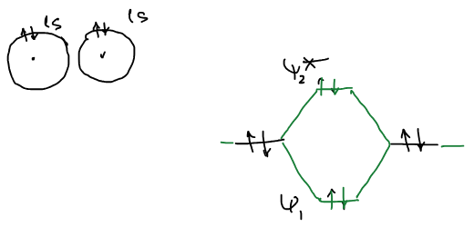
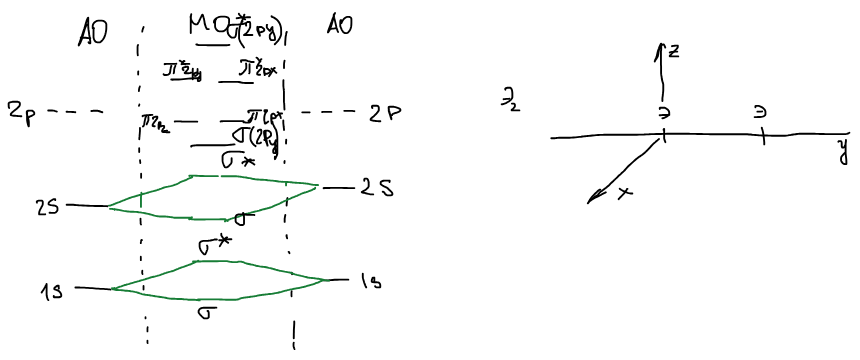
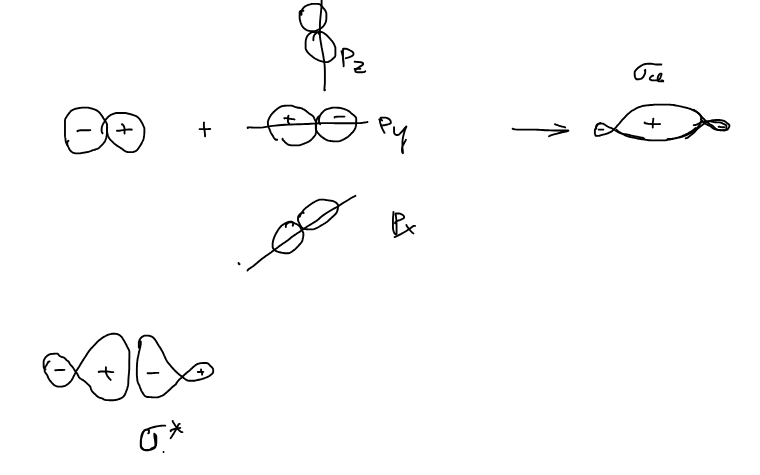
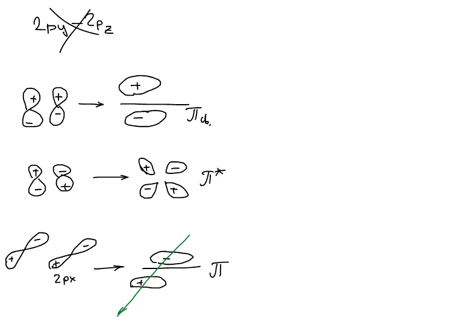

## Молекула He₂

У каждого атома гелия — заполненная $1s$-орбиталь. Как и у [водорода](../vodorod-metodom-mo/), из двух $1s$-орбиталей получаются связывающая $\psi_1$ и разрыхляющая $\psi_2^*$, но теперь электронов четыре, и заполнены обе:

Молекула He₂ не выгодна, т. к. заполнена разрыхляющая орбиталь. Порядок связи:

$$
P = \frac{n_{св} - n_{р}}{2} = 0
$$

## Молекулы элементов второго периода

У атомов второго периода валентных орбиталей больше. Каждая молекулярная орбиталь — линейная комбинация всех атомных орбиталей обоих атомов:

$$
\psi = \sum_\nu c_\nu\chi_\nu = c_1\,1s + c_2\,1s' + \dots + c_{10}\,2p_z'
$$

$$
\text{Э}: \quad 1s,\ 2s,\ 2p_x,\ 2p_y,\ 2p_z \qquad\qquad \text{Э}_2: \quad 10\ \text{базисных орбиталей}
$$

Значит, и молекулярных орбиталей будет десять. Но не все атомные орбитали смешиваются друг с другом.

**Правила комбинирования атомных орбиталей:**

1. Можно комбинировать атомные орбитали, близкие по энергии.
2. Комбинируют атомные орбитали, соответствующие друг другу по симметрии.

Каждая молекулярная орбиталь — сумма всех АО, но можно скомбинировать и рассматривать ограниченное количество АО: $1s$ с $1s$, $2s$ с $2s$, $2p$ с $2p$.

Ось молекулы направим по $y$. Тогда $2p_y$-орбитали смотрят друг на друга вдоль оси, а $2p_x$ и $2p_z$ — перпендикулярно ей.

🙏 Если вам нравится сайт, подпишитесь на наш <a href="https://t.me/+JfpTv9CJlwQ0MThi">🔗 Телеграм-канал</a>.

### σ-орбитали из p-орбиталей

Две $2p_y$-орбитали перекрываются «лоб в лоб» вдоль оси связи. Если навстречу друг другу обращены доли одного знака, получается связывающая σ-орбиталь, если разных — разрыхляющая σ\*:

Орбиталь $2p_y$ не эквивалентна $2p_z$ и $2p_x$: она лежит на оси связи, и ее комбинации — σ-орбитали.

### π-орбитали из p-орбиталей

Орбитали $2p_z$ (и точно так же $2p_x$) перекрываются «боком». Доли одного знака над осью и одного под осью дают связывающую π-орбиталь — с узловой плоскостью, в которой лежит ось связи; противоположные знаки дают разрыхляющую π\* с двумя узловыми плоскостями:

Комбинации $2p_x$ и $2p_z$ одинаковы по энергии: $\pi(2p_x) = \pi(2p_z)$ и $\pi^*(2p_x) = \pi^*(2p_z)$ — вырожденные пары орбиталей.

## Электронные конфигурации молекул

Электроны обоих атомов размещаются по молекулярным орбиталям снизу вверх, по два на орбиталь. Порядок связи — по [той же формуле](../vodorod-metodom-mo/): $P = \dfrac{n_{св} - n_{р}}{2}$.

**Литий.** $\text{Li}: 1s^2\,2s^1$ — три электрона, в молекуле шесть:

$$
\text{Li}_2: \quad \sigma(1s)^2\,\sigma^*(1s)^2\,\sigma(2s)^2 \qquad P = \frac{4 - 2}{2} = 1
$$

Молекула Li₂ существует — в газообразной фазе.

**Бериллий.** $\text{Be}: 1s^2\,2s^2$:

$$
\text{Be}_2: \quad \sigma(1s)^2\,\sigma^*(1s)^2\,\sigma(2s)^2\,\sigma^*(2s)^2 \qquad P = 0
$$

**Азот.** $\text{N}: 1s^2\,2s^2\,2p^3$ — в молекуле 14 электронов:

$$
\text{N}_2: \quad \sigma(1s)^2\,\sigma^*(1s)^2\,\sigma(2s)^2\,\sigma^*(2s)^2\,\sigma(2p_y)^2\,\pi(2p_x)^2 = \pi(2p_z)^2 \qquad P = \frac{10 - 4}{2} = 3
$$

Тройная связь.

**Кислород.** $\text{O}: 1s^2\,2s^2\,2p^4$ — в молекуле 16 электронов, два лишних по сравнению с азотом попадают на вырожденную пару разрыхляющих π\*-орбиталей — по одному на каждую:

$$
\text{O}_2: \quad \sigma(1s)^2\,\sigma^*(1s)^2\,\sigma(2s)^2\,\sigma^*(2s)^2\,\sigma(2p_y)^2\,\pi(2p_x)^2 = \pi(2p_z)^2\,\pi^*(2p_x)^1 = \pi^*(2p_z)^1
$$

$$
P = \frac{10 - 6}{2} = 2
$$

Заполненные орбитали остова $\sigma(1s)^2\,\sigma^*(1s)^2$ на связь не влияют, и их сокращенно обозначают $KK$ (kernel — ядро, остов):

$$
\text{O}_2: \quad KK\,\sigma(2s)^2\,\sigma^*(2s)^2\,\sigma(2p_y)^2\,\pi(2p_x)^2 = \pi(2p_z)^2\,\pi^*(2p_x)^1 = \pi^*(2p_z)^1
$$

Молекула кислорода парамагнитна, но в обычной структурной формуле O=O у нее нет неспаренных электронов. Однако если рассмотреть с теории МО — есть: два электрона на двух вырожденных π\*-орбиталях. Кислород — π-радикал.
