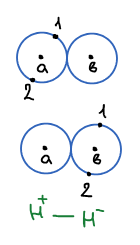
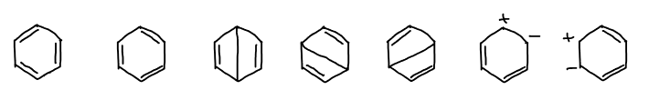

В [расчете молекулы водорода](../metod-valentnyh-shem/) пробная функция строилась из двух валентных схем: $\psi_1 = \varphi_a(1)\varphi_b(2)$ и $\psi_2 = \varphi_a(2)\varphi_b(1)$. В обеих у каждого ядра находится по одному электрону — это **ковалентные** структуры. Но можно посадить оба электрона на одно ядро — получатся **полярные** (ионные) структуры:

$$
\psi_3 = \varphi_a(1)\,\varphi_a(2)
$$

$$
\psi_4 = \varphi_b(1)\,\varphi_b(2)
$$

Структура $\psi_4$ — это $\text{H}^+\text{—}\text{H}^-$, структура $\psi_3$ — наоборот, $\text{H}^-\text{—}\text{H}^+$.

Волновая функция — линейная комбинация уже четырех схем:

$$
\psi = c_1\psi_1 + c_2\psi_2 + c_3\psi_3 + c_4\psi_4
$$

Коэффициенты при полярных структурах $c_3, c_4$ заметно меньше, чем при ковалентных: у молекулы водорода связь в основном ковалентная. Но вклад ионных схем понижает энергию, и результат становится ближе к эксперименту.

🙏 Если вам нравится сайт, подпишитесь на наш <a href="https://t.me/+JfpTv9CJlwQ0MThi">🔗 Телеграм-канал</a>.

Чем больше валентных схем в разложении, тем точнее результат. Лучшее решение: 13 валентных схем.

$$
\Delta E = 0{,}05\ \text{эВ}
$$

— расхождение с экспериментальной энергией связи (напомним, что с двумя схемами оно составляло больше 1,5 эВ).

## Резонансные структуры

Для более сложных молекул валентные схемы — это привычные химикам структурные формулы. Например, для бензола:

Валентные схемы (резонансные): две структуры Кекуле, три структуры Дьюара с «длинной» связью через кольцо и полярные структуры с разделенными зарядами. Настоящая волновая функция молекулы — их линейная комбинация, поэтому в химии говорят, что бензол — **резонансный гибрид** этих структур.
