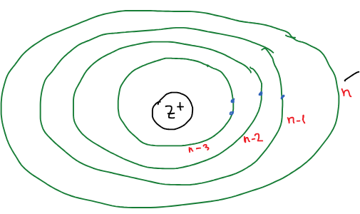

[Метод Хартри — Фока](../metod-hartri-foka/) дает орбиталь в виде таблицы значений. Для расчетов удобнее иметь аналитическую формулу, поэтому численную орбиталь **аппроксимируют** — подбирают функцию, максимально близкую к ней.

Слейтер, Зенер. Атомная орбиталь! — аппроксимирующая функция.

АО построена максимально приближенно к атомной орбитали [водородоподобного атома](../atomnye-orbitali/):

$$
\psi_{n,l,m} = \underbrace{\left( \frac{2\xi}{a_0} \right)^{n + \frac{1}{2}} \frac{1}{\sqrt{(2n)!}}\; r^{\,n-1}\, e^{-\frac{\xi r}{a_0}}}_{\text{радиальная часть}} \cdot \underbrace{Y_{l,m}(\theta, \varphi)}_{\text{угловая часть}}
$$

Здесь $n$ — главное квантовое число, $a_0$ — боровский радиус. Угловая часть — та же **сферическая гармоника**, что у водородоподобного атома. Радиальная часть проще, чем у водородоподобного атома: вместо полинома Лагерра — одна степень $r^{\,n-1}$ на экспоненту, поэтому у слейтеровской орбитали нет радиальных узлов. Численный множитель выбран так, чтобы орбиталь была нормирована.

Главное отличие — в показателе экспоненты. У водородоподобного атома там стоит заряд ядра $Z$, а здесь:

- $Z$ — заряд ядра;
- $\xi$ — **эффективный заряд ядра** (кажущийся).

Этому электрону кажется, что ядро имеет меньший заряд, т. к. электроны экранируют заряд.

🙏 Если вам нравится сайт, подпишитесь на наш <a href="https://t.me/+JfpTv9CJlwQ0MThi">🔗 Телеграм-канал</a>.

## Постоянная экранирования

$$
\xi = \frac{Z - S_{эк}}{n}
$$

$S_{эк}$ — **постоянная экранирования**. Она складывается из вкладов всех остальных электронов атома, и вклад электрона зависит от того, на каком уровне он находится по отношению к рассматриваемому:

$$
S_{эк} =
\begin{cases}
0 & \text{для электронов на уровнях } n + 1,\ n + 2, \dots \\
0{,}3 & \text{для электронов на уровне } n \\
0{,}85 & \text{для электронов на уровне } n - 1 \\
1 & \text{для электронов на уровнях } n - 2,\ n - 3, \dots
\end{cases}
$$

Внешние электроны (уровни выше $n$) заряд ядра не экранируют совсем; электроны того же уровня экранируют слабо; внутренние — почти полностью, а начиная с уровня $n - 2$ каждый внутренний электрон отнимает у ядра ровно один заряд.
