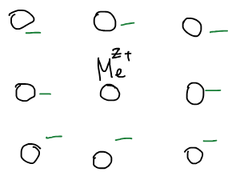
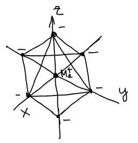
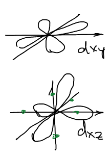
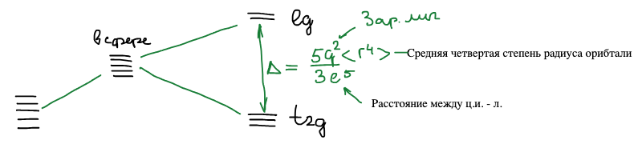
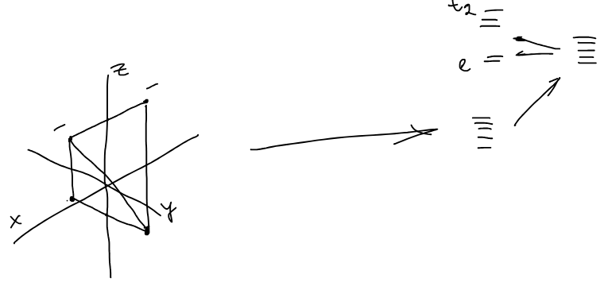
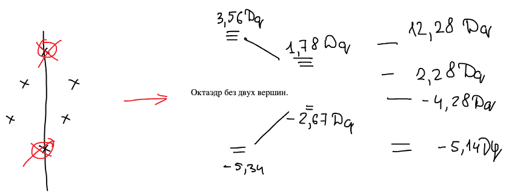
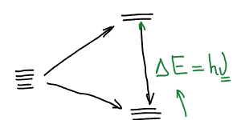

Примеры практических квантовых расчетов. Мы рассмотрим 2 простых метода квантовых расчетов свойств химических соединений двух классов. Первый — теория кристаллического поля для комплексных соединений.

## Комплексные соединения

Комплексные, или координационные, соединения включают в свой состав **комплексный ион** — устойчивый, образованный атомом или ионом металла, окруженным правильной геометрической структурой из простых молекул или ионов.

- $\text{Me}$ — центральный ион;
- $\text{L}$ — лиганды.

$$
\text{Me}\left( \text{L}_n \right)^{z}, \qquad n = 4,\ 6
$$

Комплексный ион имеет правильную геометрическую структуру, она сохраняется и в растворах, и в кристаллах:

$$
\left[ \text{Cu}^{2+}(\text{H}_2\text{O})_6 \right]^{2+}, \qquad
\left[ \text{Cu}(\text{NH}_3)_6 \right]^{2+}, \qquad
\left[ \text{Fe}(\text{CN})_6 \right]^{3-}
$$

Отличительные черты:

1. Устойчивость комплекса.
2. Окраска. Комплексы ярко окрашены и часто применяются в аналитической химии.
3. Магнетизм (парамагнетизм).

## Теория Бете

1929 г. — работа Ганса Бете. Рассматривает электронную структуру комплексных ионов в кристаллах. Направлена была к описанию магнитных свойств. Теория формулировалась для кристаллов!

У иона имеется орбиталь, электронная плотность и т. д. Как эта решетка подействует на эти орбитали?

Теория кристаллического поля — в рамках теории возмущений. Для свободного иона $\text{Me}$ (до введения в поле):

$$
\widehat{H}_0\psi_0 = E\psi_0
$$

После введения в поле к гамильтониану добавляется возмущение:

$$
\widehat{H} = \widehat{H}_0 + \widehat{V}_{кп}
$$

$\widehat{V}_{кп}$ — **потенциал кристаллического поля**. Вычисляется как электростатический потенциал: энергия взаимодействия зарядов $\varphi = \dfrac{q^2}{r}$, просуммированная по всем лигандам,

$$
V_{кп} = \sum_i \frac{z_i q \cdot z_{эф}\,q}{r_{ци-л}}
$$

, где $z_i$ — заряд $i$-того лиганда, $z_{эф}$ — эффективный заряд центрального иона, $r_{ци-л}$ — расстояние от центрального иона до лиганда.

Геометрическая структура является заданной координационным числом: 6 — октаэдр; 4 — тетраэдр или квадрат. Лиганды рассматриваются как точечные заряды, расположенные в вершинах многогранника, окружающего центральный ион. Нейтральные молекулы рассматриваются как диполи.

Электронная конфигурация $d$-орбиталей центрального иона рассматривается явным образом. Для нее решается квантовомеханическая задача о влиянии электростатического поля лигандов на энергию $d$-орбиталей. Решение проводится методом возмущений.

**Основной результат решения:** если возмущение накладывается на систему вырожденных орбиталей, то происходит снятие вырождения.

🙏 Если вам нравится сайт, подпишитесь на наш <a href="https://t.me/+JfpTv9CJlwQ0MThi">🔗 Телеграм-канал</a>.

## Октаэдрическое поле

Пусть имеется центральный ион $d$-металла, помещенный в комплекс с КЧ = 6. Оно соответствует октаэдрической структуре комплекса: шесть лигандов на осях координат.

Пять $d$-орбиталей свободного иона вырождены. Вокруг иона сначала мысленно помещаем сферу с тем же суммарным зарядом лигандов — все пять орбиталей поднимаются на одинаковую величину. Затем мы убираем сферу и переходим к шести точечным зарядам на осях. Орбитали, доли которых направлены на лиганды ($d_{z^2}$, $d_{x^2-y^2}$), отталкиваются от них сильнее и поднимаются; орбитали, доли которых лежат между осями ($d_{xy}$, $d_{xz}$, $d_{yz}$), — опускаются:

Верхняя пара орбиталей обозначается $e_g$, нижняя тройка — $t_{2g}$. Расстояние между ними — **параметр расщепления**:

$$
\Delta = 10Dq
$$

$$
\Delta = \frac{5q^2\langle r^4 \rangle}{3\ell^5}
$$

, где $q$ — заряд лиганда, $\langle r^4 \rangle$ — средняя четвертая степень радиуса $d$-орбитали, $\ell$ — расстояние между центральным ионом и лигандом.

Если идет расщепление, то при этом суммарная энергия должна оставаться той же самой. Поэтому две орбитали $e_g$ поднимаются на $6Dq$, а три орбитали $t_{2g}$ опускаются на $4Dq$:

$$
2 \cdot 6Dq = 3 \cdot 4Dq
$$

## Тетраэдрическое и квадратное поле

При КЧ = 4 и тетраэдрическом расположении лиганды сидят в четырех вершинах куба, между осями координат. Картина расщепления переворачивается: тройка $t_2$ теперь выше, а пара $e$ — ниже:

Расщепление в тетраэдре меньше, чем в октаэдре с теми же лигандами:

$$
\Delta_т = \frac{4}{9}\Delta_о = \frac{4}{9}\left( 10Dq \right)
$$

Уровни: $t_2$ на $+1{,}78Dq$, $e$ на $-2{,}67Dq$.

Квадратный комплекс — это октаэдр без двух вершин: убираем два лиганда на оси $z$. Тогда $d_{x^2-y^2}$, направленная на четыре оставшихся лиганда, уходит высоко вверх, а $d_{z^2}$, наоборот, опускается:

| Орбиталь | Энергия |
|:-:|:-:|
| $d_{x^2-y^2}$ | $+12{,}28Dq$ |
| $d_{xy}$ | $+2{,}28Dq$ |
| $d_{z^2}$ | $-4{,}28Dq$ |
| $d_{xz}, d_{yz}$ | $-5{,}14Dq$ |

С позиции теории кристаллического поля рассматриваются спектральные свойства, устойчивость и магнитные свойства комплексов.

## Спектральные свойства

Окраска определяется переходом электрона с нижнего уровня $t_{2g}$ на верхний $e_g$:

$$
\Delta E = h\nu
$$

Для комплексов эти переходы соответствуют видимой области:

$$
10\,000 - 40\,000\ \text{см}^{-1}, \qquad 1000 - 250\ \text{нм}
$$

Поэтому параметр расщепления можно измерить прямо из спектра — это **спектральный параметр**:

$$
\Delta E = 10Dq
$$

Он зависит от типа лигандов (было определено эмпирически). Лиганды выстраиваются в **спектрохимический ряд** по возрастанию расщепления:

$$
\text{I}^- < \text{Br}^- < \text{Cl}^- < \text{NO}_3^- < \text{F}^- < \text{OH}^- < \text{H}_2\text{O} < \text{NCS}^- < \text{NH}_3 < \text{NO}_2^- < \text{CN}^-
$$

Граница проходит примерно по $13\,000\ \text{см}^{-1}$:

- $\Delta < 13\,000\ \text{см}^{-1}$ — **комплексы слабого поля** (лиганды левее H₂O);
- $\Delta > 13\,000\ \text{см}^{-1}$ — **сильное поле**.

Чем больше заряд центрального иона — тем выше величина расщепления:

$$
\left[ \text{Co}(\text{H}_2\text{O})_6 \right]^{2+}: \ \Delta = 9700\ \text{см}^{-1}, \qquad
\left[ \text{Co}(\text{H}_2\text{O})_6 \right]^{3+}: \ \Delta = 20\,000\ \text{см}^{-1}
$$

Зависит и от окружения: $\Delta_{тет} = \dfrac{4}{9}\Delta_{окт}$. Чаще всего лиганды сильного поля дают комплексы октаэдрические.

## Заполнение уровней

Комплексы отличаются по устойчивости! А устойчивость характеризуется заполнением электронного облака. Принцип Паули: сначала заполняются нижние уровни, а затем — верхние. Правило Гунда действует для вырожденных орбиталей. Когда уровни сходятся, тогда оно работает. Но оно так же работает, когда $\Delta$ малая:

- $\Delta < 13\,000$ — правило Гунда: электроны по одному занимают все пять орбиталей, и только потом спариваются;
- $\Delta > 13\,000$ — принцип Паули: сначала полностью заполняются три нижние орбитали $t_{2g}$.

Сила лигандов сказывается не только на окраске, но и на том, как заполняются электронные уровни. К чему приводят различные заполнения — на примере двух комплексов Fe³⁺:

$$
\text{Fe}: \ 3d^6\,4s^2 \qquad\qquad \text{Fe}^{3+}: \ 3d^5
$$

Т. к. анализируем ион — не забываем убрать электроны!

![Заполнение d-уровней в [Fe(CN)₆]³⁻ (принцип Паули: 2 пары и один неспаренный электрон) и в [FeF₆]³⁻ (правило Гунда: 5 неспаренных)](images/teoriya-kristallicheskogo-polya/zapolnenie.png)

В $[\text{Fe}(\text{CN})_6]^{3-}$ — сильное поле, принцип Паули: все пять электронов на $t_{2g}$ — 2 электронные пары и один неспаренный электрон. В $[\text{FeF}_6]^{3-}$ — слабое поле, правило Гунда: три электрона на $t_{2g}$ и два на $e_g$, все пять неспаренные.

### Энергия стабилизации кристаллическим полем

Суммарный выигрыш в энергии от расщепления. В сильном поле все пять электронов сидят на уровне $-4Dq$:

$$
E_{ст} = 5\left( -4Dq \right) = -20Dq
$$

В слабом поле три электрона на $-4Dq$ и два на $+6Dq$ компенсируют друг друга:

$$
E_{ст} = \left( -4Dq \right) \cdot 3 + \left( 6Dq \right) \cdot 2 = 0
$$

Если вводим лиганд более сильного поля, он вытесняет слабый, т. к. энергия стабилизации сильным полем больше, чем слабым.

## Магнитный момент комплекса

Магнитный момент определяется числом неспаренных электронов. Каждый электрон — магнитик. Величина — **магнетон Бора** $\beta_M$, магнитный момент отдельного электрона.

Если электроны в паре — магнитные моменты компенсируются, и суммарный момент равен нулю. Если в одну сторону — суммарный момент складывается.

| Число неспаренных электронов | $\mu$, $\beta_M$ |
|:-:|:-:|
| 1 | 1,73 |
| 2 | 2,83 |
| 3 | 3,87 |
| 4 | 4,90 |
| 5 | 5,92 |

Значения в таблице — это $\mu = \sqrt{n(n + 2)}\,\beta_M$, где $n$ — число неспаренных электронов. Для двух комплексов железа:

$$
\left[ \text{Fe}(\text{CN})_6 \right]^{3-}: \ \mu = 1{,}73\,\beta_M \ \text{— низкоспиновый комплекс}
$$

$$
\left[ \text{FeF}_6 \right]^{3-}: \ \mu = 5{,}92\,\beta_M \ \text{— высокоспиновый комплекс}
$$

Эти закономерности характерны не только для растворов! Теория была развита для кристаллов!
