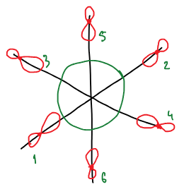
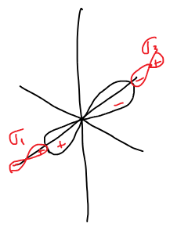
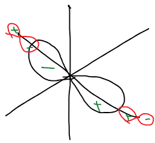
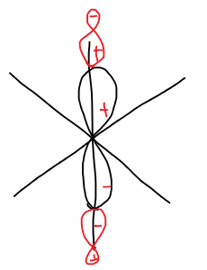
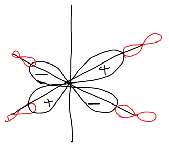
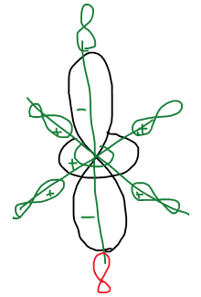
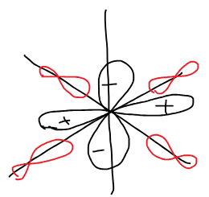
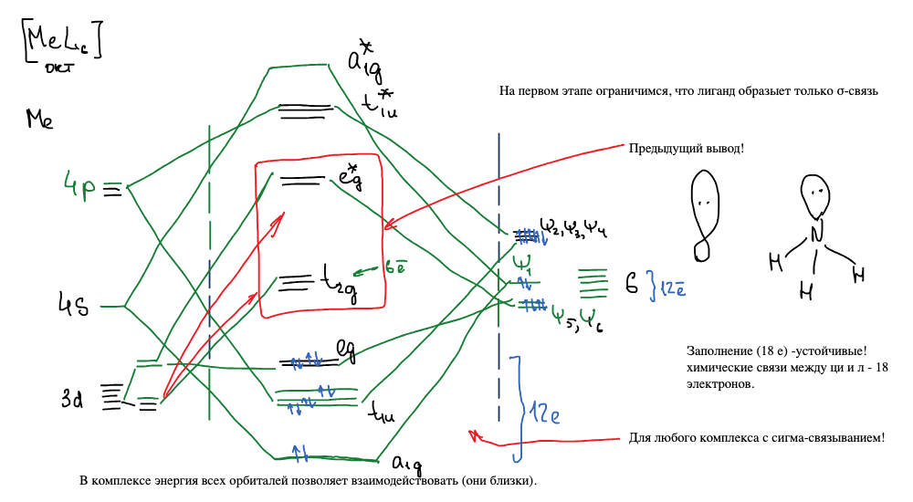

[Теория кристаллического поля](../teoriya-kristallicheskogo-polya/) — начальная теория. Дальше она развивалась. С теории атома — к молекулярным системам. Есть 2 базовых подхода: [метод ВС](../metod-valentnyh-shem/) и [метод МО](../metod-molekulyarnyh-orbitalej/). ВС не были успешны. Метод МО оказался продуктивным: МО в приложении к комплексным координационным соединениям получил название **теория поля лигандов**.

Задача этого подхода состоит в построении энергетической диаграммы соединения.

## Комплекс как молекулярная система

Рассмотрим комплекс как молекулярную систему — октаэдрический $[\text{MeL}_6]$. На первом этапе ограничимся тем, что лиганд образует только σ-связь: у каждого лиганда есть одна орбиталь с неподеленной парой, направленная на центральный ион (например, орбиталь азота в NH₃).

Со стороны центрального иона $\text{Me}$ в связывании участвуют девять орбиталей: пять $3d$, одна $4s$ и три $4p$. В комплексе энергия всех орбиталей позволяет взаимодействовать (они близки). Со стороны лигандов — шесть σ-орбиталей с двенадцатью электронами. Пронумеруем лиганды: 1 и 3 — на одной оси, 2 и 4 — на второй, 5 и 6 — на оси $z$:

## Групповые орбитали лигандов

На качественном уровне принято вводить понятие **групповой орбитали лигандов** — это линейная комбинация σ-орбиталей лигандов, способная по симметрии взаимодействовать с орбиталью центрального иона. Начнем с самой симметричной:

$$
\psi_1 = \frac{1}{\sqrt{6}}\left( \sigma_1 + \sigma_2 + \sigma_3 + \sigma_4 + \sigma_5 + \sigma_6 \right)
$$

Наиболее симметричная орбиталь дает наименьшую энергию. По симметрии она подходит к сферической $4s$-орбитали иона.

Меняем знаки: разность орбиталей двух лигандов на одной оси имеет ту же симметрию, что $p$-орбиталь, направленная вдоль этой оси. Таких комбинаций три — по числу $4p$-орбиталей:

$$
\psi_2 = \frac{1}{\sqrt{2}}\left( \sigma_1 - \sigma_3 \right)
$$

$$
\psi_3 = \frac{1}{\sqrt{2}}\left( \sigma_2 - \sigma_4 \right)
$$

$$
\psi_4 = \frac{1}{\sqrt{2}}\left( \sigma_5 - \sigma_6 \right)
$$

🙏 Если вам нравится сайт, подпишитесь на наш <a href="https://t.me/+JfpTv9CJlwQ0MThi">🔗 Телеграм-канал</a>.

Теперь $d$-орбитали. Орбиталь $d_{x^2-y^2}$ смотрит долями на четыре лиганда в плоскости, причем знаки долей на двух осях противоположны — под нее подходит комбинация с чередующимися знаками:

$$
\psi_5 = \frac{1}{2}\left( \sigma_1 - \sigma_2 + \sigma_3 - \sigma_4 \right)
$$

Орбиталь $d_{z^2}$ имеет две большие доли вдоль $z$ и кольцо противоположного знака в плоскости — под нее подходит комбинация, где лиганды 5 и 6 входят с удвоенным весом и противоположным знаком:

$$
\psi_6 = \frac{1}{\sqrt{12}}\left( \sigma_1 + \sigma_2 + \sigma_3 + \sigma_4 - 2\sigma_5 - 2\sigma_6 \right)
$$

Остались $d_{xy}$, $d_{xz}$, $d_{yz}$. Их доли лежат между осями, то есть между лигандами: положительное и отрицательное перекрывание с любой σ-орбиталью компенсируются.

Орбитали $d_{xy}$, $d_{xz}$, $d_{yz}$ центрального иона не способны по симметрии взаимодействовать с σ-орбиталями лигандов — они остаются несвязывающими.

## Диаграмма МО комплекса

Шесть групповых орбиталей лигандов комбинируются с шестью орбиталями иона ($4s$, три $4p$, $d_{x^2-y^2}$, $d_{z^2}$) и дают шесть связывающих и шесть разрыхляющих МО; три $d$-орбитали остаются несвязывающими:

Снизу вверх:

- $a_{1g}$ — связывающая из $4s$ и $\psi_1$;
- $t_{1u}$ — три связывающие из $4p$ и $\psi_2, \psi_3, \psi_4$;
- $e_g$ — две связывающие из $d_{x^2-y^2}$, $d_{z^2}$ и $\psi_5, \psi_6$;
- $t_{2g}$ — три несвязывающие $d_{xy}$, $d_{xz}$, $d_{yz}$;
- $e_g^*$ — две разрыхляющие;
- $t_{1u}^*$, $a_{1g}^*$ — разрыхляющие.

Двенадцать электронов лигандов заполняют шесть связывающих орбиталей $a_{1g}$, $t_{1u}$, $e_g$. Электроны $d$-оболочки иона попадают на $t_{2g}$ и $e_g^*$ — а это в точности та пара уровней, которую давала теория кристаллического поля: **предыдущий вывод** получен заново, из метода МО, и он верен для любого комплекса с σ-связыванием!

Заполнение 18 электронами — устойчивые комплексы: химические связи между центральным ионом и лигандами — 18 электронов (12 на связывающих орбиталях и 6 на $t_{2g}$).

В итоге мы увидели причину образования комплекса.
